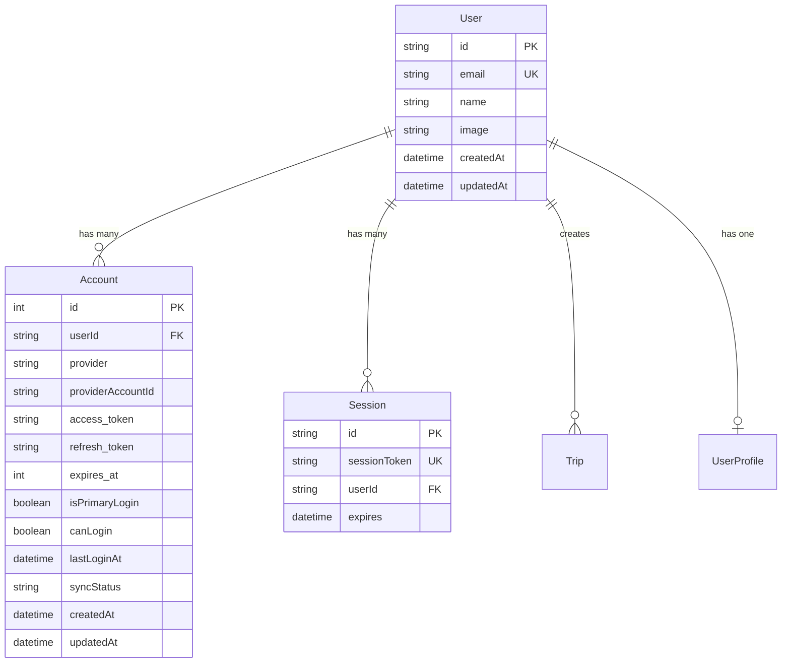
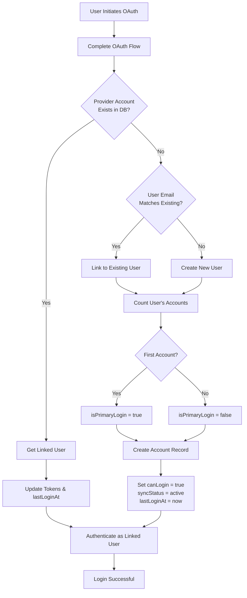
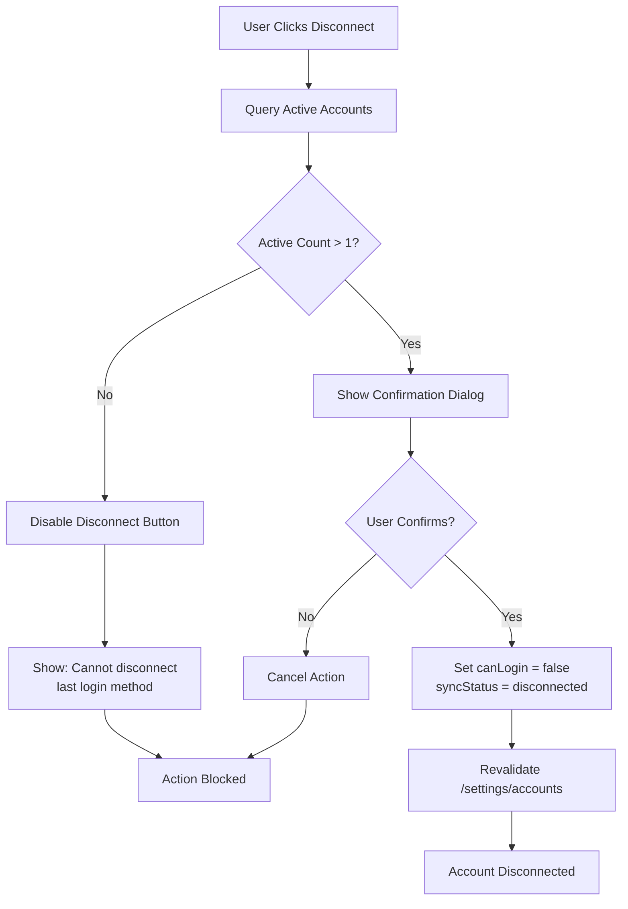
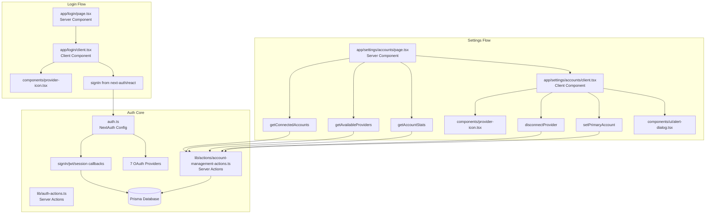
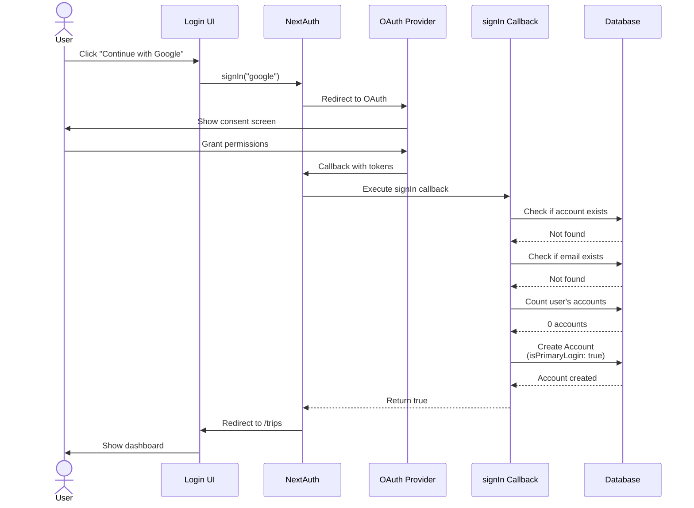
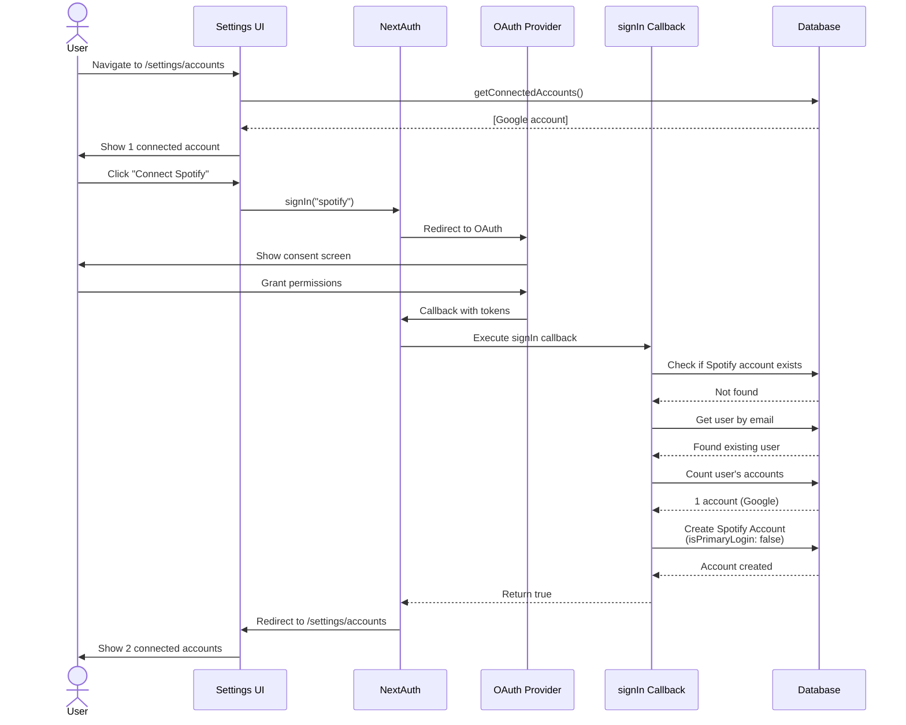
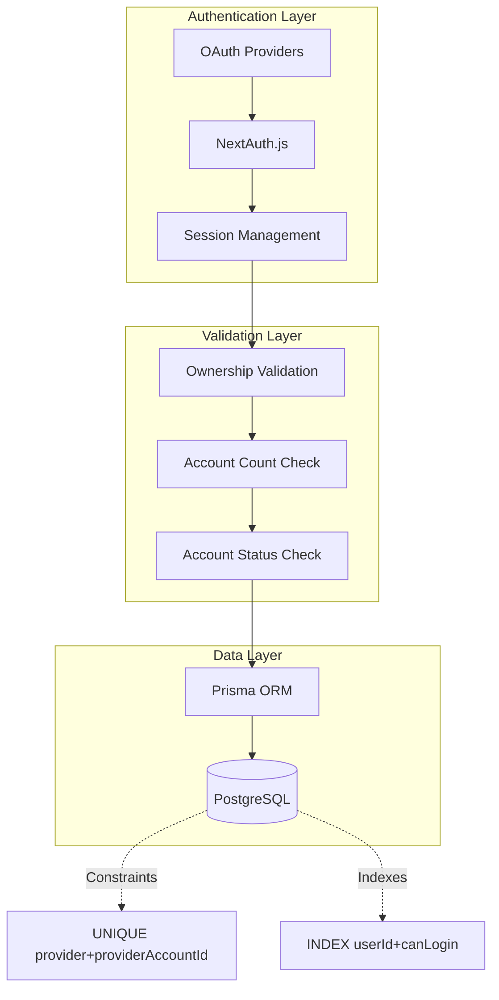
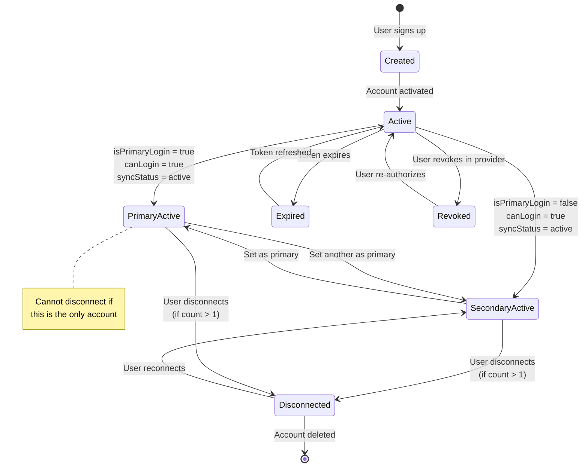
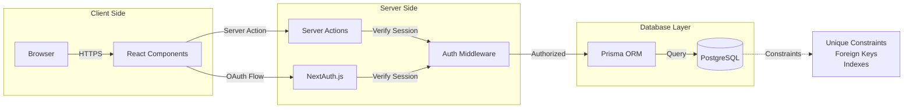

# Account Management System Architecture

## System Overview

```mermaid
graph TB
    User[User] -->|Visits| LoginPage[/login]
    User -->|Authenticated| SettingsPage[/settings/accounts]
    
    LoginPage --> ProviderButtons[Provider Selection UI]
    ProviderButtons --> Google[Google OAuth]
    ProviderButtons --> Facebook[Facebook OAuth]
    ProviderButtons --> Apple[Apple Sign In]
    ProviderButtons --> Twitter[Twitter OAuth]
    ProviderButtons --> LinkedIn[LinkedIn OAuth]
    ProviderButtons --> Spotify[Spotify OAuth]
    ProviderButtons --> GitHub[GitHub OAuth]
    
    Google --> NextAuthCallback[NextAuth Callback Handler]
    Facebook --> NextAuthCallback
    Apple --> NextAuthCallback
    Twitter --> NextAuthCallback
    LinkedIn --> NextAuthCallback
    Spotify --> NextAuthCallback
    GitHub --> NextAuthCallback
    
    NextAuthCallback --> AccountLinker{Account Exists?}
    AccountLinker -->|Yes| UpdateLogin[Update lastLoginAt]
    AccountLinker -->|No| EmailCheck{Email Matches?}
    
    EmailCheck -->|Yes| LinkToExisting[Link to Existing User]
    EmailCheck -->|No| CreateNew[Create New User]
    
    UpdateLogin --> Authenticate[Authenticate User]
    LinkToExisting --> SetPrimary{First Account?}
    CreateNew --> SetPrimary
    
    SetPrimary -->|Yes| MarkPrimary[Set isPrimaryLogin: true]
    SetPrimary -->|No| MarkSecondary[Set isPrimaryLogin: false]
    
    MarkPrimary --> Authenticate
    MarkSecondary --> Authenticate
    
    Authenticate --> Redirect[Redirect to /trips]
    
    SettingsPage --> AccountsList[Display Connected Accounts]
    SettingsPage --> AvailableProviders[Show Available Providers]
    
    AccountsList --> DisconnectBtn[Disconnect Button]
    AccountsList --> SetPrimaryBtn[Set Primary Button]
    
    DisconnectBtn --> ValidateCount{Count > 1?}
    ValidateCount -->|No| ShowError[Show Error: Cannot Disconnect]
    ValidateCount -->|Yes| ConfirmDialog[Confirmation Dialog]
    ConfirmDialog --> MarkDisconnected[Set canLogin: false]
    
    SetPrimaryBtn --> UpdatePrimary[Update isPrimaryLogin flags]
    
    AvailableProviders --> ConnectNew[Connect New Provider]
    ConnectNew --> Google
```

## Database Schema Relationships



## Account Linking Logic Flow



## Disconnect Validation Flow



## Component Architecture



## Data Flow: New User Signup



## Data Flow: Add Second Account



## Security Model



## Account States



## File Structure

```
travel-planner-v2/
├── auth.ts                                    # NextAuth config with 7 providers
├── prisma/
│   ├── schema.prisma                          # Extended Account model
│   └── migrations/
│       └── 20260121150301_add_account_management_fields/
│           └── migration.sql                  # Account management fields
├── lib/
│   └── actions/
│       ├── auth-actions.ts                    # Login/logout actions
│       └── account-management-actions.ts      # Account CRUD operations
├── components/
│   ├── provider-icon.tsx                      # Provider SVG icons
│   ├── auth-button.tsx                        # Updated auth button
│   ├── Navbar.tsx                             # Updated with Accounts link
│   └── ui/
│       ├── alert-dialog.tsx                   # Confirmation dialogs
│       └── alert.tsx                          # Error alerts
├── app/
│   ├── login/
│   │   ├── page.tsx                           # Login server component
│   │   └── client.tsx                         # Login client component
│   └── settings/
│       └── accounts/
│           ├── page.tsx                       # Settings server component
│           └── client.tsx                     # Settings client component
├── scripts/
│   └── migrate-existing-accounts.ts           # Migration script
└── docs/
    ├── ENV_SETUP.md                           # OAuth setup guide
    ├── ACCOUNT_MANAGEMENT_QUICK_START.md      # Quick start guide
    ├── ACCOUNT_MANAGEMENT_TESTING_GUIDE.md    # Testing scenarios
    ├── ACCOUNT_MANAGEMENT_IMPLEMENTATION_SUMMARY.md
    ├── ACCOUNT_MANAGEMENT_SETUP_CHECKLIST.md
    └── ACCOUNT_MANAGEMENT_README.md
```

## Technology Stack

### Core
- **Next.js 15**: App Router
- **NextAuth.js v5**: Authentication
- **Prisma**: ORM and database migrations
- **PostgreSQL**: Database (Neon)

### UI Components
- **Radix UI**: Accessible components (Dialog, Alert)
- **Tailwind CSS**: Styling
- **Lucide React**: Icons
- **Custom SVG**: Provider brand icons

### OAuth Providers
- Google (with YouTube)
- Facebook
- Apple
- Twitter/X
- LinkedIn
- Spotify
- GitHub

## API Endpoints (Auto-generated by NextAuth)

```
GET  /api/auth/signin                    # Sign in page
POST /api/auth/signin/:provider          # Initiate OAuth
GET  /api/auth/callback/:provider        # OAuth callback
GET  /api/auth/signout                   # Sign out
POST /api/auth/signout                   # Sign out action
GET  /api/auth/session                   # Get session
GET  /api/auth/csrf                      # CSRF token
GET  /api/auth/providers                 # List providers
```

## State Management

### Session State
- Managed by NextAuth.js
- JWT-based (stateless)
- Contains: userId, accessToken, refreshToken, provider

### Account State
- Stored in PostgreSQL via Prisma
- Fields: isPrimaryLogin, canLogin, lastLoginAt, syncStatus
- Cached and revalidated on changes

### UI State
- React useState for loading, dialogs
- Server actions for data mutations
- Optimistic updates where appropriate

## Security Architecture



## Performance Considerations

### Database Indexes

```sql
-- Efficient account lookups
CREATE INDEX "Account_userId_canLogin_idx" 
ON "Account"("userId", "canLogin");

-- Existing unique constraint
CREATE UNIQUE INDEX "Account_provider_providerAccountId_key"
ON "Account"("provider", "providerAccountId");
```

### Query Optimization

```typescript
// Efficient: Uses index
await prisma.account.findMany({
  where: { 
    userId: "user_123",
    canLogin: true 
  }
});

// Efficient: Parallel queries
const [accounts, available, stats] = await Promise.all([
  getConnectedAccounts(),
  getAvailableProviders(),
  getAccountStats()
]);
```

### Caching Strategy

- Session data cached by NextAuth
- Account lists revalidated on changes via `revalidatePath()`
- Statistics can be cached with short TTL

## Error Handling

### OAuth Errors

```typescript
// In auth.ts signIn callback
try {
  // Account linking logic
} catch (error) {
  console.error("Sign in error:", error);
  return false; // Prevents sign in
}
```

### User-Facing Errors

```typescript
// In server actions
if (activeAccounts <= 1) {
  return {
    success: false,
    error: "Cannot disconnect your only login method."
  };
}
```

### Error Pages

- `/login?error=OAuthAccountNotLinked` - Account already linked
- `/login?error=Callback` - OAuth callback failed
- `/login/error` - Generic error page

## Monitoring & Observability

### Key Metrics

```typescript
// Track in analytics
{
  event: "user_login",
  provider: "google",
  isNewUser: false,
  accountCount: 2
}

{
  event: "account_linked",
  provider: "spotify",
  totalAccounts: 3
}

{
  event: "account_disconnected",
  provider: "facebook",
  remainingAccounts: 2
}
```

### Database Monitoring

```sql
-- Active users by provider
SELECT provider, COUNT(DISTINCT "userId") as users
FROM "Account"
WHERE "canLogin" = true AND "syncStatus" = 'active'
GROUP BY provider;

-- Account health
SELECT syncStatus, COUNT(*) as count
FROM "Account"
GROUP BY syncStatus;

-- Multi-account adoption
SELECT account_count, COUNT(*) as users
FROM (
  SELECT "userId", COUNT(*) as account_count
  FROM "Account"
  WHERE "canLogin" = true
  GROUP BY "userId"
) subquery
GROUP BY account_count;
```

## Scalability Considerations

### Current Design (Good for 0-100K users)
- Single database
- JWT sessions (stateless)
- Indexed queries
- Efficient account lookups

### Future Scaling (100K+ users)
- Implement token encryption
- Add Redis for session caching
- Consider read replicas for account queries
- Implement rate limiting per user
- Add CDN for static assets

## Integration Points

### With Existing Features

1. **Profile System**: Account data enhances user profile
2. **Trip Planning**: Social data improves recommendations
3. **AI Chat**: Social interests provide context
4. **Personalization**: Multi-provider data = better insights

### With Future Features (Main Plan)

1. **Data Extractors**: Use account tokens to fetch social data
2. **Interest Analyzer**: Analyze data from all linked accounts
3. **Social Graph**: Map connections across providers
4. **Friend Matching**: "Friends who visited" features

## Deployment

### Development
```bash
npm run dev
# Access at http://localhost:3000
```

### Production
1. Set production environment variables
2. Update OAuth redirect URIs
3. Deploy to hosting platform
4. Run migrations
5. Monitor for errors

### Environment-Specific Config

```typescript
// Development
NEXTAUTH_URL="http://localhost:3000"

// Production
NEXTAUTH_URL="https://yourdomain.com"
```

## Maintenance

### Regular Tasks
- Monitor OAuth error rates
- Check for expired tokens
- Review account statistics
- Update provider SDKs
- Rotate NEXTAUTH_SECRET periodically

### User Support
- Help users reconnect expired accounts
- Assist with account linking issues
- Handle account merge requests
- Process account deletion requests

---

## Summary

The account management system provides a robust foundation for multi-provider authentication with:
- Flexible account linking
- Strong validation
- Intuitive UI
- Comprehensive error handling
- Security best practices
- Scalable architecture

Ready for OAuth setup and testing!
