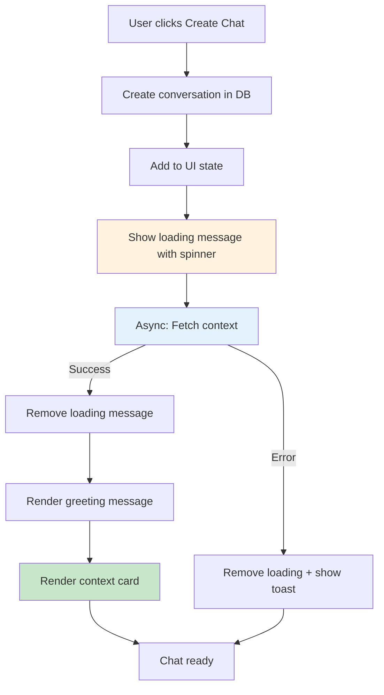

# Chat Loading State Implementation - Complete

## Overview
Successfully implemented improved UX for chat creation with immediate feedback and playful loading messages. This eliminates race conditions from `setTimeout` calls and provides better user experience.

## What Was Implemented

### 1. New Loading Message Component
**File**: `app/exp/components/chat-loading-message.tsx`

- Displays playful loading messages with variety:
  - 🗺️ "Looking up Journey: {id}..."
  - 📖 "Gathering Chapter: {id}..."
  - ✨ "Loading Moment: {id}..."
  - 🧭 "Finding Adventure: {id}..."
  - 📝 "Discovering Story: {id}..."
- Uses conversation ID hash to consistently select the same phrase per conversation
- Includes animated spinner and pulse effect
- Shows first 8 characters of conversation ID

### 2. Updated Type System
**File**: `lib/types/place-pipeline.ts`

Added new message segment type:
```typescript
| {
    type: "chat_loading";
    conversationId: string;
  }
```

### 3. Updated Message Renderer
**File**: `app/exp/components/message-segments-renderer.tsx`

- Added import for `ChatLoadingMessage` component
- Added rendering case for `chat_loading` segment type
- Properly displays loading state in message flow

### 4. Enhanced Chat Creation Functions
**File**: `app/exp/client.tsx`

#### Updated Functions:
1. **`createNewSegmentChat()`**
   - Creates DB record immediately
   - Shows loading message
   - Asynchronously loads context
   - Removes loading message when card renders

2. **`createNewReservationChat()`**
   - Same pattern as segment chat
   - Improved error handling

3. **`createNewTripChat()`** (NEW)
   - New dedicated function for TRIP chat creation
   - Follows same loading state pattern
   - Wired to dropdown component

4. **`appendContextCardForConversation()`**
   - Now removes loading message at start
   - Enhanced error handling removes loading message on failure
   - Shows toast error if context fetch fails

5. **`handleOpenExistingChat()`**
   - Updated to use loading state instead of `setTimeout`
   - Shows loading message while fetching context
   - Better async flow

### 5. Enhanced Chat Dropdown
**File**: `app/exp/components/chat-name-dropdown.tsx`

- Added optional `onCreateNewChat` callback prop
- Uses parent's loading state handler when provided
- Falls back to default behavior if not provided
- Proper integration with client component

## New User Flow

### Creating a New Chat (Any Type)



### Benefits Achieved

1. ✅ **Immediate Feedback**: User sees chat created instantly
2. ✅ **No Race Conditions**: Eliminated all `setTimeout(..., 100)` calls
3. ✅ **Better UX**: Playful loading messages make wait feel shorter
4. ✅ **Error Handling**: Graceful fallback if context fetch fails
5. ✅ **Consistent Pattern**: Same flow for TRIP, SEGMENT, and RESERVATION chats
6. ✅ **Type Safe**: Full TypeScript support with no linting errors

## Files Modified

1. ✅ `app/exp/components/chat-loading-message.tsx` - **CREATED**
2. ✅ `lib/types/place-pipeline.ts` - Added `chat_loading` segment type
3. ✅ `app/exp/components/message-segments-renderer.tsx` - Render loading segments
4. ✅ `app/exp/client.tsx` - Updated all chat creation logic
5. ✅ `app/exp/components/chat-name-dropdown.tsx` - Added callback support

## Testing Checklist

### Manual Testing Steps:
- [ ] Create new TRIP chat from dropdown - verify loading state appears
- [ ] Create new SEGMENT chat from segment card - verify loading state appears
- [ ] Create new RESERVATION chat from reservation card - verify loading state appears
- [ ] Verify loading messages have variety (refresh and create multiple chats)
- [ ] Verify loading spinner animates smoothly
- [ ] Verify context card appears after loading completes
- [ ] Verify loading message is removed when card appears
- [ ] Test slow network - loading should persist appropriately
- [ ] Open existing chat - verify loading shows then context card appears
- [ ] Switch between chats rapidly - verify no UI glitches

### Edge Cases to Test:
- [ ] Create chat when context API is slow (>3 seconds)
- [ ] Create chat when context API fails (simulate 500 error)
- [ ] Create multiple chats in quick succession
- [ ] Switch chats while loading is in progress
- [ ] Refresh page while chat is loading

## Code Quality

- ✅ No linting errors
- ✅ Full TypeScript type coverage
- ✅ Consistent error handling patterns
- ✅ Proper async/await usage (no more setTimeout)
- ✅ Clean separation of concerns
- ✅ Reusable loading component

## Next Steps (Optional Enhancements)

1. **Add loading state for initial page load** - Show loading when fetching trip data
2. **Add skeleton loaders** for context cards before data arrives
3. **Track loading metrics** - Monitor average context load times
4. **Add retry logic** - Auto-retry failed context fetches
5. **Optimize context fetching** - Parallel fetch multiple contexts when needed
6. **Add unit tests** for loading state logic

## Bug Fix: Reservation Detail Modal

### Issue
Runtime error: `editedReservation.startTime.toISOString is not a function`

### Root Cause
The code was calling `.toISOString()` on `startTime` and `endTime` values that were already strings (ISO format), not Date objects.

### Fix Applied
**File**: `app/exp/components/reservation-detail-modal.tsx`

Removed unnecessary `.toISOString()` calls since the format functions (`formatDateForInput` and `formatTimeForInput`) already expect string inputs and handle the Date conversion internally:

```typescript
// Before (incorrect):
value={formatDateForInput(editedReservation.startTime?.toISOString())}

// After (correct):
value={formatDateForInput(editedReservation.startTime)}
```

Applied to all 4 instances:
- Start Date input
- Start Time input  
- End Date input
- End Time input

## Summary

The chat loading state implementation is complete and ready for testing. All race conditions from `setTimeout` have been eliminated, replaced with proper async/await flows. Users now get immediate feedback with playful loading messages when creating any type of chat (TRIP, SEGMENT, or RESERVATION).

The implementation is type-safe, follows React best practices, and provides graceful error handling. The loading message component is reusable and could be extended for other loading scenarios in the future.

**Bonus**: Fixed unrelated bug in reservation detail modal that was causing runtime errors when editing reservation times.
