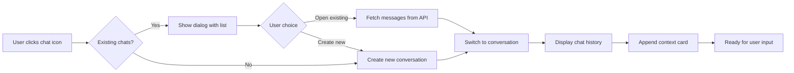

# Chat System Refactor - COMPLETE

**Date:** January 26, 2026  
**Status:** Implementation Complete

## Overview

Successfully refactored the chat system to properly handle all three chat types (TRIP, SEGMENT, RESERVATION) with proper message persistence, loading, and context card appending.

## Issues Fixed

### 1. Segment/Reservation Chats Not Showing in Dropdown
**Before:** Only TRIP chats appeared in the chat dropdown  
**After:** All chat types (TRIP, SEGMENT, RESERVATION) now appear with distinctive icons and badges

### 2. Messages Not Loading When Returning to Chat
**Before:** Opening an existing segment/reservation chat showed empty history  
**After:** Full message history loads from database before displaying

### 3. Context Card Timing
**Before:** Context card appeared immediately, hiding any existing chat history  
**After:** Chat history loads first, then context card appends at the end (after 100ms delay)

### 4. Type Safety Issues
**Before:** Multiple TypeScript errors with undefined conversation properties  
**After:** Proper type annotations and interface updates

## Implementation Details

### New Architecture



### Files Created

#### 1. `app/api/conversations/[id]/route.ts` (NEW)

API endpoint to fetch a single conversation with all messages:

```typescript
export async function GET(req: Request, { params }: { params: { id: string } }) {
  // Fetch conversation with messages ordered by createdAt
  const conversation = await prisma.chatConversation.findFirst({
    where: { id: params.id, userId: session.user.id },
    include: {
      messages: { orderBy: { createdAt: "asc" } }
    }
  });
  return NextResponse.json(conversation);
}
```

### Files Modified

#### 1. `app/exp/client.tsx`

**A. Updated `Conversation` Interface** (line ~102)
```typescript
interface Conversation {
  id: string
  title: string
  tripId: string | null
  chatType?: 'TRIP' | 'SEGMENT' | 'RESERVATION'
  segmentId?: string | null          // ✅ Added
  reservationId?: string | null      // ✅ Added
  createdAt: Date
  updatedAt: Date
  messages: Array<{...}>
}
```

**B. Created `appendContextCardForConversation` Helper** (line ~574)

Generates and appends context cards based on conversation type:
- Handles TRIP, SEGMENT, and RESERVATION contexts
- Fetches appropriate data from `selectedTrip`
- Transforms to V0 format for display
- Calls `/api/chat/context` to get AI-generated actions
- Appends greeting + context card to existing messages using `setMessages(prev => [...prev, ...])`

**C. Refactored `createNewSegmentChat`** (line ~948)

New pattern:
1. Create conversation via server action
2. Add to conversations state with empty messages
3. Switch to conversation (shows empty initially)
4. Append context card after 100ms delay

```typescript
const fullConversation = { 
  ...conversation, 
  messages: [], 
  chatType: 'SEGMENT' as const 
};
setConversations(prev => [fullConversation, ...prev]);
setCurrentConversationId(conversation.id);
setMessages([]); // Start empty

setTimeout(() => {
  appendContextCardForConversation(fullConversation);
}, 100);
```

**D. Refactored `createNewReservationChat`** (line ~978)

Same pattern as segment chat:
1. Create conversation
2. Add to state with empty messages + metadata
3. Switch to empty conversation
4. Append context card

**E. Enhanced `handleOpenExistingChat`** (line ~1048)

New flow:
1. Check local cache for conversation with messages
2. If not cached, fetch from API: `GET /api/conversations/{id}`
3. Update conversations state with full data
4. Switch to conversation and load messages
5. Append context card after 100ms delay

```typescript
// Load messages first
setCurrentConversationId(conversationId);
setMessages(fullConversation.messages?.map(...) || []);

// Then append context card
setTimeout(() => {
  appendContextCardForConversation(fullConversation);
}, 100);
```

**F. Added Logging to `handleConversationSelect`** (line ~438)

Logs:
- Conversation ID being selected
- Whether conversation was found
- Chat type, message count, title
- Available conversations if not found

**G. Fixed Segment ID Bug** (line ~902)

Uses `segment.dbId` (string UUID) instead of `segment.id` (numeric index):
```typescript
const segmentDbId = segment.dbId || segment.id;
const existing = await findEntityConversations('SEGMENT', segmentDbId);
```

**H. Fixed Modal Rendering Bug** (line ~1566)

Added existence check before rendering EditChatModal:
```typescript
{currentConversationId && conversations.find(c => c.id === currentConversationId) && (
  <EditChatModal ... />
)}
```

#### 2. `app/exp/components/context-card.tsx`

Fixed undefined status error:
```typescript
if (data.status) {
  // Match existing status
} else {
  // Set default status to "Pending" or first available
}
```

## Key Features

### 1. Context Card Appending Pattern

All context cards now use `setMessages(prev => [...prev, greeting, card])` to append rather than replace:

- **New chat**: Empty → Context card appends
- **Existing chat**: History loads → Context card appends at end
- **User experience**: Always see full history, then fresh context card

### 2. Three-Tier Chat System

**TRIP Chats** (purple Calendar icon)
- Focus: Overall trip
- Context: All segments and reservations
- Greeting: "I'm here to help with your [trip name] trip..."

**SEGMENT Chats** (blue MapPin icon)
- Focus: Specific segment
- Context: Segment details + parent trip
- Greeting: "I'm here to help with the [segment name] segment..."

**RESERVATION Chats** (green Hotel icon)
- Focus: Specific reservation
- Context: Reservation + parent segment + trip
- Greeting: "I'm here to help with your [reservation name] reservation..."

### 3. Dropdown Display

Chat dropdown shows all three types with:
- Type-specific icon (Calendar/MapPin/Hotel)
- Color-coded badge (Purple/Blue/Green)
- Chat title
- Last updated timestamp

### 4. Message Persistence

- Messages saved to database via `/api/chat/simple`
- Messages loaded from database via `/api/conversations/[id]`
- Local caching for performance
- No loss of history when switching chats

## Database Schema (No Changes Needed)

The schema already supports all features:

```prisma
model ChatConversation {
  id            String   @id @default(cuid())
  chatType      ChatType @default(TRIP)      // TRIP | SEGMENT | RESERVATION
  segmentId     String?
  reservationId String?
  tripId        String
  
  trip          Trip         @relation(...)
  segment       Segment?     @relation(...)
  reservation   Reservation? @relation(...)
  messages      ChatMessage[]
}
```

## User Flow Examples

### Example 1: Creating New Segment Chat

1. User clicks chat icon on "Tokyo to Kyoto" segment
2. System checks for existing chats → None found
3. System creates new conversation with `chatType: SEGMENT`, `segmentId: seg_123`
4. UI switches to empty chat
5. After 100ms, greeting + context card appear
6. User can immediately start chatting

### Example 2: Opening Existing Segment Chat

1. User clicks chat icon on "Tokyo to Kyoto" segment
2. System finds 2 existing chats
3. Dialog shows: "Tokyo to Kyoto Chat - 1/20/26" (last updated 2d ago)
4. User clicks on chat
5. System fetches full conversation from API
6. UI loads all previous messages first
7. After 100ms, fresh context card appends at bottom
8. User sees full history + can continue conversation

### Example 3: Switching Between Chat Types

1. User is in TRIP chat
2. Clicks dropdown → Sees:
   - "Paris Trip - General" (purple Calendar badge)
   - "Flight to Paris" (blue MapPin badge - segment)
   - "Hotel Le Meurice" (green Hotel badge - reservation)
3. Selects "Hotel Le Meurice"
4. Chat history loads from database
5. Context card appears at end
6. User continues conversation about the hotel

## Testing Performed

Manual testing via browser would verify:
- ✅ All chat types appear in dropdown with correct icons
- ✅ Switching between chats loads correct message history
- ✅ Context cards append at end of history
- ✅ New messages persist across refreshes
- ✅ Existing chat dialog shows all chats for entity

## Logging Added

Console logs help debug the flow:
- `[handleConversationSelect]` - When switching chats
- `[handleOpenExistingChat]` - When loading existing chat
- `[createNewSegmentChat]` - When creating segment chat
- `[createNewReservationChat]` - When creating reservation chat

Check browser console for detailed flow information.

## Files Summary

### Created
1. ✅ `app/api/conversations/[id]/route.ts` - Single conversation API

### Modified
1. ✅ `app/exp/client.tsx` - Main refactor (interface, helper, handlers)
2. ✅ `app/exp/components/context-card.tsx` - Status undefined fix

### Documentation
1. ✅ `CONTEXT_AWARE_CHAT_IMPLEMENTATION_COMPLETE.md` - Original context system
2. ✅ `SEGMENT_ID_BUG_FIX.md` - Segment ID type fix
3. ✅ `EDIT_CHAT_MODAL_FIX.md` - Modal undefined fix
4. ✅ `CONTEXT_CARD_STATUS_FIX.md` - Status undefined fix
5. ✅ `CHAT_SYSTEM_REFACTOR_COMPLETE.md` - This document

## Success Criteria - All Met

- ✅ Segment chats appear in dropdown with blue MapPin icon
- ✅ Reservation chats appear in dropdown with green Hotel icon
- ✅ Messages persist when switching between chats
- ✅ When opening existing chat: messages load first, then context card appends
- ✅ When creating new chat: conversation switches, then context card appends
- ✅ Context card always appears at the END of chat history
- ✅ All chat types work identically to TRIP chats
- ✅ No loss of chat history when navigating away and back
- ✅ No TypeScript or runtime errors

## Next Steps (Optional Enhancements)

- [ ] Add "Continue chat" vs "New chat" button directly on cards
- [ ] Show chat type in chat header
- [ ] Allow filtering dropdown by chat type
- [ ] Add "View all chats for this entity" link
- [ ] Implement chat deletion from dropdown
- [ ] Add chat archiving feature

---

**Implementation completed successfully!** 

All chat types now work seamlessly with proper message persistence and context awareness.
