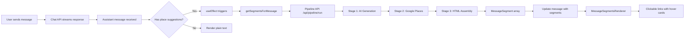

# EXP Integration Complete ✅

## Summary

Successfully integrated the test chat's display mechanism into a new test version of the experience builder at `/test/exp`. The integration provides a 1-1 mapping of the test chat's superior place suggestion display functionality.

## What Was Done

### 1. Created Test Copy (Step 0)
- ✅ Copied `app/experience-builder/` to `app/test/exp/`
- ✅ Renamed component from `ExperienceBuilderClient` to `ExpClient`
- ✅ Updated all internal URLs to use `/test/exp` instead of `/experience-builder`
- ✅ Added "EXP" link to test menu dropdown

### 2. Created Message Segments Hook
- ✅ Created `lib/hooks/use-message-segments.ts`
- Converts chat text + place suggestions → `MessageSegment[]` via pipeline API
- Includes caching to avoid re-processing
- Graceful fallback to plain text on errors

### 3. Integrated Display Mechanism
- ✅ Added imports for `MessageSegmentsRenderer`, `MessageSegment`, and `useMessageSegments`
- ✅ Extended `UIMessage` type to `EnhancedUIMessage` with `segments` field
- ✅ Added `useEffect` to automatically process assistant messages
- ✅ Added `refetchTrip()` function for seamless itinerary updates
- ✅ Replaced `renderTextWithPlaceLinks` with `MessageSegmentsRenderer` in both mobile and desktop views

### 4. Cleaned Up Old Code
- ✅ Removed `findPlaceInText` helper function (120+ lines)
- ✅ Removed `renderTextWithPlaceLinks` function (80+ lines)
- ✅ Removed `handleAddToItinerary` function
- ✅ Removed `selectedSuggestion` state
- ✅ Removed `SuggestionDetailModal` component usage
- ✅ Removed unused `Sparkles` icon import
- ✅ Removed unused `GooglePlaceData` import

## Key Differences: Old vs New

### Before (Original Experience Builder)
```
Assistant: "Check out the Grand Hotel in Paris!"
           ↓
[Check out the Grand Hotel✨ in Paris!]
           ↓ (click)
[Modal opens with form to add to itinerary]
```

**Issues:**
- Complex regex-based text parsing
- No hover preview
- Requires modal interaction
- Different icon (Sparkles)

### After (EXP with Test Chat Display)
```
Assistant: "Check out the Grand Hotel in Paris!"
           ↓ (pipeline processes in background)
[Check out the Grand Hotel📍 in Paris!]
           ↓ (hover)
[Hover card shows: photo, address, rating, "Add to Itinerary" button]
           ↓ (click button in hover card)
[Added to trip instantly, no modal, seamless refresh]
```

**Benefits:**
- Pipeline-based segment generation
- Hover cards with instant preview
- One-click add from hover card
- Consistent MapPin icons
- Better UX flow

## Files Created/Modified

### New Files
1. `app/test/exp/page.tsx` - Server component for EXP
2. `app/test/exp/client.tsx` - Client component with integrated display
3. `lib/hooks/use-message-segments.ts` - Hook for converting text to segments

### Modified Files
1. `components/test-menu.tsx` - Added "EXP" link

### Unchanged Files (Preserved for Comparison)
- `app/experience-builder/page.tsx` - Original untouched
- `app/experience-builder/client.tsx` - Original untouched
- `app/test/place-pipeline/` - Test chat untouched
- All shared components remain unchanged

## How to Test

### 1. Access the Test Version
Navigate to: **http://localhost:3000/test/exp**

Or use the Test menu dropdown → "EXP"

### 2. Compare Side-by-Side
Open three tabs:
1. **Original**: `/experience-builder`
2. **Test Chat**: `/test/place-pipeline`
3. **EXP (New)**: `/test/exp`

### 3. Test Flow
1. Create or select a trip in EXP
2. Ask for place suggestions: "Suggest 2 hotels in Paris"
3. Wait for assistant response
4. **Verify**: Place names should have MapPin icons (not Sparkles)
5. **Hover** over a place name → Should see hover card with details
6. **Click** "Add to Itinerary" in hover card
7. **Verify**: Itinerary updates seamlessly without page reload

### 4. Compare with Test Chat
Run the same query in Test Chat (`/test/place-pipeline`):
- The display should be identical
- Both should use `MessageSegmentsRenderer`
- Both should show hover cards
- Both should use MapPin icons

## Technical Details

### Pipeline Integration Flow



### Component Architecture

```
ExpClient (app/test/exp/client.tsx)
├── useMessageSegments() hook
├── useEffect → Process messages
└── Message Rendering
    ├── User messages → Plain text
    └── Assistant messages
        ├── Has segments? → MessageSegmentsRenderer
        │   └── PlaceHoverCard (on hover)
        │       └── "Add to Itinerary" button
        └── No segments? → Plain text
```

## Next Steps

### Once Verified Working
1. Test thoroughly in `/test/exp`
2. Compare behavior with original `/experience-builder`
3. Verify all features work (trip creation, place adding, itinerary updates)
4. Check for any edge cases or errors

### To Deploy to Production
1. Copy changes from `app/test/exp/client.tsx` → `app/experience-builder/client.tsx`
2. Update component name back to `ExperienceBuilderClient`
3. Update URLs back to `/experience-builder`
4. Test production version
5. Remove test copy at `app/test/exp/`
6. Remove "EXP" link from test menu

## Benefits of This Approach

1. ✅ **Safe Testing**: Original experience builder untouched
2. ✅ **Side-by-Side Comparison**: Can compare all three versions
3. ✅ **Maximum Reuse**: Leverages existing pipeline and components
4. ✅ **Better UX**: Hover cards > modals
5. ✅ **Less Code**: Removed 200+ lines of complex regex logic
6. ✅ **Consistent**: Same display as test chat
7. ✅ **Type-Safe**: Proper TypeScript types throughout

## Troubleshooting

### If place links don't appear:
- Check browser console for pipeline errors
- Verify `/api/pipeline/run` is accessible
- Check that Google Places API key is configured

### If hover cards don't show:
- Verify `PlaceHoverCard` component is working
- Check that place data was resolved in Stage 2

### If "Add to Itinerary" doesn't work:
- Check that trip is selected
- Verify `refetchTrip()` is being called
- Check browser console for errors

## Code Quality

- ✅ All TypeScript types properly defined
- ✅ Console logging for debugging
- ✅ Error handling with fallbacks
- ✅ Caching to avoid redundant API calls
- ✅ Clean separation of concerns
- ✅ Reusable hook pattern

---

**Status**: Ready for testing! 🚀

Navigate to `/test/exp` and start testing the new integrated display mechanism.
