# Follow-Up Questions with Bubble Answers - Design Plan

## Overview

Add an intelligent follow-up question system that prompts users with specific questions and provides clickable bubble answers, making profile building fast, fun, and exploratory. Questions appear naturally in the conversation flow, with pre-suggested answers as bubbles plus an "Other" option for custom input.

## User Experience Flow

### Example Conversation

```
User: "I love visiting London"

AI: "London is amazing! I've added that to your profile."

Bubbles appear:
[London ✓] (fades out, added)

Follow-up appears immediately:
━━━━━━━━━━━━━━━━━━━━━━━━━━━━━━━━━━━━━━━━
How often do you visit London?

[Once a month] [Once a year] [A few times a year] [Other...]

User clicks: "Once a year"
→ Creates new item: "Visit London annually"
→ AI: "Nice! What do you usually do there?"

New bubbles:
[Sightseeing] [Food & dining] [Museums] [Shopping] [Other...]
```

## Visual Design

### Layout

```
┌─────────────────────────────────────────────────────────┐
│  Chat Messages                                          │
│  ┌────────────────────────────────────────────────────┐│
│  │ You: I love visiting London                        ││
│  │                                                    ││
│  │ AI: London is amazing! I've added that.           ││
│  └────────────────────────────────────────────────────┘│
│                                                          │
│  Add to your profile:                                   │
│  [London 🔷 ×] → (fades out)                            │
│                                                          │
│  ┌────────────────────────────────────────────────────┐│
│  │ 💬 How often do you visit London?                  ││
│  │                                                    ││
│  │ [Once a month] [Once a year] [A few times a year] ││
│  │ [Other...]                                         ││
│  └────────────────────────────────────────────────────┘│
│                                                          │
│  [Type your message...              ] [Send]            │
└─────────────────────────────────────────────────────────┘
```

### Follow-Up Question Card

```
┌────────────────────────────────────────────┐
│ 💬 How often do you visit London?         │
│                                            │
│ [Once a month] [Once a year]              │
│ [A few times a year] [Other...]           │
└────────────────────────────────────────────┘
```

**Styling:**
- Light background (bg-blue-50)
- Question icon (💬 or question mark)
- Question text in medium font
- Bubbles below with same style as suggestions
- Subtle border to distinguish from regular suggestions

### "Other" Bubble Interaction

**State 1: Default**
```
[Other...]
```

**State 2: Clicked (becomes input)**
```
[Type your answer...        ] [✓]
```

**State 3: Submitted**
```
[Custom answer ✓] → (fades out, added)
```

## AI Prompt Enhancement

### System Prompt Addition

```typescript
## Follow-Up Questions

After extracting items, generate contextual follow-up questions to explore deeper:

1. **Frequency questions** for places/activities:
   - "How often do you visit [place]?"
   - Answers: "Once a month", "Once a year", "A few times a year", "Rarely", "Other"

2. **Preference questions** for choices:
   - "What do you like about [item]?"
   - "What class do you fly with [airline]?"
   - Answers: Context-specific options

3. **Exploration questions** to find tangents:
   - "What do you usually do in [place]?"
   - "What other [category] do you enjoy?"
   - Answers: Related items as bubbles

4. **Detail questions** for depth:
   - "How long have you been [activity]?"
   - "What's your favorite [aspect]?"
   - Answers: Specific options

## Response Format

{
  "message": "Your conversational response",
  "items": [...extracted items...],
  "followUpQuestion": {
    "question": "How often do you visit London?",
    "relatedTo": "item-id-123",
    "answers": [
      { "value": "Once a month", "creates": "Visit London monthly" },
      { "value": "Once a year", "creates": "Visit London annually" },
      { "value": "A few times a year", "creates": "Visit London regularly" },
      { "value": "Other", "allowCustom": true }
    ]
  },
  "suggestions": [...]
}
```

### Question Generation Rules

1. **Trigger after specific items:**
   - Destinations → Ask frequency
   - Airlines → Ask class preference
   - Hotels → Ask loyalty status
   - Hobbies → Ask frequency/level
   - Family → Ask ages/details

2. **One question at a time:**
   - Don't overwhelm user
   - Wait for answer before next question
   - Can skip by typing new message

3. **Smart question selection:**
   - Prioritize most interesting items
   - Avoid repetitive questions
   - Learn from user patterns

## Component Structure

### FollowUpQuestionCard Component

```typescript
interface FollowUpQuestion {
  id: string;
  question: string;
  relatedItemId: string;
  answers: FollowUpAnswer[];
}

interface FollowUpAnswer {
  id: string;
  value: string;
  creates: string; // What item gets created
  allowCustom?: boolean;
}

export function FollowUpQuestionCard({
  question,
  answers,
  onAnswerSelected,
  onCustomAnswer
}: FollowUpQuestionCardProps) {
  const [editingOther, setEditingOther] = useState(false);
  const [customValue, setCustomValue] = useState("");

  return (
    <div className="follow-up-card">
      <div className="question">
        <MessageCircle className="icon" />
        <span>{question.question}</span>
      </div>
      
      <div className="answers">
        {answers.map(answer => (
          answer.allowCustom ? (
            editingOther ? (
              <div className="custom-input-bubble">
                <input
                  value={customValue}
                  onChange={(e) => setCustomValue(e.target.value)}
                  placeholder="Type your answer..."
                  autoFocus
                />
                <button onClick={() => handleCustomSubmit()}>
                  <Check />
                </button>
              </div>
            ) : (
              <SuggestionBubble
                value="Other..."
                type="prompt"
                onClick={() => setEditingOther(true)}
              />
            )
          ) : (
            <SuggestionBubble
              value={answer.value}
              type="prompt"
              onClick={() => onAnswerSelected(answer)}
            />
          )
        ))}
      </div>
    </div>
  );
}
```

## Flow Integration

### Smooth Conversation Flow

```mermaid
sequenceDiagram
    participant User
    participant Chat
    participant AI
    participant Bubbles
    participant Graph
    
    User->>Chat: "I love visiting London"
    Chat->>AI: Process message
    AI->>Bubbles: Show [London ×]
    User->>Bubbles: Click [London ×]
    Bubbles->>Graph: Add London
    
    Note over Chat: Follow-up appears
    AI->>Chat: "How often do you visit?"
    Chat->>Bubbles: Show answer options
    
    User->>Bubbles: Click "Once a year"
    Bubbles->>Graph: Add "Visit London annually"
    
    AI->>Chat: "Nice! What do you do there?"
    Chat->>Bubbles: Show activity options
```



### State Management

```typescript
interface ChatState {
  messages: Message[];
  pendingSuggestions: PendingSuggestion[];
  activeFollowUp: FollowUpQuestion | null;
  fadingOutIds: Set<string>;
}

// When follow-up answer is clicked
const handleFollowUpAnswer = async (answer: FollowUpAnswer) => {
  // 1. Create new item from answer
  const newItem = {
    category: determineCategory(answer.creates),
    subcategory: determineSubcategory(answer.creates),
    value: answer.creates,
    metadata: { source: 'follow-up', originalItem: question.relatedItemId }
  };
  
  // 2. Add to profile
  await onSuggestionAccepted(newItem);
  
  // 3. Clear follow-up
  setActiveFollowUp(null);
  
  // 4. AI might generate new follow-up
  // (handled in next AI response)
};
```

## Question Templates

### Destinations

```typescript
const DESTINATION_QUESTIONS = [
  {
    trigger: (item) => item.category === 'destinations',
    question: (item) => `How often do you visit ${item.value}?`,
    answers: [
      { value: "Once a month", creates: (item) => `Visit ${item.value} monthly` },
      { value: "Once a year", creates: (item) => `Visit ${item.value} annually` },
      { value: "A few times a year", creates: (item) => `Visit ${item.value} regularly` },
      { value: "Rarely", creates: (item) => `Visit ${item.value} occasionally` },
      { value: "Other", allowCustom: true }
    ]
  },
  {
    trigger: (item) => item.category === 'destinations',
    question: (item) => `What do you usually do in ${item.value}?`,
    answers: [
      { value: "Sightseeing", creates: "Sightseeing" },
      { value: "Food & dining", creates: "Food tourism" },
      { value: "Museums", creates: "Museum visits" },
      { value: "Shopping", creates: "Shopping" },
      { value: "Nightlife", creates: "Nightlife" },
      { value: "Other", allowCustom: true }
    ]
  }
];
```

### Travel Preferences

```typescript
const TRAVEL_QUESTIONS = [
  {
    trigger: (item) => item.subcategory === 'airlines',
    question: (item) => `What class do you usually fly with ${item.value}?`,
    answers: [
      { value: "Economy", creates: "Economy class" },
      { value: "Premium Economy", creates: "Premium economy" },
      { value: "Business", creates: "Business class" },
      { value: "First Class", creates: "First class" },
      { value: "It varies", creates: null } // Don't create item
    ]
  },
  {
    trigger: (item) => item.subcategory === 'hotels',
    question: (item) => `Do you have status with ${item.value}?`,
    answers: [
      { value: "Yes, elite status", creates: (item) => `${item.value} elite member` },
      { value: "Yes, basic member", creates: (item) => `${item.value} member` },
      { value: "No", creates: null }
    ]
  }
];
```

### Hobbies

```typescript
const HOBBY_QUESTIONS = [
  {
    trigger: (item) => item.category === 'hobbies',
    question: (item) => `How often do you ${item.value.toLowerCase()}?`,
    answers: [
      { value: "Daily", creates: (item) => `${item.value} daily` },
      { value: "Weekly", creates: (item) => `${item.value} weekly` },
      { value: "Monthly", creates: (item) => `${item.value} monthly` },
      { value: "Occasionally", creates: (item) => `${item.value} occasionally` },
      { value: "Other", allowCustom: true }
    ]
  },
  {
    trigger: (item) => item.category === 'hobbies' && item.subcategory === 'sports',
    question: (item) => `What's your skill level in ${item.value}?`,
    answers: [
      { value: "Beginner", creates: null },
      { value: "Intermediate", creates: null },
      { value: "Advanced", creates: null },
      { value: "Expert/Professional", creates: (item) => `Professional ${item.value}` }
    ]
  }
];
```

## Visual Styling

### Follow-Up Card CSS

```css
.follow-up-card {
  background: linear-gradient(135deg, #eff6ff 0%, #dbeafe 100%);
  border: 1px solid #93c5fd;
  border-radius: 12px;
  padding: 16px;
  margin: 16px 0;
  animation: slideIn 300ms ease-out;
}

.follow-up-card .question {
  display: flex;
  align-items: center;
  gap: 8px;
  margin-bottom: 12px;
  font-size: 15px;
  font-weight: 500;
  color: #1e40af;
}

.follow-up-card .icon {
  width: 20px;
  height: 20px;
  color: #3b82f6;
}

.follow-up-card .answers {
  display: flex;
  flex-wrap: wrap;
  gap: 8px;
}

@keyframes slideIn {
  from {
    opacity: 0;
    transform: translateY(-10px);
  }
  to {
    opacity: 1;
    transform: translateY(0);
  }
}
```

### Custom Input Bubble

```css
.custom-input-bubble {
  display: inline-flex;
  align-items: center;
  gap: 8px;
  padding: 8px 16px;
  background: white;
  border: 2px solid #3b82f6;
  border-radius: 999px;
  animation: expandIn 200ms ease-out;
}

.custom-input-bubble input {
  border: none;
  outline: none;
  background: transparent;
  font-size: 14px;
  min-width: 150px;
}

.custom-input-bubble button {
  width: 24px;
  height: 24px;
  border-radius: 50%;
  background: #3b82f6;
  color: white;
  display: flex;
  align-items: center;
  justify-content: center;
  border: none;
  cursor: pointer;
}

@keyframes expandIn {
  from {
    width: 80px;
  }
  to {
    width: auto;
  }
}
```

## Files to Create/Modify

### New Files
1. `components/follow-up-question-card.tsx` - Question card component
2. `components/custom-answer-bubble.tsx` - Editable "Other" bubble
3. `lib/ai/follow-up-questions.ts` - Question templates and logic

### Modified Files
1. `components/graph-chat-interface.tsx` - Add follow-up question display
2. `lib/ai/profile-graph-chat.ts` - Update AI to generate follow-ups
3. `lib/types/profile-graph.ts` - Add follow-up types
4. `app/profile/graph/client.tsx` - Handle follow-up answers

## Benefits

### For Users
- Faster profile building (click vs type)
- Guided exploration of interests
- Discover new aspects to share
- Fun, game-like interaction
- Natural conversation flow
- Can always type freely instead

### For Profile Quality
- More detailed information
- Structured metadata
- Better categorization
- Richer graph connections
- Discover tangents naturally

## Example Scenarios

### Scenario 1: Destination Deep Dive

```
User: "I love Paris"
→ [Paris ×] appears
→ User clicks [Paris ×]

Follow-up: "How often do you visit Paris?"
→ [Once a month] [Once a year] [A few times a year] [Other...]
→ User clicks [Once a year]
→ Creates: "Visit Paris annually"

Follow-up: "What do you usually do in Paris?"
→ [Sightseeing] [Food & dining] [Museums] [Shopping] [Other...]
→ User clicks [Food & dining] and [Museums]
→ Creates: "Food tourism" and "Museum visits"

AI: "Sounds amazing! Any favorite restaurants or museums?"
(User can now type freely or click more bubbles)
```

### Scenario 2: Hobby Exploration

```
User: "I'm into photography"
→ [Photography ×] appears
→ User clicks [Photography ×]

Follow-up: "How often do you do photography?"
→ [Daily] [Weekly] [Monthly] [Occasionally] [Other...]
→ User clicks [Weekly]
→ Creates: "Photography weekly"

Follow-up: "What do you like to photograph?"
→ [Landscapes] [Portraits] [Street] [Wildlife] [Travel] [Other...]
→ User clicks [Travel] and [Landscapes]
→ Creates: "Travel photography" and "Landscape photography"

AI: "Nice! Do you share your photos anywhere?"
```

### Scenario 3: Custom Answer

```
User: "I visit Tokyo"
→ [Tokyo ×] appears
→ User clicks [Tokyo ×]

Follow-up: "How often do you visit Tokyo?"
→ [Once a month] [Once a year] [A few times a year] [Other...]
→ User clicks [Other...]
→ Bubble becomes: [Type your answer...        ] [✓]
→ User types: "Every quarter for work"
→ User clicks [✓]
→ Creates: "Visit Tokyo every quarter for work"

AI: "Business travel! What do you do for work?"
```

## Implementation Priority

1. Basic follow-up question display
2. Pre-defined answer bubbles
3. "Other" bubble with inline edit
4. Question templates for common items
5. AI integration for question generation
6. Animation polish
7. Smart question selection logic

This creates a smooth, engaging flow that encourages users to build detailed profiles quickly while having fun!