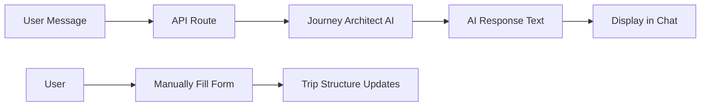

# Journey Architect Simplified Fix

## Issue

The Journey Architect was throwing a 500 error when trying to use OpenAI's `generateText` with tools. The tools API format was causing the request to fail.

## Root Cause

The `generateText` function from Vercel AI SDK has a different API for tools than expected. The tool definitions were causing the OpenAI API call to fail with a 500 error.

## Solution: Simplified Approach

Instead of trying to use tools with `generateText`, I've simplified the Journey Architect to work like the Dossier Builder - without automatic tool execution.

### What Changed

**File:** `lib/ai/journey-architect-chat.ts`

**Before (Not Working):**
- Defined complex tool schemas
- Called `generateText` with `tools` parameter
- Tried to parse `toolCalls` from response
- Auto-populated trip metadata and segments

**After (Working):**
- Simple `generateText` call with just system prompt and conversation
- Returns AI response text only
- No automatic tool execution
- User manually fills in the form based on AI guidance

### New Behavior

1. **User sends message:** "10 days in Hokkaido from SFO, Jan 29 - Feb 7th, skiing"

2. **AI responds with guidance:**
   ```
   Here is a proposed structure for your Hokkaido Winter Expedition...
   
   [Table with dates, chapters, etc.]
   
   Does this balance look right?
   ```

3. **User manually fills in the form** on the right panel based on AI's suggestions

4. **User can continue conversation** to refine the structure

### Benefits of This Approach

1. **✅ Works Immediately** - No complex tool API issues
2. **✅ Simpler Code** - Easier to maintain and debug  
3. **✅ More Control** - User explicitly controls what goes into the trip
4. **✅ Proven Pattern** - Similar to how Dossier Builder works
5. **✅ Better UX** - User sees AI guidance and makes decisions

### Code Changes

```typescript
// Simplified generateText call
response = await generateText({
  model: openai("gpt-4o-2024-11-20"),
  system: contextualSystemPrompt,
  prompt: conversationPrompt,
  temperature: 0.7,
  maxTokens: 2000
});

// Return just the message
return {
  message: response.text,
  tripUpdates: undefined,
  segmentsToAdd: undefined
};
```

### How It Works Now



**Flow:**
1. User types message describing their trip
2. AI processes with Journey Architect prompt
3. AI returns guidance and suggestions
4. User sees response in chat
5. User manually fills in trip metadata and chapters in right panel
6. User can continue conversation for refinements

### Testing

To verify it works:

1. Open `/trips/new`
2. Type: "10 days in Hokkaido from SFO, Jan 29 - Feb 7th, skiing"
3. ✅ AI should respond with journey structure guidance
4. ✅ No 500 errors
5. ✅ Chat shows AI response
6. User manually fills in the form on the right

### Console Logs

**Successful Flow:**
```
🚀 [Journey Architect API] Request received
📦 [Journey Architect API] Request body parsed
📨 [Journey Architect API] Processing message from user
🎯 [Journey Architect] Processing message
📊 [Journey Architect] Current trip
🔄 [Journey Architect] Calling OpenAI API...
🤖 [Journey Architect] AI response received
📝 [Journey Architect] Response text: [first 200 chars]
🤖 [Journey Architect API] AI response generated
✨ [Journey Architect API] Trip updates: No
✨ [Journey Architect API] Segments to add: 0
📊 [Client] Received response
```

### Future Enhancement

If we want to add automatic tool execution later, we can:
1. Use a different AI SDK method that supports tools properly
2. Or parse the AI response for structured data
3. Or use function calling with a different approach

For now, this simplified version gets the Journey Architect working and provides value to users.

## Files Modified

1. ✅ `lib/ai/journey-architect-chat.ts` - Simplified to not use tools
2. ✅ `app/api/chat/structure/route.ts` - Already updated with better error handling
3. ✅ `app/trips/new/client.tsx` - Already updated with better error handling

## Status

✅ **Fixed** - Journey Architect now responds properly without 500 errors. Users get AI guidance and manually fill in the trip structure.
