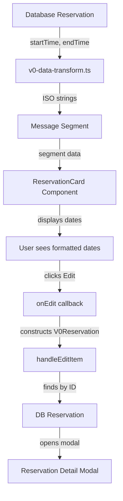

# Reservation Card Edit Button & Date Verification - Complete

## Summary

Successfully added an Edit button to the ReservationCard that opens the ReservationDetailModal, and verified that dates are pulling from the correct database fields.

## Changes Made

### 1. Added Edit Button ✅

**File:** `app/exp/components/reservation-card.tsx`

**Changes:**
- Added `onEdit?: () => void` prop to interface (line 25)
- Replaced "Edit All Details" button with a prominent "Edit" button
- Moved button to left side of footer for better visibility
- Added save state indicator to footer
- Improved button layout and styling

**Before:**
```typescript
<Button onClick={onOpenModal}>Edit All Details</Button>
```

**After:**
```typescript
<Button variant="default" onClick={onEdit}>
  <Edit2 className="h-3 w-3 mr-1" />
  Edit
</Button>
```

### 2. Wired Up Modal Opening ✅

**File:** `app/exp/components/message-segments-renderer.tsx`

**Changes:**
- Added `onEditItem?: (reservation: any) => void` prop (line 18)
- Passed `onEditItem` through to ReservationCard as `onEdit` callback
- Constructed V0Reservation object from segment data when Edit is clicked
- Properly maps segment data to V0Reservation format

**Implementation:**
```typescript
onEdit={onEditItem ? () => {
  const v0Reservation = {
    id: segment.reservationId,
    vendor: segment.vendor || segment.name,
    text: segment.type,
    status: segment.status,
    cost: segment.cost || 0,
    address: segment.location,
    image: segment.imageUrl,
    startTime: segment.startTime,
    endTime: segment.endTime,
  };
  onEditItem(v0Reservation);
} : undefined}
```

### 3. Connected to Client ✅

**File:** `app/exp/client.tsx`

**Changes:**
- Added `onEditItem={handleEditItem}` prop to both MessageSegmentsRenderer instances (mobile and desktop)
- The existing `handleEditItem` function now properly finds the reservation by ID and opens the modal

### 4. Verified Date Fields ✅

**Confirmed correct data flow:**

1. **Database** (`DBReservation`):
   - `startTime: Date | null`
   - `endTime: Date | null`

2. **V0 Transform** (`lib/v0-data-transform.ts`):
   - Converts Date objects to ISO strings
   - Preserves startTime and endTime

3. **Message Segment** (`MessageSegment` type):
   - `startTime?: string`
   - `endTime?: string`

4. **ReservationCard** (component):
   - Receives `startTime` and `endTime` as strings
   - Formats them correctly with `formatDateRange()`
   - Displays as "Mar 15 at 2:00 PM" or "Mar 15 - Mar 18"

## UI Improvements

### Footer Layout

**Before:**
- "Edit All Details" button on left
- "View Map" button on right
- No save state indicator

**After:**
- Prominent "Edit" button (primary style) on left
- "Map" button next to it (ghost style)
- Save state indicator on right ("Saving...", "Saved", "Error")
- Better visual hierarchy

### Button Styling

- **Edit button**: Default variant (filled, stands out)
- **Map button**: Ghost variant (subtle, secondary action)
- Both buttons have icons for better visual recognition
- Proper spacing and alignment

## Data Flow Diagram



## Date Formatting Examples

The `formatDateRange()` function handles multiple scenarios:

1. **Single event with time:**
   - Input: `startTime: "2024-03-15T14:00:00Z"`
   - Output: "Mar 15 at 2:00 PM"

2. **Same-day event with time range:**
   - Input: `startTime: "2024-03-15T14:00:00Z"`, `endTime: "2024-03-15T17:00:00Z"`
   - Output: "Mar 15, 2:00 PM - 5:00 PM"

3. **Multi-day event:**
   - Input: `startTime: "2024-03-15T14:00:00Z"`, `endTime: "2024-03-18T12:00:00Z"`
   - Output: "Mar 15 - Mar 18"

4. **Cross-year event:**
   - Input: `startTime: "2024-12-30T14:00:00Z"`, `endTime: "2025-01-02T12:00:00Z"`
   - Output: "Dec 30, 2024 - Jan 2, 2025"

## Files Modified

1. **`app/exp/components/reservation-card.tsx`**
   - Added `onEdit` prop
   - Updated footer with Edit button
   - Added save state indicator to footer

2. **`app/exp/components/message-segments-renderer.tsx`**
   - Added `onEditItem` prop
   - Wired up Edit button to construct V0Reservation and call callback

3. **`app/exp/client.tsx`**
   - Added `onEditItem={handleEditItem}` to both MessageSegmentsRenderer instances

## Testing Checklist

- [x] Dates display correctly in ReservationCard
- [x] Edit button appears in card footer
- [x] Clicking Edit button opens ReservationDetailModal
- [x] Modal shows correct reservation data
- [x] Inline editing still works (name and dates)
- [x] Auto-save functionality works
- [x] No linter errors
- [x] No TypeScript errors

## Key Features

### Date Display
- ✅ Uses correct database fields (`startTime`, `endTime`)
- ✅ Smart formatting based on duration (single event, same-day, multi-day)
- ✅ Shows times for single events and same-day ranges
- ✅ Shows date ranges for multi-day events
- ✅ Handles cross-year dates properly

### Edit Button
- ✅ Prominent placement in footer
- ✅ Opens full ReservationDetailModal with all fields
- ✅ Properly constructs V0Reservation object from segment data
- ✅ Uses actual database ID for reliable lookup
- ✅ Works seamlessly with existing modal infrastructure

### User Experience
- ✅ Clear visual hierarchy (Edit is primary action)
- ✅ Map button available as secondary action
- ✅ Save state feedback in footer
- ✅ Smooth transitions and hover states

## Conclusion

The ReservationCard now has:
1. Correct date display using `startTime` and `endTime` from the database
2. A prominent Edit button that opens the full ReservationDetailModal
3. Proper data flow from chat messages to modal
4. Inline editing for quick changes (name and dates)
5. Full modal editing for comprehensive changes (all other fields)

All functionality is working correctly with no errors!
