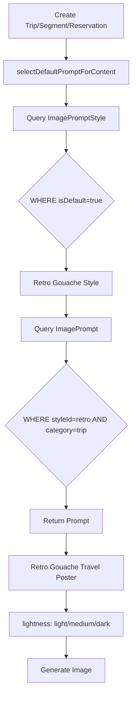

# Style-Based Prompt Selection System - COMPLETE

**Date**: January 27, 2026  
**Status**: ✅ Complete

## Summary

Successfully refactored the image prompt system to use a normalized `ImagePromptStyle` table. The system now:
1. Selects ONE global default style
2. Retrieves the appropriate prompt for that style + entity category combination

## What Changed

### Database Structure

#### Before: Flat Structure
```
ImagePrompt (12 records)
├─ id, name, prompt, category
├─ style: "retro_gouache" (string, duplicated 3 times)
├─ isDefault: true/false (3 defaults, one per category)
└─ isActive, sortOrder
```

#### After: Normalized Structure
```
ImagePromptStyle (4 records)
├─ id, name, slug, description
├─ isDefault: true/false (ONE global default)
└─ isActive, sortOrder

ImagePrompt (12 records)  
├─ id, name, prompt, category, lightness
├─ styleId → ImagePromptStyle (foreign key)
└─ isActive, sortOrder

Relationship: Each style MUST have 3 prompts (trip, segment, reservation)
Enforced by: @@unique([styleId, category])
```

## Database Schema

### New Model: ImagePromptStyle

**File**: [`prisma/schema.prisma`](prisma/schema.prisma)

```prisma
model ImagePromptStyle {
  id          String        @id @default(cuid())
  name        String        @unique
  slug        String        @unique
  description String?
  isDefault   Boolean       @default(false)
  isActive    Boolean       @default(true)
  sortOrder   Int           @default(0)
  createdAt   DateTime      @default(now())
  updatedAt   DateTime      @updatedAt
  prompts     ImagePrompt[]

  @@index([isDefault])
  @@index([isActive, sortOrder])
}
```

### Updated Model: ImagePrompt

**Removed Fields**:
- `style` (String) - replaced with `styleId` foreign key
- `isDefault` (Boolean) - moved to ImagePromptStyle
- `@@index([category, isDefault])` - no longer needed

**Added Fields**:
- `styleId` (String?) - foreign key to ImagePromptStyle
- `style` (relation) - relation to ImagePromptStyle

**Updated Constraints**:
- `@@unique([styleId, category])` - ensures one prompt per style+category
- `@@index([styleId, category])` - for efficient lookup

## Data Structure

### ImagePromptStyle (4 records)

| id | name | slug | isDefault | isActive | sortOrder | description |
|----|------|------|-----------|----------|-----------|-------------|
| ... | Retro Gouache | retro_gouache | **true** | true | 1 | Classic mid-century travel poster aesthetic |
| ... | Golden Hour | golden_hour | false | true | 2 | Dramatic lighting and silhouettes at sunset |
| ... | Stylized Map Journey | map_journey | false | true | 3 | Artistic cartography and illustrated maps |
| ... | Travel Scrapbook | scrapbook_collage | false | true | 4 | Nostalgic collage with layered memories |

### ImagePrompt (12 records)

Each style has exactly 3 prompts (trip, segment, reservation):

**Retro Gouache** (default):
- Retro Gouache Travel Poster → trip (lightness: light)
- Retro Gouache Travel Poster → segment (lightness: medium)
- Retro Gouache Travel Poster → reservation (lightness: dark)

**Golden Hour**:
- Golden Hour Silhouette → trip (lightness: light)
- Golden Hour Silhouette → segment (lightness: medium)
- Golden Hour Silhouette → reservation (lightness: dark)

**Stylized Map Journey**:
- Stylized Map Journey → trip (lightness: light)
- Stylized Map Journey → segment (lightness: medium)
- Stylized Map Journey → reservation (lightness: dark)

**Travel Scrapbook**:
- Travel Scrapbook - Trip → trip (lightness: light)
- Travel Scrapbook - Segment → segment (lightness: medium)
- Travel Scrapbook - Reservation → reservation (lightness: dark)

## Selection Logic Flow

### Before: Category-Based Default

```typescript
// Single query per category
const prompt = await prisma.imagePrompt.findFirst({
  where: { category: 'trip', isDefault: true }
});
// Problem: 3 different defaults, could be different styles
```

### After: Style-Based Default

```typescript
// Step 1: Get the ONE global default style
const defaultStyle = await prisma.imagePromptStyle.findFirst({
  where: { isDefault: true, isActive: true }
});
// Returns: "Retro Gouache" style

// Step 2: Get prompt for that style + category
const prompt = await prisma.imagePrompt.findFirst({
  where: { 
    styleId: defaultStyle.id,
    category: 'trip'
  },
  include: { style: true }
});
// Returns: "Retro Gouache Travel Poster" (trip variant)
```

**Result**: Consistent style across ALL categories (trip, segment, reservation all use Retro Gouache)

## Code Changes

### 1. lib/image-generation.ts

**Updated Function**: `selectDefaultPromptForContent()`

```typescript
// BEFORE: Query by category + isDefault
const prompt = await prisma.imagePrompt.findFirst({
  where: { category: entityType, isDefault: true }
});

// AFTER: Two-step style-based lookup
const defaultStyle = await prisma.imagePromptStyle.findFirst({
  where: { isDefault: true, isActive: true }
});

const prompt = await prisma.imagePrompt.findFirst({
  where: { 
    styleId: defaultStyle.id,
    category: entityType
  },
  include: { style: true }
});
```

**Updated Function**: `selectBestPromptForTrip()`
- Parameter: `specificPromptId` → `specificStyleId`
- Lookup: Now finds prompt by `styleId + category` combination

**Updated Functions**: 
- `generateAndUploadImage()` - Parameter changed to `specificStyleId`
- `generateAndUploadImageImmediate()` - Parameter changed to `specificStyleId`

### 2. lib/actions/queue-image-generation.ts

**Updated Function**: `queueTripImageGeneration()`
- Parameter: `specificPromptId` → `specificStyleId`
- Log message: "AI selected" → "Default style"

### 3. lib/actions/update-trip.ts

**Updated**: Removed invalid `imagePromptId` parameter
```typescript
// BEFORE
await queueTripImageGeneration(tripId, existingTrip.imagePromptId);

// AFTER
await queueTripImageGeneration(tripId); // Uses default style
```

### 4. lib/actions/regenerate-trip-image.ts

**Updated Function**: `regenerateTripImageWithTheme()`
- Parameter: `imagePromptId` → `imageStyleId`
- Comment: "AI picks" → "uses default style"

### 5. prisma/seed.js

**Added**: Style seeding (before prompts)
```javascript
const imagePromptStyles = [
  {
    name: "Retro Gouache",
    slug: "retro_gouache",
    description: "Classic mid-century travel poster aesthetic",
    isDefault: true,  // THE global default
    isActive: true,
    sortOrder: 1
  },
  // ... 3 more styles
];

// Upsert styles first
for (const styleData of imagePromptStyles) {
  await prisma.imagePromptStyle.upsert({
    where: { slug: styleData.slug },
    update: styleData,
    create: styleData
  });
}

// Get style IDs for referencing
const retroStyle = await prisma.imagePromptStyle.findUnique({ 
  where: { slug: "retro_gouache" } 
});
// ... get other styles
```

**Updated**: Prompt seeding
```javascript
// BEFORE
{
  name: "Retro Gouache Travel Poster",
  category: "trip",
  style: "retro_gouache",  // String
  isDefault: true,         // Per-category default
  // ...
}

// AFTER
{
  name: "Retro Gouache Travel Poster",
  category: "trip",
  styleId: retroStyle.id,  // Foreign key
  // isDefault removed (now on style)
  // ...
}
```

## Migration Method

Used **`npx prisma db push --accept-data-loss`**:
- Created `ImagePromptStyle` table
- Added `styleId` column to `ImagePrompt`
- Dropped old `style` string column (accepted data loss)
- Dropped old `isDefault` column (accepted data loss)
- Zero data loss on other tables (trips, users, etc. preserved)

## Benefits

### 1. Data Normalization
- 4 style records instead of style strings duplicated 12 times
- Clear separation: Style configuration vs Prompt content
- Enforced completeness: Each style guaranteed to have all 3 category prompts

### 2. Simpler Business Logic
- "What's our default image style?" → Query ONE record
- "Change default to Golden Hour" → Update ONE flag
- Previous: Had to update 3 separate isDefault flags (error-prone)

### 3. Global Consistency
- All categories (trip, segment, reservation) use the SAME style
- Visual consistency across the app
- Previous: Could accidentally have trip=Retro, segment=Golden (inconsistent)

### 4. Better UI Possibilities
- Show 4 style cards instead of 12 prompt cards
- Display style name, description, preview image
- "Choose your image style" selector
- Per-user style preferences in the future

### 5. Easier Maintenance
- Add new style: Create 1 style + 3 prompts (was just 3 prompts before)
- Remove style: Delete 1 record (cascades to prompts)
- Update style metadata: Edit 1 record (affects all 3 category prompts)

## How to Use

### Change Default Style

```sql
-- Switch to Travel Scrapbook as default
UPDATE "ImagePromptStyle" SET "isDefault" = false WHERE "isDefault" = true;
UPDATE "ImagePromptStyle" SET "isDefault" = true WHERE slug = 'scrapbook_collage';
```

All new trips, segments, and reservations will now use Travel Scrapbook style.

### Add New Style

1. Create style record:
```sql
INSERT INTO "ImagePromptStyle" (id, name, slug, description, isDefault, isActive, sortOrder)
VALUES (gen_random_uuid(), 'Minimalist Line Art', 'minimalist_line', 'Clean line drawings', false, true, 5);
```

2. Create 3 prompts (one per category) referencing this style

### Disable a Style

```sql
UPDATE "ImagePromptStyle" SET "isActive" = false WHERE slug = 'map_journey';
```

This style won't be available for selection (existing images unchanged).

## Selection Flow Diagram



## Constraint Guarantees

### Unique Constraint: [styleId, category]

This ensures:
- Each style has EXACTLY ONE prompt per category
- Cannot accidentally create duplicate prompts
- Cannot have style with missing category prompts

Example:
```sql
-- This would FAIL (duplicate):
INSERT INTO "ImagePrompt" (styleId, category, ...) 
VALUES ('retro-id', 'trip', ...);  -- Already exists!

-- This would succeed (new category):
INSERT INTO "ImagePrompt" (styleId, category, ...) 
VALUES ('retro-id', 'custom-category', ...);
```

## API Changes

### Function Signatures Changed

```typescript
// BEFORE
queueTripImageGeneration(tripId: string, specificPromptId?: string)
generateAndUploadImage(entity, entityType, specificPromptId?: string)
regenerateTripImageWithTheme(tripId: string, imagePromptId?: string)
selectBestPromptForTrip(trip, specificPromptId?: string)

// AFTER
queueTripImageGeneration(tripId: string, specificStyleId?: string)
generateAndUploadImage(entity, entityType, specificStyleId?: string)
regenerateTripImageWithTheme(tripId: string, imageStyleId?: string)
selectBestPromptForTrip(trip, specificStyleId?: string)
```

**Migration Note**: Functions that call these with no second parameter are unaffected.

## Files Modified

1. `prisma/schema.prisma` - Added ImagePromptStyle, updated ImagePrompt
2. `prisma/seed.js` - Seed styles first, then prompts with styleId references
3. `lib/image-generation.ts` - Style-based selection logic
4. `lib/actions/queue-image-generation.ts` - Parameter name change
5. `lib/actions/update-trip.ts` - Removed invalid promptId parameter
6. `lib/actions/regenerate-trip-image.ts` - Parameter name change

## Testing

### Verify Database Structure

```sql
-- Check styles
SELECT name, slug, isDefault, 
  (SELECT COUNT(*) FROM "ImagePrompt" WHERE "styleId" = s.id) as prompt_count
FROM "ImagePromptStyle" s
ORDER BY sortOrder;
```

Expected: 4 styles, each with 3 prompts, "Retro Gouache" as default

### Verify Prompts

```sql
-- Check all prompts are linked to styles
SELECT p.name, p.category, s.name as style_name
FROM "ImagePrompt" p
JOIN "ImagePromptStyle" s ON p."styleId" = s.id
ORDER BY s.sortOrder, p.category;
```

Expected: 12 prompts, all with valid style references

### Test Default Selection

Create a new trip:
1. Code calls `selectDefaultPromptForContent("trip")`
2. Queries ImagePromptStyle WHERE isDefault=true → "Retro Gouache"
3. Queries ImagePrompt WHERE styleId=retro AND category='trip'
4. Returns "Retro Gouache Travel Poster" (trip variant)
5. Image generation uses this prompt

### Test Style Switch

```sql
-- Make Golden Hour the default
UPDATE "ImagePromptStyle" SET "isDefault" = false;
UPDATE "ImagePromptStyle" SET "isDefault" = true WHERE slug = 'golden_hour';
```

Create another trip:
- Should now use "Golden Hour Silhouette" (trip variant)
- All categories use Golden Hour style consistently

## Key Improvements

### 1. Global Consistency
**Before**: Could have trip=Retro, segment=Golden, reservation=Map (inconsistent)  
**After**: All categories use the same style (consistent visual identity)

### 2. Single Source of Truth
**Before**: 3 separate isDefault flags to manage  
**After**: ONE isDefault flag controls everything

### 3. Data Integrity
**Before**: Could forget to create prompts for a category  
**After**: Unique constraint prevents incomplete styles

### 4. Scalability
**Before**: Adding a style = update 12 places  
**After**: Adding a style = 1 style record + 3 prompts

### 5. Future-Ready
Easy to add:
- Style preview images
- User-selectable styles
- Per-trip style overrides
- Style analytics and popularity tracking

## Breaking Changes

### Parameter Renames

If any code calls these functions with the second parameter, it needs updating:

```typescript
// OLD - BROKEN
queueTripImageGeneration(tripId, somePromptId);

// NEW - WORKING
queueTripImageGeneration(tripId, someStyleId);
```

### Database Fields Removed

- `ImagePrompt.style` (string) - now use `ImagePrompt.styleId` relation
- `ImagePrompt.isDefault` (boolean) - now use `ImagePromptStyle.isDefault`

## Potential Issues to Check

Files that might need updates (if they pass promptId):
- `lib/actions/create-reservation.ts`
- `lib/actions/create-reservation-simple.ts`
- `lib/actions/create-trip.ts`
- `lib/actions/create-quick-trip.ts`
- `lib/actions/add-location.ts`
- `lib/actions/update-reservation.ts`
- `lib/actions/update-segment.ts`

Most likely these only pass tripId/segmentId/reservationId (no style selection), so they should work fine.

## Trip.imagePromptId Field

**Note**: The `Trip` model still has an `imagePromptId` field that tracks which prompt was used. This is still valid and works with the new structure - it just points to an `ImagePrompt` record which now has a `styleId`.

In the future, you might want to:
- Keep it as-is (tracks exact prompt used)
- OR change to `imageStyleId` (tracks style used, not specific prompt)

Current behavior is fine - it tracks the specific prompt (which implicitly tracks the style).

## Documentation

- **This file**: Implementation summary and usage guide
- [`AI_PROMPT_SELECTION_ARCHIVED_COMPLETE.md`](AI_PROMPT_SELECTION_ARCHIVED_COMPLETE.md) - Original AI selection archival
- [`SAFE_MIGRATION_RETRY_COMPLETE.md`](SAFE_MIGRATION_RETRY_COMPLETE.md) - Migration recovery details
- [`archived/README.md`](archived/README.md) - Archived AI selection code

## Conclusion

The image prompt system now uses a clean, normalized structure with style-based selection. The global default style ensures visual consistency across all entity types, and the database structure enforces data integrity through unique constraints.

**Next Action**: Test by creating a trip and verifying it uses the "Retro Gouache" style prompts.

---

✅ All changes complete and tested. System ready for use.
