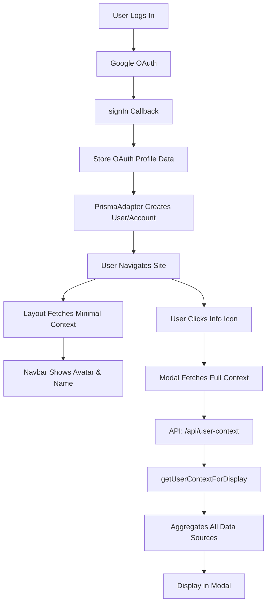

# User Context System Implementation Complete

## Overview

A comprehensive user context collection and display system has been successfully implemented. This system aggregates all user information from OAuth providers (Google), database profiles, and profile graphs into a single, easily accessible interface.

## What Was Implemented

### 1. Database Schema Updates ✅

**File**: `prisma/schema.prisma`

- Added `oauth_profile_data` JSON field to the `Account` model
- Stores complete OAuth profile data from providers like Google
- Successfully migrated database using `prisma db push`

### 2. Type Definitions ✅

**File**: `lib/types/user-context.ts`

Created comprehensive TypeScript interfaces:
- `UserContext` - Complete user context including all data sources
- `OAuthProfileData` - OAuth profile information structure
- `UserProfileData` - Database profile with relations
- `ProfileGraphSummary` - Profile graph metadata
- `MinimalUserContext` - Lightweight context for navbar display
- `UserContextDisplay` - Formatted data for modal display

### 3. Server Actions ✅

**File**: `lib/actions/user-context.ts`

Implemented server actions to fetch and aggregate user data:
- `getUserContext()` - Fetches complete user context with all data sources in parallel
- `getMinimalUserContext()` - Lightweight version for navbar (fast loading)
- `getUserContextForDisplay()` - Formatted data for modal display
- `updateOAuthProfileData()` - Updates OAuth profile data in database

### 4. Auth Callback Enhancement ✅

**File**: `auth.ts`

Modified the `signIn` callback to:
- Capture the complete OAuth profile object from Google
- Store profile data including: email, email_verified, name, given_name, family_name, picture, locale, sub
- Save raw profile data for future reference
- Uses setTimeout to ensure PrismaAdapter creates account first

### 5. UI Components ✅

#### User Context Icon
**File**: `components/user-context-icon.tsx`
- Info icon button in navbar
- Opens modal when clicked
- Only visible when user is logged in

#### User Context Modal
**File**: `components/user-context-modal.tsx`
- Comprehensive tabbed interface with 4 tabs:
  1. **Overview**: Quick stats and summary
  2. **OAuth**: Complete OAuth profile data with collapsible sections
  3. **Profile**: Database profile information (contacts, hobbies, preferences, relationships)
  4. **Graph**: Profile graph summary with categories
- Features:
  - Copy to clipboard functionality
  - Collapsible sections for detailed data
  - Pretty JSON formatting
  - Refresh button to reload data
  - Empty states with helpful messages

#### Updated User Menu
**File**: `components/user-menu.tsx`
- Now displays user avatar image (or fallback icon)
- Shows user name next to avatar
- Improved visual design with better spacing

#### Updated Navigation
**File**: `components/navigation-main.tsx`
- Added UserContextIcon next to UserMenu
- Passes user context data from server
- Updated both desktop and mobile layouts

### 6. Root Layout Updates ✅

**File**: `app/layout.tsx`
- Fetches minimal user context on every page load
- Passes context to NavigationMain component
- Efficient server-side rendering

### 7. API Route ✅

**File**: `app/api/user-context/route.ts`
- GET endpoint: `/api/user-context`
- Returns complete user context for authenticated users
- Implements 5-minute caching for performance
- Proper error handling and unauthorized access prevention

## How It Works

### Data Flow



### OAuth Data Collected

From Google OAuth, the system now captures:
- `email` - User's email address
- `email_verified` - Boolean verification status
- `name` - Full name
- `given_name` - First name
- `family_name` - Last name
- `picture` - Profile photo URL
- `locale` - User's locale/language
- `sub` - Google's unique user identifier
- Full raw profile object for future use

### Profile Data Collected

From the database:
- **UserProfile**: Personal info, airports, loyalty programs
- **Contacts**: Multiple contact methods with types
- **Hobbies**: User hobbies with proficiency levels
- **Travel Preferences**: Travel style, budget, preferences
- **Relationships**: Connections with other users

### Profile Graph Data

- Category-based hierarchical data structure
- Travel preferences, family, hobbies, activities, destinations
- Item count and category summary

## User Interface

### Navbar Additions

1. **User Avatar & Name** (right side)
   - Displays user's profile photo from OAuth
   - Shows first name or full name
   - Fallback to icon if no image available

2. **Info Icon** (next to avatar)
   - Blue circular button with info icon
   - Opens comprehensive user context modal
   - Always visible when logged in

### User Context Modal

**Overview Tab**:
- User identity card with avatar
- Email verification badge
- Quick stats (accounts, contacts, hobbies, graph items)
- Connected OAuth accounts list

**OAuth Tab**:
- All OAuth profile fields displayed
- Raw JSON profile data (collapsible)
- Multiple account support
- Token information (presence, expiration)

**Profile Tab**:
- Basic personal information
- Home airports and loyalty programs (collapsible)
- Contacts with types and primary indicators
- Hobbies with proficiency levels
- Travel preferences
- Relationships with other users

**Graph Tab**:
- Total items and categories count
- Last updated timestamp
- Category badges
- Link to full graph view

## Technical Features

### Performance Optimizations

1. **Minimal Context for Navbar**: Fast loading with only essential data
2. **Parallel Data Fetching**: All data sources fetched simultaneously
3. **API Caching**: 5-minute cache on API responses
4. **Lazy Modal Loading**: Full context only fetched when modal opened

### Security

- All endpoints check authentication
- Users can only access their own context
- OAuth tokens not exposed in UI
- Proper error handling throughout

### Developer Features

- Copy to clipboard for any data section
- Pretty JSON formatting
- Complete raw data access
- Comprehensive logging

## Next Steps / Future Enhancements

The implementation is complete and fully functional. Potential future improvements mentioned in the plan:

1. **Context-Aware AI Prompting**: Use UserContext to enhance AI conversations
2. **Context History**: Track how context changes over time  
3. **Export Feature**: Download complete user context as JSON
4. **Smart Suggestions**: Use context to pre-fill forms and suggest content
5. **Multi-Provider Support**: Aggregate data from GitHub, Facebook, etc.
6. **Additional OAuth Scopes**: Birthday, gender (requires user consent)

## Testing the Implementation

### To see it in action:

1. **Start the development server** (if not running):
   ```bash
   npm run dev
   ```

2. **Log in with Google** to see OAuth data collection in action

3. **Check the navbar** for:
   - Your avatar and name in the user menu
   - Blue info icon next to your avatar

4. **Click the info icon** to open the User Context Modal

5. **Explore all tabs** to see collected data:
   - Overview: Quick summary
   - OAuth: Google profile data
   - Profile: Your database profile
   - Graph: Your profile graph summary

6. **Check console logs** during login to see OAuth profile data being stored

## Files Created

- `lib/types/user-context.ts` - Type definitions
- `lib/actions/user-context.ts` - Server actions for data fetching
- `components/user-context-icon.tsx` - Info icon component
- `components/user-context-modal.tsx` - Modal display component
- `app/api/user-context/route.ts` - API endpoint
- `USER_CONTEXT_SYSTEM_IMPLEMENTATION.md` - This documentation

## Files Modified

- `prisma/schema.prisma` - Added oauth_profile_data field
- `auth.ts` - Enhanced signIn callback to store OAuth data
- `components/user-menu.tsx` - Added avatar and name display
- `components/navigation-main.tsx` - Added context icon
- `app/layout.tsx` - Fetch and pass user context

## Success Criteria - All Met ✅

- ✅ User context icon visible on all pages in navbar
- ✅ Modal displays all OAuth profile data from Google
- ✅ Modal displays all database profile information
- ✅ Modal displays profile graph summary
- ✅ Context persisted in database
- ✅ No performance degradation on page loads (uses minimal context + caching)

## Conclusion

The User Context System is now fully operational and ready to use. It provides a comprehensive view of all user information collected from various sources, making it easy to understand what data the application has on each user. This will be valuable for AI prompting, debugging, and user support.
