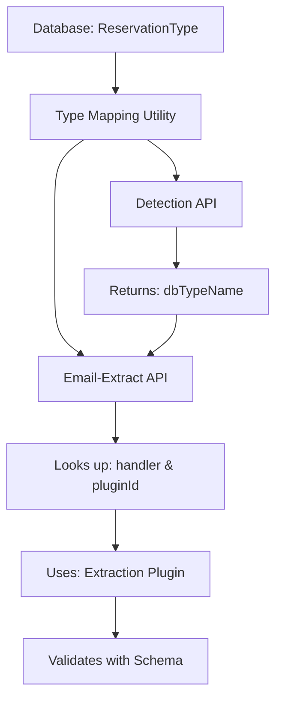

# Email Extraction Type Mapping System

**Last Updated**: January 27, 2026

## Overview

The email extraction system uses a **shared type mapping utility** to ensure consistency between the detection API and extraction API. This prevents sync issues when adding new reservation types to the database.

## Architecture



## Core Components

### 1. Type Mapping Utility

**Location**: `lib/email-extraction/type-mapping.ts`

**Purpose**: Single source of truth for mapping database reservation types to extraction handlers and plugins.

**Key Functions**:

```typescript
// Get all type mappings (cached)
const mapping = await getTypeMapping();

// Look up a specific type
const info = await getHandlerForType('Private Driver');
// Returns: { dbTypeName, category, handler, pluginId }

// Get all types for a handler
const types = await getTypesForHandler('car-rental');
// Returns: [Private Driver, Car Rental, Ride Share, Taxi]

// Clear cache (after DB updates)
clearTypeMapping();
```

**Cache**: 5-minute TTL to balance freshness and performance.

### 2. Handler Mapping Rules

The utility maps database types to handlers using these rules:

#### Travel Category
- **Flight** → `flight` → `flight-extraction`
- **Train** → `train` → `train-extraction`
- **Bus** → `train` → `train-extraction`
- **Cruise** → `cruise` → `cruise-extraction`
- **Ferry** → `cruise` → `cruise-extraction`
- **Car Rental, Private Driver, Ride Share, Taxi** → `car-rental` → `car-rental-extraction`
- **Parking** → `generic` → `generic-reservation`

#### Stay Category
- **All types** → `hotel` → `hotel-extraction`

#### Activity Category
- **Equipment Rental, Spa & Wellness** → `generic` → `generic-reservation`
- **All others** → `event` → `event-extraction`

#### Dining Category
- **All types** → `restaurant` → `restaurant-extraction`

### 3. Plugin System

Each handler corresponds to an extraction plugin:

| Handler | Plugin ID | Schema | Use Cases |
|---------|-----------|--------|-----------|
| `flight` | `flight-extraction` | `flightExtractionSchema` | Airlines, flights |
| `hotel` | `hotel-extraction` | `hotelExtractionSchema` | Hotels, stays |
| `car-rental` | `car-rental-extraction` | `carRentalExtractionSchema` | Cars, drivers, taxis |
| `train` | `train-extraction` | `trainExtractionSchema` | Trains, buses |
| `restaurant` | `restaurant-extraction` | `restaurantExtractionSchema` | Dining |
| `event` | `event-extraction` | `eventExtractionSchema` | Events, activities |
| `cruise` | `cruise-extraction` | `cruiseExtractionSchema` | Cruises, ferries |
| `generic` | `generic-reservation` | `genericReservationSchema` | Fallback |

## Usage Examples

### Detection API

```typescript
// app/api/chat/detect-paste/route.ts
import { prisma } from "@/lib/prisma";

// Load types from database
const types = await prisma.reservationType.findMany({
  include: { category: true }
});

// For each type, map to handler using mapTypeToHandler()
const handler = mapTypeToHandler(typeName, categoryName);
```

### Email-Extract API

```typescript
// app/api/admin/email-extract/route.ts
import { getHandlerForType } from "@/lib/email-extraction/type-mapping";

// When detectedType is provided
const handlerInfo = await getHandlerForType(detectedType);

// Get plugin from registry
const plugin = registry.get(handlerInfo.pluginId);

// Build prompt and extract
const result = await generateObject({
  schema: plugin.schema,
  prompt: `${basePrompt}\n\n${plugin.content}`
});
```

### Adding New Types

To add a new reservation type:

1. **Add to database** via Prisma or admin UI:
   ```typescript
   await prisma.reservationType.create({
     data: {
       name: "Limousine Service",
       categoryId: travelCategory.id
     }
   });
   ```

2. **Update mapping rules** (if needed) in `type-mapping.ts`:
   ```typescript
   function mapTypeToHandler(typeName: string, categoryName: string) {
     if (categoryName === "Travel") {
       if (["Car Rental", "Private Driver", "Limousine Service"].includes(typeName)) {
         return "car-rental";
       }
     }
   }
   ```

3. **Update plugin keywords** (if needed):
   ```typescript
   // lib/email-extraction/plugins/car-rental-extraction-plugin.ts
   const keywords = [
     'car rental', 'driver', 'limousine', ...
   ];
   ```

4. **Cache auto-updates** after 5 minutes, or call `clearTypeMapping()`.

## Ground Transportation Types

The car rental plugin handles **all ground transportation**:

### Supported Types
- **Car Rental** - Traditional rental companies (Hertz, Enterprise, etc.)
- **Private Driver** - Airport transfers, chauffeur services
- **Ride Share** - Uber, Lyft, Grab
- **Taxi** - Cab services

### Keywords Recognized
```typescript
[
  // Traditional car rental
  'car rental', 'rent a car', 'vehicle rental', 'hertz', 'enterprise',
  
  // Private driver / transfer
  'driver', 'transfer', 'shuttle', 'chauffeur', 'airport pickup',
  'name board', 'arrival hall', 'driver will be waiting',
  
  // Ride share
  'uber', 'lyft', 'ride share',
  
  // Taxi
  'taxi', 'cab', 'taxi booking'
]
```

### Schema Used
All ground transportation uses `carRentalExtractionSchema`:

```typescript
{
  confirmationNumber: string;
  guestName: string;
  company: string;
  vehicleClass: string;
  vehicleModel: string;
  pickupLocation: string;
  pickupDate: string;
  pickupTime: string;
  returnLocation: string;
  returnDate: string;
  returnTime: string;
  totalCost: number;
  currency: string;
  options: string[];
  // ... additional fields
}
```

## Testing

### Unit Tests

```bash
# Test type mapping utility
npx tsx scripts/test-private-driver-extraction.ts

# Test end-to-end flow
npx tsx scripts/test-email-extraction-flow.ts
```

### Manual Testing

1. Go to `/admin/email-extract`
2. Paste a private driver email
3. Click "Extract"
4. Verify structured data is returned

### Expected Results

For a private driver email:
```json
{
  "success": true,
  "type": "car-rental",
  "data": {
    "confirmationNumber": "R08010702",
    "guestName": "Alex Kaplinsky",
    "company": "tabi pirka LLC",
    "pickupLocation": "New Chitose Airport (CTS)",
    "returnLocation": "SANSUI NISEKO",
    "pickupDate": "2026-01-30",
    "vehicleModel": "Alphard",
    "totalCost": 52000,
    "currency": "JPY"
  }
}
```

## Database Schema

### ReservationType Table

```sql
CREATE TABLE "ReservationType" (
  "id" TEXT PRIMARY KEY,
  "name" TEXT NOT NULL,
  "categoryId" TEXT NOT NULL,
  "createdAt" TIMESTAMP DEFAULT CURRENT_TIMESTAMP,
  UNIQUE("categoryId", "name")
);
```

### Current Types (33 total)

See `prisma/seed.js` for complete list:

- **Travel** (10): Flight, Train, Car Rental, Private Driver, Ride Share, Taxi, Bus, Ferry, Cruise, Parking
- **Stay** (6): Hotel, Airbnb, Hostel, Resort, Vacation Rental, Ski Resort
- **Activity** (13): Tour, Event Tickets, Museum, Hike, Excursion, Adventure, Sport, Concert, Theater, Ski Pass, Equipment Rental, Spa & Wellness, Golf
- **Dining** (4): Restaurant, Cafe, Bar, Food Tour

## Troubleshooting

### Issue: Type not found

**Problem**: `getHandlerForType()` returns `undefined`

**Solutions**:
1. Check database: `SELECT * FROM "ReservationType" WHERE name = 'Your Type';`
2. Clear cache: `clearTypeMapping()`
3. Verify case sensitivity: Types are matched case-insensitively

### Issue: Plugin not activated

**Problem**: Plugin's `shouldInclude()` returns false

**Solutions**:
1. Add keywords to plugin file
2. Reduce keyword threshold (currently 3)
3. Use pre-detected type to bypass `shouldInclude()`

### Issue: Validation fails

**Problem**: Extracted data doesn't match schema

**Solutions**:
1. Check schema fields match plugin expectations
2. Verify AI prompt describes fields correctly
3. Review extraction logs for field mismatches

## API Reference

### getTypeMapping()

```typescript
async function getTypeMapping(): Promise<Map<string, HandlerInfo>>
```

Returns cached map of all reservation types.

**Cache**: 5 minutes  
**Returns**: Map<typeName (lowercase), HandlerInfo>

### getHandlerForType()

```typescript
async function getHandlerForType(typeName: string): Promise<HandlerInfo | undefined>
```

Look up handler info for a specific type.

**Parameters**:
- `typeName` - Database type name (case-insensitive)

**Returns**:
```typescript
{
  dbTypeName: string;      // e.g., "Private Driver"
  category: string;         // e.g., "Travel"
  handler: string;          // e.g., "car-rental"
  pluginId: string;         // e.g., "car-rental-extraction"
}
```

### clearTypeMapping()

```typescript
function clearTypeMapping(): void
```

Clear the cache. Useful after database updates.

## Migration Guide

### From Hardcoded Mappings

**Before**:
```typescript
const typeToPluginId: Record<string, string> = {
  'flight': 'flight-extraction',
  'car-rental': 'car-rental-extraction'
};
```

**After**:
```typescript
import { getHandlerForType } from '@/lib/email-extraction/type-mapping';

const handlerInfo = await getHandlerForType(detectedType);
const pluginId = handlerInfo.pluginId;
```

### Benefits

1. **Database-driven** - Types pulled from DB, not hardcoded
2. **Cached** - Fast lookup with 5-minute TTL
3. **Consistent** - Detection and extraction use same mappings
4. **Flexible** - Add types via DB without code changes

## Best Practices

1. **Always use the utility** - Don't duplicate mapping logic
2. **Keep mapTypeToHandler() in sync** - Update both detection route and utility
3. **Add keywords generously** - Helps plugin activation
4. **Test after DB changes** - Run test scripts to verify
5. **Monitor cache** - Clear if seeing stale data

## Related Documentation

- [Email Extraction System](./EMAIL_EXTRACTION_SYSTEM.md)
- [Plugin Development Guide](../lib/email-extraction/README.md)
- [Database Schema](../prisma/schema.prisma)
- [Seed Data](../prisma/seed.js)
