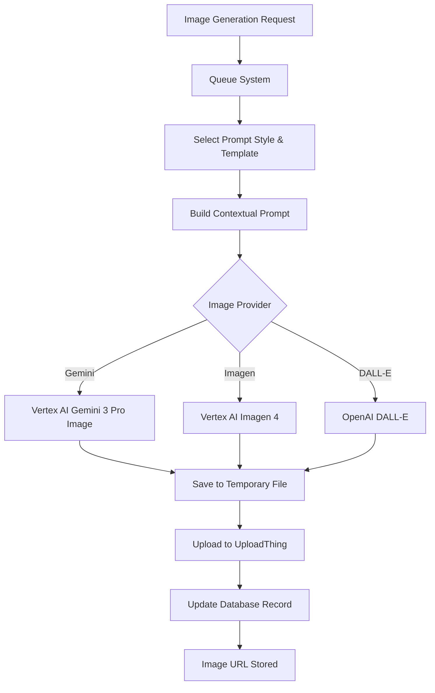

# Image Generation System Documentation

**Last Updated**: January 27, 2026  
**Status**: ✅ Active and Working

## Overview

This document describes the complete image generation pipeline, including configuration, file paths, and critical integration points. **Read this before making ANY changes to the image generation system.**

---

## Architecture Overview



---

## Critical File Paths

### ⚠️ IMPORTANT: Path Consistency

All image generation components MUST use consistent paths. Any mismatch will cause 404 errors.

| Component | Path | Purpose |
|-----------|------|---------|
| **Vertex AI Client (Save)** | `app/api/imagen/output/` | Where generated images are saved temporarily |
| **Image Serving Route (Read)** | `app/api/imagen/output/` | Where the API route reads images from |
| **Frontend Request** | `/api/imagen/output/[filename]` | URL pattern the browser requests |

### Path Configuration Locations

1. **Generator Path** - `archived/image-generator/lib/vertex-ai-client.ts` (Line ~222)
   ```typescript
   const outputPath = join(process.cwd(), "app", "api", "imagen", "output", outputFilename);
   ```

2. **Server Path** - `app/api/imagen/output/[filename]/route.ts` (Line ~22)
   ```typescript
   const imagePath = join(process.cwd(), "app", "api", "imagen", "output", filename);
   ```

3. **API Response** - `app/api/admin/test/imagen-generate/route.ts` (Line ~62)
   ```typescript
   const imageUrl = `/api/imagen/output/${actualFilename}`;
   ```

### ❌ DO NOT USE These Old Paths

- `image-generator/output/` - **ARCHIVED**, will cause 404 errors
- `archived/image-generator/output/` - **ARCHIVED**, only for reference
- `public/images/` - Only for static assets, not generated images

---

## Environment Configuration

### Required Environment Variables

```bash
# .env file

# Image Provider Selection
IMAGE_PROVIDER=imagen                    # Options: 'imagen', 'dalle'

# Google Cloud / Vertex AI Configuration
GOOGLE_CLOUD_PROJECT=travel-planer-v1    # Your GCP project ID
GOOGLE_CLOUD_LOCATION=global             # MUST be 'global' for Gemini 3 Pro Image
GOOGLE_APPLICATION_CREDENTIALS=.gcloud/service-account.json
IMAGEN_MODEL=gemini-3-pro-image-preview  # Current model
IMAGEN_RPM_LIMIT=5                       # Rate limit (requests per minute)

# OpenAI (if using DALL-E)
OPENAI_API_KEY=sk-...                    # OpenAI API key
```

### ⚠️ Critical: Location Configuration

**For Gemini 3 Pro Image:**
- ✅ **MUST use** `GOOGLE_CLOUD_LOCATION=global`
- ❌ **DO NOT use** `us-central1` or other regional endpoints
- Reason: Gemini 3 Pro Image is only available via the global endpoint

**Endpoint URLs:**
- Global: `https://aiplatform.googleapis.com/v1/...`
- Regional: `https://{region}-aiplatform.googleapis.com/v1/...`

The code automatically detects the location and constructs the correct endpoint URL:

```typescript
// archived/image-generator/lib/vertex-ai-client.ts
const baseUrl = this.location === 'global' 
  ? 'https://aiplatform.googleapis.com'
  : `https://${this.location}-aiplatform.googleapis.com`;
```

---

## Image Generation Flow

### 1. Queue-Based Generation (Production)

**Entry Points:**
- `lib/actions/queue-image-generation.ts` - Queue creation functions
- `scripts/process-queue-loop.ts` - Background queue processor
- `app/api/process-image-queue/route.ts` - HTTP endpoint for queue processing

**Flow:**
```
User Action → queueTripImageGeneration() 
           → Create ImageGenerationQueue record (status: 'waiting')
           → Background processor picks up queue item
           → Generate image via generateAndUploadImageImmediate()
           → Upload to UploadThing
           → Update Trip/Segment/Reservation with imageUrl
           → Mark queue item as 'completed'
```

### 2. Immediate Generation (Admin/Testing)

**Entry Point:**
- `app/api/admin/test/imagen-generate/route.ts`

**Flow:**
```
Admin Page → POST /api/admin/test/imagen-generate
          → getVertexAIClient().generateImage()
          → Save to app/api/imagen/output/
          → Return URL: /api/imagen/output/[filename]
          → Frontend displays via GET /api/imagen/output/[filename]
```

### 3. Image Serving

**Route:** `app/api/imagen/output/[filename]/route.ts`

**Flow:**
```
Browser Request → GET /api/imagen/output/admin-test-xxx.png
               → Validate filename (security check)
               → Read from app/api/imagen/output/
               → Return image buffer with proper headers
```

---

## Prompt Selection System

### Database Schema

```sql
-- Style definitions (themes)
ImagePromptStyle {
  id          String   @id @default(cuid())
  name        String   @unique
  description String?
  isDefault   Boolean  @default(false)  -- Only ONE style should be default
  isActive    Boolean  @default(true)
  sortOrder   Int      @default(0)
}

-- Specific prompts for each category within a style
ImagePrompt {
  id        String    @id @default(cuid())
  name      String    @unique
  prompt    String    @db.Text
  category  String                      -- 'trip', 'segment', 'reservation'
  styleId   String
  style     ImagePromptStyle @relation
  
  @@unique([styleId, category])  -- One prompt per category per style
}
```

### Selection Logic

**Default Selection:**
1. Find the style where `isDefault = true` and `isActive = true`
2. Within that style, find the prompt where `category = entityType`
3. Use that prompt template

**Code Location:** `lib/image-generation.ts` → `selectDefaultPromptForContent()`

```typescript
// 1. Get default style
const defaultStyle = await prisma.imagePromptStyle.findFirst({
  where: { isDefault: true, isActive: true }
});

// 2. Get prompt for this category within the style
const prompt = await prisma.imagePrompt.findFirst({
  where: {
    styleId: defaultStyle.id,
    category: entityType,
    isActive: true
  }
});
```

### Prompt Template System

Prompts use a placeholder system for dynamic content:

```
Create a vintage travel poster...

RULES: NO text, logos, modern elements...

TRAVEL CONTEXT TO VISUALIZE:
```

The `buildContextualPrompt()` function replaces the placeholder with actual trip/segment/reservation data:

```typescript
return template.replace(
  "TRAVEL CONTEXT TO VISUALIZE:", 
  `TRAVEL CONTEXT TO VISUALIZE:\n${travelContext}`
);
```

⚠️ **BUG TO AVOID:** Don't append `travelContext` twice (was causing prompts >4000 chars)

---

## Models and Capabilities

### Current Models

| Model | ID | Provider | Best For | Text Support |
|-------|-----|----------|----------|--------------|
| **Gemini 3 Pro Image** | `gemini-3-pro-image-preview` | Vertex AI | Text rendering, posters, complex layouts | ⭐⭐⭐ Excellent |
| Imagen 4 | `imagen-4.0-generate-001` | Vertex AI | Fast generation, artistic images | ⭐⭐ Good |
| DALL-E 3 | `dall-e-3` | OpenAI | Creative concepts | ⭐⭐ Good |

### Model Metadata

**Location:** `lib/utils/model-pricing.ts`

Contains pricing, performance tiers, and supported aspect ratios for each model.

---

## Common Issues and Solutions

### Issue 1: Image Not Appearing (404)

**Symptoms:**
- Image generates successfully (200 response)
- But doesn't appear in UI
- Browser shows 404 for `/api/imagen/output/[filename]`

**Root Cause:** Path mismatch between generator and server

**Solution:**
1. Check `archived/image-generator/lib/vertex-ai-client.ts` line ~222
2. Check `app/api/imagen/output/[filename]/route.ts` line ~22
3. Ensure both use `app/api/imagen/output/`

### Issue 2: Model Not Found (404 from Vertex AI)

**Symptoms:**
- `Publisher Model not found` error
- Status 404 from Vertex AI API

**Root Cause:** Model not available in configured location

**Solution:**
1. Check `.env` → `GOOGLE_CLOUD_LOCATION`
2. For Gemini 3 Pro Image, must use `global`
3. Verify model availability: [Google's location docs](https://docs.cloud.google.com/vertex-ai/generative-ai/docs/learn/locations)

### Issue 3: Prompt Too Long (400)

**Symptoms:**
- `string too long. Expected maximum length 4000`
- Error from Vertex AI

**Root Causes:**
- Duplicate `travelContext` appended in `buildContextualPrompt()`
- Overly verbose prompt templates

**Solution:**
1. Check `lib/image-generation.ts` → `buildContextualPrompt()`
2. Ensure only ONE replacement of placeholder
3. Consider shortening base templates in `prisma/seed.js`

### Issue 4: Directory Not Found (ENOENT)

**Symptoms:**
- `ENOENT: no such file or directory, open '.../image-generator/output/...'`

**Root Cause:** Using archived path

**Solution:**
1. Update path to `app/api/imagen/output/`
2. Ensure directory exists (should be committed to repo)

---

## Testing

### Admin Test Page

**URL:** `/admin/apis/imagen`

**Features:**
- Single image generation with custom prompts
- Batch generation testing
- Model selection (Gemini vs Imagen)
- Aspect ratio testing
- Travel poster presets with text

**Test Checklist:**
- [ ] Generate single image (should appear in <5 seconds)
- [ ] Image displays correctly in UI
- [ ] Image is downloadable
- [ ] File exists in `app/api/imagen/output/`
- [ ] Prompts with text render correctly (Gemini)

### Production Test

**Location:** `/manage` → Image Recovery Tool

**Flow:**
1. Find trips/segments/reservations without images
2. Select items to regenerate
3. Add to queue
4. Monitor queue processing
5. Verify images appear on entities

---

## Monitoring and Logs

### Key Log Points

1. **Prompt Selection**
   ```
   [selectDefaultPromptForContent] Looking for default style...
   [selectDefaultPromptForContent] Found default style: Travel Scrapbook
   [selectDefaultPromptForContent] Found prompt: Travel Scrapbook - Trip
   ```

2. **Image Generation**
   ```
   [generateImageWithImagen] Starting image generation...
   [generateImageWithImagen] Prompt length: 1234 chars
   [VertexAI] Making API call to Vertex AI...
   [VertexAI] Image data extracted, length: 2157792 chars
   [generateImageWithImagen] Image generated successfully
   ```

3. **API Response**
   ```
   [Admin Imagen Generate] Result: { success: true, hasImagePath: true }
   POST /api/admin/test/imagen-generate 200 in 45861ms
   ```

### Debugging Commands

```bash
# Check if generated images exist
ls -lht app/api/imagen/output/ | head -10

# Monitor queue processing
tail -f terminals/[queue-processor-terminal].txt

# Check for path errors
grep -r "image-generator/output" . --include="*.ts" --exclude-dir=node_modules
# Should return NO matches (all should use app/api/imagen/output)
```

---

## Migration Notes

### From Old System (Pre-January 2026)

**Old Paths (DO NOT USE):**
- `image-generator/` → Moved to `archived/image-generator/`
- `image-generator/output/` → Now `app/api/imagen/output/`

**Old Models:**
- `imagen-4.0-generate-001` in `us-central1` → Still works for Imagen
- Gemini required migration to `global` location

**Breaking Changes:**
- All paths must be updated to `app/api/imagen/output/`
- Gemini requires `global` location
- Endpoint construction changed for global support

---

## Related Documentation

- [`GEMINI_GLOBAL_LOCATION_FIX_COMPLETE.md`](../GEMINI_GLOBAL_LOCATION_FIX_COMPLETE.md) - Recent location fix
- [`STRUCTURED_OUTPUTS_MIGRATION_COMPLETE.md`](../STRUCTURED_OUTPUTS_MIGRATION_COMPLETE.md) - Prompt schema migration
- [`prisma/seed.js`](../prisma/seed.js) - Current prompt templates
- [Google Vertex AI Locations](https://docs.cloud.google.com/vertex-ai/generative-ai/docs/learn/locations) - Official model availability

---

## Maintenance Checklist

Before making changes to the image generation system:

- [ ] Read this document completely
- [ ] Verify current `GOOGLE_CLOUD_LOCATION` setting
- [ ] Check all path references are consistent
- [ ] Test on admin page before production
- [ ] Monitor queue processing for errors
- [ ] Update this document with any changes

---

## Contact and Support

**System Owner**: Development Team  
**Last Major Update**: January 27, 2026 (Gemini 3 Pro Image migration)  
**Next Review**: When adding new models or changing architecture

