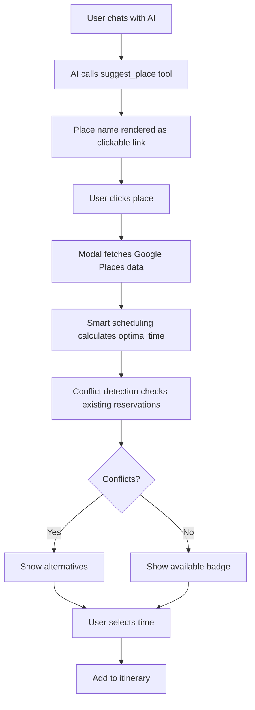

# Google Places API & Smart Scheduling Integration

This document describes the Google Places API integration and smart scheduling features in the Travel Planner application.

## Overview

The application now features:

1. **Clickable Place Suggestions** - AI-suggested places appear as interactive links in chat
2. **Google Places API Integration** - Real-time place data with photos, ratings, and contact info
3. **Smart Scheduling with Conflict Detection** - Automatic time optimization with conflict warnings
4. **Alternative Time Slots** - Suggested alternatives when scheduling conflicts occur
5. **Enhanced Chat Experience** - Context-aware welcome messages and trip-specific suggestions

## Features

### 1. Clickable Place Suggestions

When the AI suggests a place (restaurant, hotel, activity, etc.), the place name appears as a clickable link with a visual indicator (✨ or 📍 icon).

**Implementation:**
- [`components/chat-interface.tsx`](../components/chat-interface.tsx) - Standalone chat interface
- [`app/experience-builder/client.tsx`](../app/experience-builder/client.tsx) - Experience builder chat

**How it works:**
- The `suggest_place` AI tool creates structured suggestions
- The `renderTextWithPlaceLinks` function converts place names to clickable buttons
- Clicking opens a modal with detailed place information

### 2. Google Places API Integration

Fetches real-time place data including:
- Photos
- Ratings and reviews
- Contact information (phone, website)
- Opening hours
- Price level
- Full address with map link

**Implementation:**
- [`lib/actions/google-places.ts`](../lib/actions/google-places.ts) - Server actions for Places API
- [`app/api/places/route.ts`](../app/api/places/route.ts) - API endpoint
- [`lib/types/place-suggestion.ts`](../lib/types/place-suggestion.ts) - Type definitions

**Environment Variables:**
```bash
GOOGLE_PLACES_API_KEY=your_places_api_key
GOOGLE_MAPS_API_KEY=your_maps_api_key
```

### 3. Smart Scheduling System

Automatically suggests optimal times for activities based on:
- Existing reservations and conflicts
- Activity type defaults (breakfast at 8am, dinner at 7pm, etc.)
- User preferences from chat context
- Available time slots with buffer periods

**Implementation:**
- [`lib/smart-scheduling.ts`](../lib/smart-scheduling.ts) - Core scheduling logic
- [`lib/smart-scheduling-helpers.ts`](../lib/smart-scheduling-helpers.ts) - Helper functions
- [`lib/actions/check-conflicts.ts`](../lib/actions/check-conflicts.ts) - Conflict detection server actions

**Algorithm:**
Three-tier priority system:
1. **Context from chat** - Uses exact times if user specifies (e.g., "Day 2 at 7pm")
2. **Day specified, time flexible** - Finds best slot on that day
3. **Smart auto-scheduling** - Finds optimal day and time across entire trip

### 4. Conflict Detection & Resolution

**Visual Indicators:**
- ✅ Green badge: No conflicts, time slot available
- ⚠️ Amber badge: Conflict detected with existing reservations
- Lists all conflicting reservations with details

**Alternative Suggestions:**
When conflicts exist, the system automatically suggests 2-3 alternative time slots:
- Closest to preferred time
- Next available slot
- Alternative options with explanations

**Implementation:**
- [`components/conflict-indicator.tsx`](../components/conflict-indicator.tsx) - Conflict display component
- [`components/alternative-time-slots.tsx`](../components/alternative-time-slots.tsx) - Alternative slots UI
- [`components/suggestion-detail-modal.tsx`](../components/suggestion-detail-modal.tsx) - Integrated modal

### 5. Suggestion Detail Modal

Comprehensive modal for adding places to itinerary:

**Features:**
- Place photos from Google Places
- Ratings and reviews
- Contact options (call, website)
- Smart scheduling recommendations with prominent visual
- Conflict detection in real-time
- Alternative time suggestions
- Cost estimation
- Day and time selectors

**Implementation:**
- [`components/suggestion-detail-modal.tsx`](../components/suggestion-detail-modal.tsx)

### 6. Chat Context Components

**Chat Welcome Message:**
- Personalized greeting with user's name
- Hobby-based suggestions
- Recent trip context
- Example prompts

**Chat Context Welcome (Trip-Specific):**
- Trip title and dates
- Context-aware suggestions based on what's missing:
  - Add flights
  - Find accommodations
  - Add restaurants
  - Suggest activities
  - Optimize schedule
  - Budget analysis

**Implementation:**
- [`components/chat-welcome-message.tsx`](../components/chat-welcome-message.tsx) - General welcome
- [`components/chat-context-welcome.tsx`](../components/chat-context-welcome.tsx) - Trip-specific welcome

## Usage

### For Users

1. **Getting Place Suggestions:**
   - Chat with the AI: "Suggest restaurants in Rome"
   - Place names appear as clickable blue links with icons
   - Click any place name to see details

2. **Adding to Itinerary:**
   - Click a suggested place
   - Review Google Places data (photos, ratings, etc.)
   - Check the smart scheduling suggestion
   - If conflicts exist, review alternatives
   - Adjust day, time, or cost as needed
   - Click "Add to Itinerary"

3. **Resolving Conflicts:**
   - Warning appears if selected time conflicts
   - See which reservations conflict
   - Click suggested alternatives to auto-select
   - Times update in real-time

### For Developers

**Testing the Integration:**

```bash
# Test Google Places API
npm run test-places

# Start dev server
npm run dev
```

**Adding New Place Categories:**

Update the AI prompts in [`lib/ai/prompts.ts`](../lib/ai/prompts.ts) to include new categories.

**Customizing Scheduling Defaults:**

Edit the `getDefaultTimeForType` function in [`lib/smart-scheduling.ts`](../lib/smart-scheduling.ts).

**Extending Conflict Detection:**

Add new conflict types in [`lib/actions/check-conflicts.ts`](../lib/actions/check-conflicts.ts).

## Architecture

### Data Flow



### Component Hierarchy

```
ChatInterface / ExperienceBuilder
├── ChatWelcomeMessage (empty state)
├── ChatContextWelcome (trip-specific)
├── Messages with renderTextWithPlaceLinks
│   └── Clickable place buttons
└── SuggestionDetailModal
    ├── Google Places data display
    ├── Smart scheduling reason (prominent)
    ├── Day/time selectors
    ├── ConflictIndicator
    └── AlternativeTimeSlots
```

## API Reference

### Google Places Actions

**`searchPlace(placeName: string, locationContext?: string)`**
- Searches for a place using Google Places API
- Returns comprehensive place data with photos
- Used by `/api/places` endpoint

**`getPhotoUrl(photoReference: string, maxWidth?: number)`**
- Generates Google Places photo URL
- Default width: 400px

### Smart Scheduling Actions

**`suggestScheduling(suggestion: PlaceSuggestion, tripId: string)`**
- Returns optimal day and time for a suggestion
- Considers existing reservations and conflicts
- Returns scheduling reason for transparency

**`getTripDays(tripId: string)`**
- Returns array of days in trip with dates
- Used for day selection dropdown

### Conflict Detection Actions

**`checkTimeConflict(tripId, day, startTime, endTime)`**
- Checks if proposed time conflicts with existing reservations
- Returns conflict status and list of conflicting items

**`getAlternativeTimeSlots(tripId, day, durationHours, preferredStartTime?)`**
- Returns up to 3 alternative time suggestions
- Prioritizes times close to preferred time
- Includes reasons for each suggestion

## Configuration

### Required Environment Variables

```bash
# Google Places API (for place search and details)
GOOGLE_PLACES_API_KEY=your_key_here

# Google Maps API (for geocoding)
GOOGLE_MAPS_API_KEY=your_key_here

# Database (already configured)
DATABASE_URL=your_database_url
```

### Scheduling Configuration

Default times by category (configurable in `smart-scheduling.ts`):

- **Breakfast:** 8:00 AM - 9:00 AM (1 hour)
- **Lunch:** 12:00 PM - 1:30 PM (1.5 hours)
- **Dinner:** 7:00 PM - 9:00 PM (2 hours)
- **Tours:** 10:00 AM - 1:00 PM (3 hours)
- **Museums:** 10:00 AM - 12:00 PM (2 hours)
- **Hotel Check-in:** 3:00 PM - 3:30 PM (30 minutes)
- **Default Activity:** 2:00 PM - 4:00 PM (2 hours)

Buffer period: **30 minutes** between reservations

## Troubleshooting

### Places Not Clickable

**Issue:** Place names appear but aren't clickable

**Solution:**
- Check browser console for errors
- Verify `suggest_place` tool is being called by AI
- Check that place names match exactly in text

### Google Places Not Loading

**Issue:** Modal shows loading forever

**Solution:**
- Verify `GOOGLE_PLACES_API_KEY` is set
- Check API key has Places API enabled in Google Cloud Console
- Review server logs for API errors
- Check rate limits haven't been exceeded

### Conflicts Not Detected

**Issue:** Overlapping times not showing conflicts

**Solution:**
- Ensure reservations have `startTime` and `endTime` set
- Check that times are on the same day
- Verify trip dates are correct

### Alternative Slots Empty

**Issue:** No alternatives shown when conflicts exist

**Solution:**
- Day might be fully booked
- Try a different day
- Check that there are gaps between existing reservations

## Performance Considerations

- Google Places API calls are rate-limited (check your quota)
- Photos are fetched at 800px width (configurable)
- Conflict detection queries database once per time change
- Alternative slots calculation limited to 3 suggestions
- Use caching for frequently accessed places (future enhancement)

## Future Enhancements

Potential improvements:
- [ ] Cache Google Places results
- [ ] Show distance/travel time between activities
- [ ] Support for multi-day activities (e.g., hotel stays)
- [ ] Batch conflict checking for multiple suggestions
- [ ] Historical place popularity data
- [ ] Weather-aware scheduling
- [ ] Budget-based place filtering
- [ ] Group size considerations

## Related Documentation

- [AI Tools Documentation](./AI_TOOLS.md)
- [Smart Scheduling Algorithm](./SMART_SCHEDULING.md)
- [Database Schema](../prisma/schema.prisma)
- [API Routes](./API_ROUTES.md)
