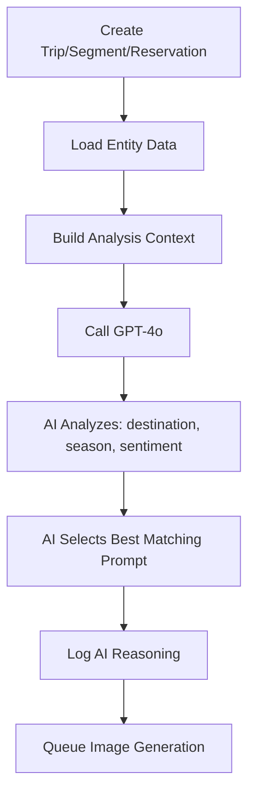
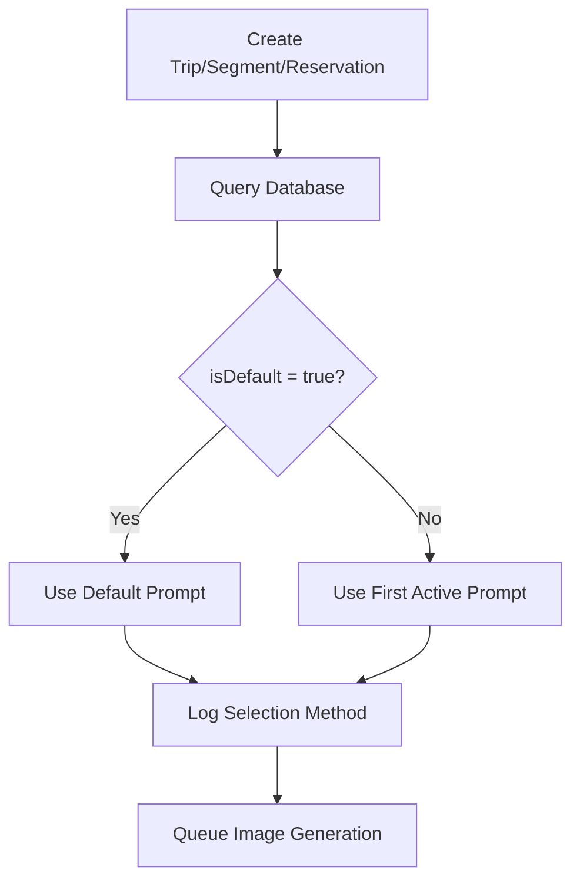

# AI Image Prompt Selection System Archived - COMPLETE

**Date**: January 27, 2026  
**Status**: ✅ Complete

## Summary

Successfully replaced the AI-based image prompt selection system with a simple database flag system. The AI prompt selector (GPT-4o) and the standalone image-generator tool have been archived for potential future use.

## Changes Made

### 1. Database Schema Updates ✅

**File**: `prisma/schema.prisma`

Added three new fields to the `ImagePrompt` model:
- `isDefault` (Boolean) - If true, this prompt is used by default for its category
- `isActive` (Boolean) - If false, prompt is hidden from selection
- `sortOrder` (Int) - Display order in UI

Created indexes for efficient querying:
- `[category, isDefault]`
- `[category, isActive, sortOrder]`

**Migration**: `prisma/migrations/20260127000000_add_image_prompts_and_flags/migration.sql`

### 2. Archived Features ✅

**Location**: `/archived/`

#### Archived Components:
1. **Image Generator Tool** (`archived/image-generator/`)
   - Standalone bulk image generation system
   - AI-powered prompt extraction using GPT-4o
   - Queue management and batch processing
   - Real-time progress tracking

2. **AI Prompt Selection Logic** (`archived/image-generation.ts.backup`)
   - Original `selectBestPromptForContent()` function
   - GPT-4o analysis of trip/segment/reservation data
   - Intelligent style matching based on:
     - Destination type (urban/nature/beach/mountains)
     - Travel dates and season
     - Activity type and character
     - Number of destinations
     - Trip sentiment

**Documentation**: `archived/README.md` explains what was archived and how to restore it

### 3. Updated Code ✅

#### `lib/image-generation.ts`
**Before**:
```typescript
// AI analyzes entity data to select best matching prompt
async function selectBestPromptForContent(entity, entityType) {
  const openai = new OpenAI({ apiKey: process.env.OPENAI_API_KEY! });
  // ... GPT-4o analysis ...
}
```

**After**:
```typescript
// Simple database flag-based selection
async function selectDefaultPromptForContent(entityType) {
  const prompt = await prisma.imagePrompt.findFirst({
    where: { 
      category: entityType,
      isActive: true,
      isDefault: true 
    },
    orderBy: { sortOrder: 'asc' }
  });
  // Returns default prompt or first active prompt
}
```

**Functions Updated**:
- `selectBestPromptForTrip()` - Now uses flag-based selection
- `selectBestPromptForSegment()` - Now uses flag-based selection  
- `selectBestPromptForReservation()` - Now uses flag-based selection
- Removed `selectBestPromptForContent()` (AI logic)
- Removed `buildAnalysisContext()` (no longer needed)

**Interface Simplified**:
```typescript
// Before
interface PromptSelectionResult {
  prompt: ImagePrompt;
  reasoning?: string;
  availablePrompts: ImagePrompt[];  // Removed
}

// After
interface PromptSelectionResult {
  prompt: ImagePrompt;
  reasoning?: string;
}
```

#### `lib/actions/queue-image-generation.ts`
Updated three queue functions:
- `queueTripImageGeneration()` - Removed AI reasoning and availablePrompts
- `queueSegmentImageGeneration()` - Removed AI reasoning and availablePrompts
- `queueReservationImageGeneration()` - Removed AI reasoning and availablePrompts

Changed selection reason from "AI selected" to "Default prompt"

#### `prisma/seed.js`
Updated all 12 image prompts with new flags:

**Default Prompts** (one per category):
- Trip: "Retro Gouache Travel Poster" (sortOrder: 1)
- Segment: "Retro Gouache Travel Poster" (sortOrder: 1)
- Reservation: "Retro Gouache Travel Poster" (sortOrder: 1)

**Other Active Prompts** (sortOrder 2-4):
- Golden Hour Silhouette
- Stylized Map Journey  
- Travel Scrapbook (Trip/Segment/Reservation variants)

All prompts marked as `isActive: true`

## Current Prompt Selection Flow

### Before (AI-Based):


### After (Flag-Based):


## Benefits of New System

### Performance ⚡
- **Before**: GPT-4o API call (~2-5 seconds)
- **After**: Database query (~10-50ms)
- **~100x faster** prompt selection

### Cost 💰
- **Before**: ~$0.001-0.003 per image (OpenAI API)
- **After**: $0 (no API calls)

### Predictability 🎯
- **Before**: AI might select different prompts for similar trips
- **After**: Consistent, predictable prompt selection
- Easier to debug and control

### Simplicity 🧩
- **Before**: Complex AI analysis logic
- **After**: Simple database flag lookup
- Easier to maintain and understand

## Database State

All 12 image prompts successfully seeded with flags:

| Name | Category | isDefault | isActive | sortOrder |
|------|----------|-----------|----------|-----------|
| Retro Gouache Travel Poster | trip | true | true | 1 |
| Golden Hour Silhouette | trip | false | true | 2 |
| Stylized Map Journey | trip | false | true | 3 |
| Travel Scrapbook - Trip | trip | false | true | 4 |
| Retro Gouache Travel Poster | segment | true | true | 1 |
| Golden Hour Silhouette | segment | false | true | 2 |
| Stylized Map Journey | segment | false | true | 3 |
| Travel Scrapbook - Segment | segment | false | true | 4 |
| Retro Gouache Travel Poster | reservation | true | true | 1 |
| Golden Hour Silhouette | reservation | false | true | 2 |
| Stylized Map Journey | reservation | false | true | 3 |
| Travel Scrapbook - Reservation | reservation | false | true | 4 |

## Future Use

### To Change Default Prompts:
```sql
-- Set Golden Hour as default for trips
UPDATE "ImagePrompt" 
SET "isDefault" = false 
WHERE category = 'trip';

UPDATE "ImagePrompt" 
SET "isDefault" = true 
WHERE name = 'Golden Hour Silhouette' AND category = 'trip';
```

### To Restore AI Selection:
1. Copy `archived/image-generation.ts.backup` back to `lib/image-generation.ts`
2. Revert changes in `lib/actions/queue-image-generation.ts`
3. Set `OPENAI_API_KEY` in environment
4. Database flags remain (they don't interfere)

### To Restore Image Generator Tool:
1. Move `archived/image-generator/` back to project root
2. Ensure `OPENAI_API_KEY` is configured
3. Ensure Google Vertex AI credentials are set up
4. Run `npm install` if needed
5. Access at `/image-generator` route

## Testing

The system is ready for testing:
- ✅ Migration applied successfully
- ✅ Database seeded with flags
- ✅ Code updated to use flag-based selection
- ✅ Backup created for rollback capability

Test by creating a new trip/segment/reservation and verifying:
1. Image generation is queued
2. "Retro Gouache Travel Poster" prompt is selected
3. No OpenAI API calls are made
4. Generation completes successfully

## Files Changed

1. `prisma/schema.prisma` - Added ImagePrompt flags
2. `lib/image-generation.ts` - Replaced AI selection with flags
3. `lib/actions/queue-image-generation.ts` - Updated queue actions
4. `prisma/seed.js` - Added flags to all prompts
5. `prisma/migrations/20260127000000_add_image_prompts_and_flags/migration.sql` - New migration
6. `archived/image-generator/` - Moved entire folder
7. `archived/image-generation.ts.backup` - Backup of original logic
8. `archived/README.md` - Archive documentation

## Conclusion

The AI prompt selection system has been successfully archived and replaced with a simpler, faster, and more predictable flag-based system. The original AI functionality is preserved in the `/archived/` folder and can be restored if needed in the future.

---

**Next Steps**: Test the system by creating trips, segments, and reservations to verify default prompt selection works correctly.
