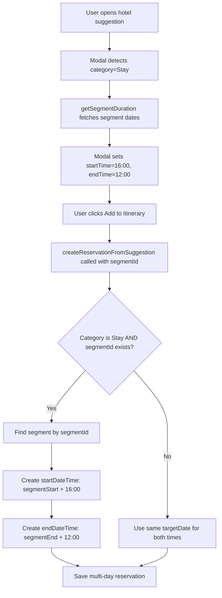

# Hotel Multi-Day Reservation Implementation - Complete

## Summary

Successfully implemented multi-day hotel reservations that automatically span entire segments with proper check-in (4:00 PM) and check-out (12:00 PM) times.

## Changes Made

### 1. Modal Time Updates
**File:** `app/exp/components/suggestion-detail-modal.tsx`

- Updated check-in time from `15:00` to `16:00` (4:00 PM)
- Updated check-out time from `11:00` to `12:00` (noon)
- Added `segmentId` to the `onAddToItinerary` callback interface
- Modal now passes `segmentId` when creating hotel reservations

**Lines Changed:** 32-46 (interface), 179-180 (times), 277 (pass segmentId)

### 2. Backend Multi-Day Logic
**File:** `lib/actions/create-reservation.ts`

- Added `segmentId` parameter to `createReservationFromSuggestion` function
- Implemented multi-day date calculation for hotels:
  - For category "Stay" with a `segmentId`, the reservation now spans from segment start date to segment end date
  - Check-in time (16:00) is applied to the segment start date
  - Check-out time (12:00) is applied to the segment end date
  - Non-hotel items continue to use same-day reservations
- Updated segment selection logic to use the specified `segmentId` for hotels

**Lines Changed:** 107-131 (function signature), 153-193 (multi-day logic), 196-215 (segment selection)

### 3. Segment ID Assignment
**Files:** `lib/types/place-pipeline.ts`, `app/api/chat/simple/route.ts`

- Added `segmentId?: string` field to `PlaceSuggestion` interface
- In segment-focused chats, the API automatically enriches hotel (Stay category) suggestions with the focused segment's ID
- This happens in stages 2 and 3 of the chat pipeline before places are resolved

**Key Logic:**
```typescript
if (chatType === 'SEGMENT' && focusedSegment) {
  places = places.map((place: any) => {
    if (place.category === "Stay") {
      return { ...place, segmentId: focusedSegment.id };
    }
    return place;
  });
}
```

### 4. Improved Modal UI
**File:** `app/exp/components/suggestion-detail-modal.tsx`

For hotels with segment information:
- Replaced day dropdown with "Stay Duration" display showing check-in and check-out dates
- Changed "Start Time"/"End Time" labels to "Check-in Time"/"Check-out Time"
- Made it visually clear that this is a multi-day reservation

### 5. Data Flow Updates

Updated all places where `createReservationFromSuggestion` is called to pass `segmentId`:

#### app/exp/components/place-hover-card.tsx
- Updated `convertToLegacySuggestion` to include `segmentId`
- Updated `onAddToItinerary` callback to pass `segmentId` to backend

#### components/place-hover-card.tsx
- Updated `convertToLegacySuggestion` to include `segmentId`
- Updated `onAddToItinerary` callback to pass `segmentId` to backend

#### components/chat-interface.tsx
- Updated `createReservationFromSuggestion` call to pass `segmentId`

## How It Works

### Data Flow



### Example Scenario

**Segment:** Paris, March 1-5, 2026

**Before:**
- Hotel reservation: March 1, 15:00 - March 1, 11:00 (same day, incorrect)

**After:**
- Hotel reservation: March 1, 16:00 (check-in) - March 5, 12:00 (check-out)
- Spans the entire segment duration
- Proper 4-night stay

## Important: How to Test Correctly

**CRITICAL**: To get hotels with segmentId properly assigned, you MUST be in a segment-focused chat. Here's how:

### Correct Testing Steps:

1. Navigate to `/exp` (http://localhost:3000/exp)
2. **Create a trip** (e.g., "Plan a ski trip to Bend, OR from Feb 11-17, 2026")
3. **Click on the segment card** that was created - this opens a segment-focused chat
4. **In the segment chat**, ask for hotel suggestions (e.g., "suggest hotels for my stay in Bend")
5. Click on a hotel suggestion to open the detail modal
6. You should now see:
   - "Stay Duration" section showing check-in and check-out dates (not "Day" dropdown)
   - "Check-in Time" label (not "Start Time")
   - "Check-out Time" label (not "End Time")
   - Times set to 16:00 (4:00 PM) and 12:00 (noon)
7. Add the hotel to your itinerary
8. Verify the reservation spans from segment start to end dates

### Why This Matters:

Hotels need a `segmentId` to span multiple days. The system automatically assigns `segmentId` to hotel suggestions **only when you're in a segment-focused chat**. If you ask for hotels in the main trip chat, they won't have a segmentId and will fall back to single-day behavior.

### Expected Results

- ✅ Check-in time: 4:00 PM (16:00)
- ✅ Check-out time: 12:00 PM (12:00)
- ✅ Reservation spans from segment start date to segment end date
- ✅ Non-hotel items (activities, dining, travel) continue to work as single-day reservations
- ✅ No linter errors

## Files Modified

1. `app/exp/components/suggestion-detail-modal.tsx` - Updated times, improved UI for hotels
2. `app/exp/components/place-hover-card.tsx` - Pass segmentId
3. `lib/actions/create-reservation.ts` - Multi-day date calculation
4. `components/place-hover-card.tsx` - Pass segmentId
5. `components/chat-interface.tsx` - Pass segmentId
6. `lib/types/place-pipeline.ts` - Added segmentId field to PlaceSuggestion
7. `app/api/chat/simple/route.ts` - Auto-assign segmentId to hotel suggestions

## Backwards Compatibility

- ✅ Non-hotel reservations continue to work as before (same-day)
- ✅ Hotels without a `segmentId` fall back to same-day reservations
- ✅ Existing reservation creation flows are unaffected
- ✅ Optional `segmentId` parameter ensures no breaking changes

## Notes

- The `segmentId` is already part of the `PlaceSuggestion` type, so no schema changes were needed
- The implementation gracefully handles cases where segment dates are not available
- All existing tests and functionality should continue to work without modification
