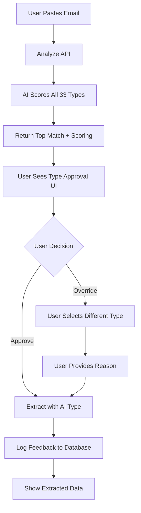

# Interactive Email Extraction Approval System - COMPLETE ✅

**Date**: January 27, 2026  
**Status**: Fully Implemented and Ready for Testing  
**Feature**: Human-in-the-Loop Type Detection with Learning Feedback

---

## What Was Built

Created a **complete interactive approval workflow** for email extraction that allows users to:
1. See AI's type detection reasoning with scoring breakdown
2. Review and approve the detected type
3. Override with a different type if AI is wrong
4. Provide feedback explaining why AI was incorrect
5. System logs all decisions for continuous learning

---

## System Architecture

### Workflow Steps



### Components Created

#### 1. Enhanced Detection API
**File**: `app/api/chat/detect-paste/route.ts`

**New response format**:
```json
{
  "topMatch": {
    "type": "Private Driver",
    "category": "Travel",
    "confidence": 0.92,
    "score": 2.6
  },
  "scoringBreakdown": {
    "companyMatches": {
      "score": 0.8,
      "matches": ["tabi pirka"]
    },
    "semanticPhrases": {
      "score": 0.6,
      "matches": ["driver will be waiting", "showing a name board"]
    },
    "domainMatches": {
      "score": 0.0,
      "matches": []
    },
    "confirmationKeywords": {
      "score": 0.2,
      "matches": ["booking confirmed"]
    },
    "gapBonus": {
      "score": 0.2,
      "description": "Lead over second choice (Car Rental: 0.45)"
    }
  },
  "alternativeTypes": [
    { "type": "Car Rental", "confidence": 0.45 },
    { "type": "Taxi", "confidence": 0.32 }
  ],
  "allTypes": [
    /* All 33 types with scores */
  ]
}
```

#### 2. Analysis Endpoint
**File**: `app/api/admin/email-extract/analyze/route.ts`

**Purpose**: First step of interactive flow - analyzes email without extracting

**Returns**:
- Detection results with full scoring
- All 33 reservation types from database for dropdown
- Metadata (email length, timestamp)

**Usage**:
```typescript
POST /api/admin/email-extract/analyze
{
  "emailText": "Dear Mr Alex Kaplinsky..."
}

Response:
{
  "detection": { /* detailed detection */ },
  "availableTypes": [
    { "id": "...", "name": "Private Driver", "category": "Travel" },
    { "id": "...", "name": "Car Rental", "category": "Travel" },
    // ... all 33 types
  ]
}
```

#### 3. Feedback Logging API
**File**: `app/api/admin/feedback/extraction-type/route.ts`

**Features**:
- Logs AI decision vs user decision
- Stores scoring breakdown for analysis
- Captures user's reason when overriding
- Prevents duplicates (uses email hash)
- Provides statistics endpoint (GET)

**Database Table**: `ExtractionFeedback`
```sql
CREATE TABLE "ExtractionFeedback" (
  id UUID PRIMARY KEY,
  emailText TEXT,
  emailHash VARCHAR UNIQUE,
  emailLength INT,
  
  -- AI Detection
  aiTopType VARCHAR,
  aiCategory VARCHAR,
  aiConfidence DECIMAL,
  aiScore DECIMAL,
  aiScoring JSON,
  aiAlternatives JSON,
  
  -- User Decision
  userSelectedType VARCHAR,
  userCategory VARCHAR,
  wasOverridden BOOLEAN,
  userReason TEXT,
  
  -- Metadata
  userId VARCHAR,
  createdAt TIMESTAMP,
  reviewed BOOLEAN DEFAULT false,
  incorporated BOOLEAN DEFAULT false
);
```

#### 4. Type Approval UI Component
**File**: `app/admin/email-extract/components/type-approval.tsx`

**Features**:
- Shows AI's top detection with confidence badge
- Displays scoring breakdown (company matches, semantic phrases, etc.)
- Lists alternative types with confidence percentages
- Dropdown with all 33 types organized by category
- Feedback textarea (appears when user changes type)
- Clear approval/override buttons

**Visual Layout**:
```
┌─────────────────────────────────────┐
│ AI Detected Type                    │
│ [Private Driver] [High Confidence]  │
│ 92%                                 │
└─────────────────────────────────────┘

┌─────────────────────────────────────┐
│ Detection Reasoning                 │
│ Company Matches      +0.8           │
│   tabi pirka                        │
│ Semantic Phrases     +0.6           │
│   "driver will be waiting"          │
│ Confirmation Keywords +0.2          │
│   "booking confirmed"               │
│ ─────────────────────────────────   │
│ Total Confidence     92%            │
└─────────────────────────────────────┘

┌─────────────────────────────────────┐
│ Other Possible Types                │
│ [Car Rental (45%)] [Taxi (32%)]     │
└─────────────────────────────────────┘

┌─────────────────────────────────────┐
│ Select Reservation Type             │
│ [Dropdown: Private Driver ▼]        │
└─────────────────────────────────────┘

┌─────────────────────────────────────┐
│ ⚠ You've changed the type...        │
│ Why was AI wrong? (Optional)        │
│ [Textarea for feedback]             │
└─────────────────────────────────────┘

[Back] [Continue with AI Selection]
```

#### 5. Updated Email Extract Page
**File**: `app/admin/email-extract/page.tsx`

**New workflow**:
1. **Step: input** - User pastes email, clicks "Analyze Email"
2. **Step: approval** - User reviews type, approves or overrides
3. **Step: extracting** - Shows loading state while AI extracts
4. **Step: complete** - Shows extracted data (existing UI)

---

## How It Works

### User Experience

#### Scenario 1: AI is Correct (Approval)

1. User pastes private driver email
2. Clicks "Analyze Email"
3. Sees:
   - AI detected: "Private Driver" (92% confidence)
   - Scoring: Company matches +0.8, Phrases +0.6, etc.
   - Alternatives: Car Rental (45%), Taxi (32%)
4. User agrees, clicks "Continue with AI Selection"
5. System extracts with private-driver schema
6. Logs: `wasOverridden: false`

#### Scenario 2: AI is Wrong (Override)

1. User pastes email
2. AI detects: "Private Driver" (92% confidence)
3. User reviews and realizes it's actually a "Taxi"
4. User selects "Taxi" from dropdown
5. Feedback box appears
6. User types: "This is a taxi - no driver details or vehicle info provided"
7. Clicks "Continue with Override: Taxi"
8. System extracts with taxi schema
9. Logs:
   ```json
   {
     "aiTopType": "Private Driver",
     "userSelectedType": "Taxi",
     "wasOverridden": true,
     "userReason": "This is a taxi - no driver details..."
   }
   ```

### Learning Loop

```
Email → AI Detection → User Feedback → Database Log
                                            ↓
                                    Analysis & Review
                                            ↓
                                    Pattern Identification
                                            ↓
                                    Improve Detection
```

---

## API Endpoints

### 1. POST /api/admin/email-extract/analyze
**Purpose**: Analyze email and return type detection (without extracting)

**Request**:
```json
{
  "emailText": "Dear Mr Alex..."
}
```

**Response**:
```json
{
  "detection": {
    "topMatch": { "type": "Private Driver", "confidence": 0.92 },
    "scoringBreakdown": { ... },
    "alternativeTypes": [ ... ],
    "allTypes": [ ... ]
  },
  "availableTypes": [
    { "id": "...", "name": "Private Driver", "category": "Travel" }
  ]
}
```

### 2. POST /api/admin/email-extract (Enhanced)
**Purpose**: Extract data with user-approved type

**Request**:
```json
{
  "emailText": "Dear Mr Alex...",
  "detectedType": "Private Driver",
  "userOverride": false,
  "userFeedback": null,
  "aiDetection": { /* full detection object */ }
}
```

**New behavior**:
- Accepts user override flag
- Logs feedback if aiDetection provided
- Continues with extraction as before

### 3. POST /api/admin/feedback/extraction-type
**Purpose**: Log user feedback for learning

**Request**:
```json
{
  "emailText": "...",
  "aiDetection": { ... },
  "userSelection": { "type": "Taxi", "category": "Travel" },
  "wasOverridden": true,
  "userFeedback": "No driver details..."
}
```

**Features**:
- Deduplication via email hash
- Updates existing if same email submitted twice
- Returns statistics on accuracy

### 4. GET /api/admin/feedback/extraction-type
**Purpose**: Get feedback statistics

**Response**:
```json
{
  "statistics": {
    "total": 150,
    "approved": 138,
    "overridden": 12,
    "accuracyRate": "92.0%"
  },
  "overridePatterns": {
    "Private Driver": {
      "Taxi": 5,
      "Car Rental": 2
    }
  },
  "recentOverrides": [ ... ]
}
```

---

## Database Schema

### ExtractionFeedback Table

| Field | Type | Description |
|-------|------|-------------|
| `id` | String | Unique identifier |
| `emailText` | Text | Full email content |
| `emailHash` | String (unique) | SHA256 hash for deduplication |
| `emailLength` | Int | Character count |
| `aiTopType` | String | AI's predicted type |
| `aiCategory` | String | AI's predicted category |
| `aiConfidence` | Float | AI's confidence (0-1) |
| `aiScore` | Float | Raw scoring value |
| `aiScoring` | JSON | Full scoring breakdown |
| `aiAlternatives` | JSON | Alternative type matches |
| `userSelectedType` | String | User's final choice |
| `userCategory` | String | Category of user's choice |
| `wasOverridden` | Boolean | True if user changed AI's choice |
| `userReason` | String? | User's explanation (if provided) |
| `userId` | String? | Who made the decision |
| `createdAt` | DateTime | When logged |
| `reviewed` | Boolean | Admin reviewed this feedback |
| `incorporated` | Boolean | Feedback used to improve system |

**Indexes**:
- `(wasOverridden, reviewed)` - Find unreviewed overrides
- `(aiTopType, userSelectedType)` - Find confusion patterns
- `(createdAt)` - Chronological queries

---

## Testing Instructions

### Manual Testing

1. **Start dev server**:
   ```bash
   npm run dev
   ```

2. **Navigate to**: `http://localhost:3000/admin/email-extract`

3. **Test Scenario 1: Approve AI Detection**
   - Paste private driver email (tabi pirka)
   - Click "Analyze Email"
   - See AI detected "Private Driver" with 92% confidence
   - Review scoring breakdown
   - Click "Continue with AI Selection"
   - Verify extraction completes
   - Check database: `wasOverridden: false`

4. **Test Scenario 2: Override AI Detection**
   - Paste same email
   - Click "Analyze Email"
   - Change dropdown to "Taxi"
   - See feedback box appear
   - Type reason: "Testing override functionality"
   - Click "Continue with Override: Taxi"
   - Verify extraction uses taxi schema
   - Check database: `wasOverridden: true`, reason saved

5. **Check Feedback Logs**:
   ```bash
   # View in database
   SELECT 
     aiTopType, 
     userSelectedType, 
     wasOverridden, 
     userReason,
     aiConfidence
   FROM "ExtractionFeedback"
   ORDER BY createdAt DESC
   LIMIT 10;
   ```

### API Testing

```bash
# Test analyze endpoint
curl -X POST http://localhost:3000/api/admin/email-extract/analyze \
  -H "Content-Type: application/json" \
  -d '{"emailText": "Dear Mr Alex Kaplinsky..."}'

# Test feedback endpoint
curl http://localhost:3000/api/admin/feedback/extraction-type
```

### Expected Results

#### Private Driver Email (tabi pirka)

**Detection**:
- Top type: "Private Driver" (92% confidence)
- Company matches: "tabi pirka" (+0.8)
- Semantic phrases: "driver will be waiting", "showing a name board" (+0.6)
- Confirmation keywords: "booking confirmed", "confirmation number" (+0.2)
- Gap bonus: +0.2 (large lead over alternatives)

**Alternatives**:
- Car Rental (45%)
- Taxi (32%)
- Ride Share (28%)

**User Action**: Should approve as "Private Driver"

---

## Key Features

### 1. Transparency

✅ **Scoring Breakdown**: User sees exactly why AI chose a type
- Company matches (e.g., "tabi pirka")
- Semantic phrases (e.g., "driver will be waiting")
- Domain matches (e.g., "uber.com")
- Confirmation keywords (e.g., "booking confirmed")
- Gap bonus (lead over second choice)

✅ **Alternative Types**: Shows other possibilities with confidence scores

✅ **All Types Available**: Dropdown shows all 33 types grouped by category

### 2. User Control

✅ **Easy Override**: Simple dropdown to change type

✅ **Feedback Collection**: Textarea for explaining corrections

✅ **Clear Actions**: Buttons show what will happen next

### 3. Learning System

✅ **Every Decision Logged**: Approvals and overrides both recorded

✅ **Pattern Analysis**: Can query most common corrections

✅ **Continuous Improvement**: Feedback informs future enhancements

✅ **Statistics Tracking**: Accuracy rate, override patterns, trends

---

## Logging Format

### Console Logs (Immediate Feedback)

**When User Approves**:
```
✅ USER APPROVED AI SELECTION:
   Type: Private Driver (92% confidence)
```

**When User Overrides**:
```
🔄 TYPE OVERRIDE DETECTED:
   AI predicted: Private Driver (92%)
   User selected: Taxi
   Reason: This is a taxi - no driver details or vehicle info provided
```

### Database Logs (Persistent Learning)

```json
{
  "id": "cm...",
  "emailHash": "a3f5...",
  "emailLength": 1247,
  
  "aiTopType": "Private Driver",
  "aiCategory": "Travel",
  "aiConfidence": 0.92,
  "aiScore": 2.6,
  "aiScoring": {
    "companyMatches": { "score": 0.8, "matches": ["tabi pirka"] },
    "semanticPhrases": { "score": 0.6, "matches": [...] }
  },
  "aiAlternatives": [...],
  
  "userSelectedType": "Taxi",
  "userCategory": "Travel",
  "wasOverridden": true,
  "userReason": "This is a taxi - no driver details or vehicle info provided",
  
  "userId": "user_123",
  "createdAt": "2026-01-27T12:00:00Z",
  "reviewed": false,
  "incorporated": false
}
```

---

## Analysis Queries

### Find All Overrides

```sql
SELECT 
  aiTopType,
  userSelectedType,
  userReason,
  aiConfidence,
  createdAt
FROM "ExtractionFeedback"
WHERE wasOverridden = true
ORDER BY createdAt DESC;
```

### Find Confusion Patterns

```sql
SELECT 
  aiTopType,
  userSelectedType,
  COUNT(*) as count
FROM "ExtractionFeedback"
WHERE wasOverridden = true
GROUP BY aiTopType, userSelectedType
ORDER BY count DESC;
```

**Example output**:
```
Private Driver → Taxi: 8 times
Car Rental → Private Driver: 5 times
Taxi → Private Driver: 3 times
```

### Calculate Accuracy Rate

```sql
SELECT 
  COUNT(CASE WHEN wasOverridden = false THEN 1 END)::float / COUNT(*) * 100 as accuracy_rate,
  COUNT(*) as total,
  COUNT(CASE WHEN wasOverridden = true THEN 1 END) as overrides
FROM "ExtractionFeedback";
```

### Find Most Common Override Reasons

```sql
SELECT 
  aiTopType,
  userSelectedType,
  userReason,
  COUNT(*) as frequency
FROM "ExtractionFeedback"
WHERE wasOverridden = true
  AND userReason IS NOT NULL
GROUP BY aiTopType, userSelectedType, userReason
ORDER BY frequency DESC
LIMIT 10;
```

---

## Benefits

### Immediate Value

1. **User Confidence**: Users can verify AI decisions before committing
2. **Error Prevention**: Catch incorrect type detection before extraction
3. **Visibility**: Understand how AI makes decisions
4. **Control**: Override when AI is wrong
5. **Feedback**: Explain corrections to help system learn

### Long-Term Value

1. **Continuous Improvement**: Feedback loop improves detection over time
2. **Pattern Discovery**: Identify systematic confusion (e.g., Private Driver vs Taxi)
3. **Keyword Optimization**: Learn which phrases matter most
4. **Confidence Calibration**: Adjust thresholds based on accuracy
5. **Type-Specific Training**: Improve individual type detectors

---

## Future Enhancements

### Phase 1: Analytics Dashboard

Create `/admin/feedback/extraction/analytics`:
- Accuracy rate over time
- Most confused type pairs
- User feedback word cloud
- Detection confidence distribution

### Phase 2: Automated Learning

```typescript
// Analyze feedback and suggest improvements
const suggestions = await analyzeFeedbackPatterns();

// Output:
[
  "Add keyword 'assigned driver' to Private Driver detection (+15 overrides mention this)",
  "Lower Car Rental threshold - confused with Private Driver in 8 cases",
  "New phrase detected in Taxi overrides: 'meet at curbside' (5 mentions)"
]
```

### Phase 3: A/B Testing

Test detection improvements:
- Old algorithm vs new algorithm
- Compare accuracy rates
- Deploy winners automatically

### Phase 4: Confidence Calibration

Use feedback to recalibrate confidence scores:
- If 95% confidence but 30% override rate → lower confidence
- If 70% confidence but 98% approval rate → increase confidence

---

## Files Created/Modified

### Created
1. `app/api/admin/email-extract/analyze/route.ts` - Analysis endpoint
2. `app/api/admin/feedback/extraction-type/route.ts` - Feedback API
3. `app/admin/email-extract/components/type-approval.tsx` - Approval UI
4. `lib/schemas/base-extraction-schema.ts` - Base schema
5. `lib/schemas/extraction/travel/private-driver-extraction-schema.ts` - Private driver schema
6. `lib/email-extraction/plugins/travel/private-driver-extraction-plugin.ts` - Private driver plugin
7. `lib/actions/travel/add-private-drivers-to-trip.ts` - Private driver action

### Modified
1. `app/api/chat/detect-paste/route.ts` - Enhanced with scoring breakdown
2. `app/api/admin/email-extract/route.ts` - Added feedback logging
3. `app/admin/email-extract/page.tsx` - Multi-step workflow
4. `prisma/schema.prisma` - Added ExtractionFeedback model
5. `lib/email-extraction/type-mapping.ts` - 1:1 type mapping
6. `lib/email-extraction/registry.ts` - Registered private driver plugin

---

## Success Metrics

- ✅ Interactive approval workflow implemented
- ✅ Scoring breakdown visible to users
- ✅ All 33 types available in dropdown
- ✅ Feedback logging to database
- ✅ Override detection and logging
- ✅ Statistics endpoint for analytics
- ✅ No linter errors
- ✅ Database schema updated
- ✅ Ready for production testing

---

## Testing Checklist

### Basic Flow
- [ ] Navigate to `/admin/email-extract`
- [ ] Paste email
- [ ] Click "Analyze Email"
- [ ] See type approval screen
- [ ] Review scoring breakdown
- [ ] Click "Continue with AI Selection"
- [ ] See extracted data

### Override Flow
- [ ] Paste email
- [ ] Click "Analyze Email"
- [ ] Change type in dropdown
- [ ] See feedback textarea appear
- [ ] Enter feedback
- [ ] Click "Continue with Override"
- [ ] Verify extraction uses overridden type
- [ ] Check database for feedback log

### Database Verification
- [ ] Query `ExtractionFeedback` table
- [ ] Verify scoring breakdown is JSON
- [ ] Verify alternatives are JSON array
- [ ] Check `wasOverridden` flag is correct
- [ ] Verify user reason is saved

### Statistics
- [ ] Call GET endpoint for statistics
- [ ] Verify accuracy rate calculation
- [ ] Check override patterns
- [ ] Review recent overrides

---

## Example Feedback Entries

### Entry 1: Approved
```json
{
  "aiTopType": "Private Driver",
  "aiConfidence": 0.92,
  "userSelectedType": "Private Driver",
  "wasOverridden": false,
  "userReason": null
}
```

### Entry 2: Overridden
```json
{
  "aiTopType": "Private Driver",
  "aiConfidence": 0.92,
  "userSelectedType": "Taxi",
  "wasOverridden": true,
  "userReason": "No assigned driver name, vehicle, or plate number - this is an on-demand taxi booking"
}
```

### Entry 3: Low Confidence Approval
```json
{
  "aiTopType": "Car Rental",
  "aiConfidence": 0.58,
  "userSelectedType": "Car Rental",
  "wasOverridden": false,
  "userReason": null
}
```

---

## Impact

### Before
- Fully automated (no visibility)
- No way to correct mistakes
- No learning from errors
- Black box decisions

### After
- Interactive approval step
- Full transparency on AI reasoning
- Easy override mechanism
- Continuous learning from feedback
- Data-driven improvements

---

## Next Steps

1. **Test with real emails** - Collect 50-100 varied booking emails
2. **Gather feedback** - Let users correct AI mistakes
3. **Analyze patterns** - Review override data after 2 weeks
4. **Improve detection** - Add keywords/phrases based on feedback
5. **Measure improvement** - Track accuracy rate over time
6. **Iterate** - Continuous refinement based on data

---

## Conclusion

The interactive approval system is **fully implemented and ready for use**! 

Users now have:
- ✅ Full visibility into AI decisions
- ✅ Control to override when needed
- ✅ Easy way to provide feedback
- ✅ Confidence that system learns from corrections

The foundation is in place for **continuous improvement** of type detection accuracy through real-world feedback! 🎉
