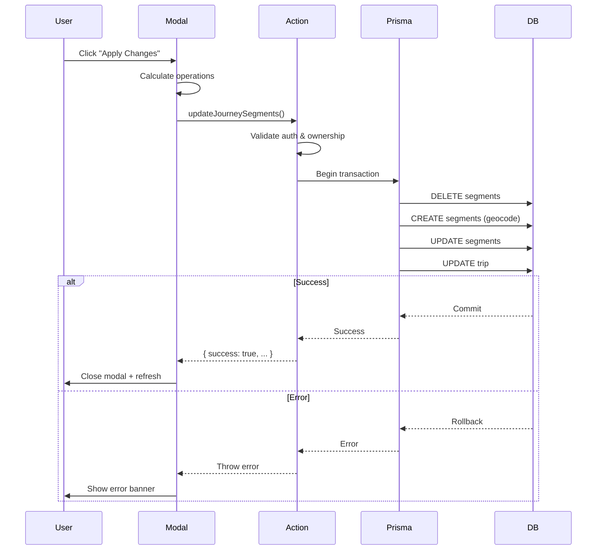

# Journey Manager Atomic Transactions - Implementation Complete

## Summary

Successfully implemented atomic database transactions for the Journey Manager Modal, ensuring all segment operations (create, update, delete) happen in a single commit with comprehensive error handling and user-friendly feedback.

## What Was Implemented

### 1. Atomic Transaction Action ✅

**New File**: `lib/actions/update-journey-segments.ts`

A single server action that handles all journey segment operations atomically using Prisma's `$transaction()`:

**Key Features**:
- **All-or-nothing execution**: If any operation fails, all changes are rolled back
- **Authentication & authorization**: Validates user session and trip ownership
- **Comprehensive validation**: Checks segment IDs exist before operations
- **Detailed error context**: Provides specific error messages for each operation type
- **Operation tracking**: Returns counts of deleted, created, and updated segments

**Operations Handled**:
1. Delete removed segments
2. Create new segments (from splits) with full geocoding and timezone support
3. Update existing segments with new dates and order
4. Update trip start/end dates

**Transaction Structure**:
```typescript
await prisma.$transaction(async (tx) => {
  // 1. Delete segments
  if (deletedSegmentIds.length > 0) {
    await tx.segment.deleteMany({ where: { id: { in: deletedSegmentIds } } })
  }
  
  // 2. Create new segments (with geocoding & timezones)
  for (const newSeg of newSegments) {
    await tx.segment.create({ data: {...} })
  }
  
  // 3. Update existing segments
  for (const updatedSeg of updatedSegments) {
    await tx.segment.update({ where: { id: updatedSeg.id }, data: {...} })
  }
  
  // 4. Update trip dates
  await tx.trip.update({ where: { id: tripId }, data: { startDate, endDate } })
})
```

### 2. Enhanced Journey Manager Modal ✅

**File**: `components/journey-manager-modal.tsx`

**Changes Made**:

#### State Management
- Added `deletedSegmentIds` state to track segments removed in the UI
- Enhanced error state from `string | null` to structured object:
  ```typescript
  {
    userMessage: string      // User-friendly explanation
    technicalDetails: string // Full error with stack trace
  }
  ```

#### Interface Updates
- Added `tripId: string` prop for transaction execution
- Updated `JourneySegment` interface to include `startLocation` and `endLocation`
- Changed `onSave` signature from complex callback to simple `() => void`

#### Deletion Tracking
Updated `handleDelete()` to track deletions:
```typescript
const handleDelete = (index: number) => {
  const deletedChapter = chapters[index]
  // Track deletion if it's an existing segment (not a new one from split)
  if (!deletedChapter.id.startsWith('new-')) {
    setDeletedSegmentIds(prev => [...prev, deletedChapter.id])
  }
  setChapters(chapters.filter((_, i) => i !== index))
}
```

#### Enhanced Split Functionality
Updated `handleSplitSegment()` to preserve all data needed for segment creation:
```typescript
newChapters.splice(index + 1, 0, {
  ...target,
  id: newId,
  title: `${target.title} (Part 2)`,
  days: halfDays,
  startLocation: target.startLocation,  // ← Preserved
  endLocation: target.endLocation,      // ← Preserved
  segmentType: target.segmentType,      // ← Preserved
})
```

#### Refactored Save Handler
Complete rewrite of `handleSave()`:
- Separates all segments into three categories: new, updated, deleted
- Calls atomic transaction action directly
- Handles errors with structured error state
- Only closes modal on success

**Before (Broken)**:
```typescript
// Called parent with filtered segments
const existingSegments = updatedSegments.filter(seg => !seg.id.startsWith('new-'))
await onSave(existingSegments, tripStartDate, newTripEnd)
```

**After (Fixed)**:
```typescript
// Separate operations
const newSegments = allSegments.filter(seg => seg.id.startsWith('new-'))...
const updatedSegments = allSegments.filter(seg => !seg.id.startsWith('new-'))...

// Call atomic transaction
await updateJourneySegments({
  tripId,
  deletedSegmentIds,
  newSegments,
  updatedSegments,
  tripStartDate,
  tripEndDate: newTripEnd,
})
```

### 3. Error Handling System ✅

**Helper Functions** (in `components/journey-manager-modal.tsx`):

```typescript
function getUserFriendlyError(error: unknown): string {
  if (error instanceof Error) {
    if (error.message.includes('Not authenticated')) {
      return 'Your session has expired. Please refresh the page and try again.'
    }
    if (error.message.includes('not found')) {
      return 'Some segments could not be found. The trip may have been modified elsewhere.'
    }
    if (error.message.includes('geocode')) {
      return 'Could not find location coordinates for new segments.'
    }
    if (error.message.includes('transaction')) {
      return 'A database error occurred. No changes were saved.'
    }
    return error.message
  }
  return 'An unexpected error occurred. No changes were saved.'
}

function getTechnicalError(error: unknown): string {
  if (error instanceof Error) {
    return `${error.name}: ${error.message}\n\nStack:\n${error.stack || 'No stack trace'}`
  }
  return JSON.stringify(error, null, 2)
}
```

**Error Banner UI**:
Added comprehensive error display with:
- User-friendly message prominently displayed
- Expandable technical details section
- Dismiss button to clear error
- Red color scheme for visibility

```tsx
{error && (
  <div className="mx-4 mt-4 p-4 bg-red-50 border border-red-200 rounded-lg">
    <div className="flex items-start gap-3">
      <AlertCircle className="text-red-600 mt-0.5" size={20} />
      <div className="flex-1">
        <h4 className="font-semibold text-red-900 mb-1">
          Failed to Save Changes
        </h4>
        <p className="text-sm text-red-800 mb-2">
          {error.userMessage}
        </p>
        <details className="text-xs text-red-700">
          <summary className="cursor-pointer hover:underline">
            Technical Details
          </summary>
          <pre className="mt-2 p-2 bg-red-100 rounded overflow-x-auto">
            {error.technicalDetails}
          </pre>
        </details>
        <button onClick={() => setError(null)}>Dismiss</button>
      </div>
    </div>
  </div>
)}
```

### 4. Parent Component Updates ✅

**Files Updated**:
1. `app/view1/components/journey-view.tsx`
2. `app/segment/[id]/edit/client.tsx`

**Changes**:
- Simplified `handleJourneySave()` to just refresh the page
- Added `tripId` prop to `JourneyManagerModal` invocation
- Removed complex segment update logic (now handled by modal)

**Before**:
```typescript
const handleJourneySave = async (updatedSegments, newTripStart, newTripEnd) => {
  await Promise.all(updatedSegments.map(seg => updatePersistedSegment(...)))
  if (tripDatesChanged) {
    await updateTripDates(...)
  }
  router.refresh()
}
```

**After**:
```typescript
const handleJourneySave = () => {
  router.refresh()
}
```

## Transaction Guarantees

Using `prisma.$transaction()` provides ACID guarantees:

1. **Atomicity**: All operations succeed together or all fail together
2. **Consistency**: Database constraints are enforced before commit
3. **Isolation**: Other requests don't see intermediate states
4. **Durability**: Once committed, changes are permanent

**Example Scenario**:
- User deletes 2 segments, splits 1 segment (creating a new one), and reorders all
- Transaction executes: Delete 2 → Create 1 → Update 3 → Update trip dates
- If geocoding fails on the new segment, **all changes roll back**
- Database remains in consistent state (no partial updates)

## Error Scenarios Handled

### User-Facing Messages

| Error Type | User Message |
|------------|--------------|
| Session Expired | "Your session has expired. Please refresh the page and try again." |
| Segment Not Found | "Some segments could not be found. The trip may have been modified elsewhere." |
| Geocoding Failed | "Could not find location coordinates for new segments. Please check location names." |
| Database Error | "A database error occurred. No changes were saved. Please try again." |
| Invalid Dates | "Invalid dates: Start date must be before end date." |

### Technical Details (Expandable)

For each error, technical details include:
- Error name and message
- Full stack trace
- Operation that failed (delete/create/update)
- Affected segment IDs

## Files Modified

1. ✅ **Created**: `lib/actions/update-journey-segments.ts` - Atomic transaction action
2. ✅ **Modified**: `components/journey-manager-modal.tsx` - Enhanced modal with error handling
3. ✅ **Modified**: `app/view1/components/journey-view.tsx` - Simplified parent handler
4. ✅ **Modified**: `app/segment/[id]/edit/client.tsx` - Simplified parent handler

## Testing Scenarios

### Success Cases to Test

- [ ] Update segment dates only
- [ ] Split segment and save (creates new segment in DB)
- [ ] Delete segment and save
- [ ] Reorder segments
- [ ] Change trip start date
- [ ] Combination: split + delete + reorder + date change in one save

### Error Cases to Test

- [ ] Invalid segment ID (should show "not found" error)
- [ ] Network failure mid-transaction (should rollback)
- [ ] Invalid dates (start after end)
- [ ] Session expired during save
- [ ] Geocoding failure for new segment

### UI Validation

- [ ] Error banner displays with user-friendly message
- [ ] Technical details are expandable
- [ ] Modal stays open on error (doesn't close)
- [ ] Modal closes only on success
- [ ] Loading state shows during save
- [ ] Page refreshes after successful save
- [ ] Toast notifications show for success/error

## Benefits Achieved

1. **Data Integrity**: No partial updates possible - database always consistent
2. **Better UX**: Clear, actionable error messages explain what went wrong
3. **Complete Feature**: Split segments now actually create database records
4. **Debugging**: Technical details help diagnose production issues
5. **User Confidence**: Users know changes either fully saved or not at all
6. **Maintainability**: Single transaction action easier to test and debug

## How It Works Now

### User Flow

1. **User opens Journey Manager**
   - Sees all current segments with dates/durations

2. **User makes changes**
   - Splits a 10-day segment into 5+5 days
   - Deletes an old segment
   - Reorders segments by dragging
   - Adjusts trip start date

3. **User clicks "Apply Changes"**
   - Modal shows loading state
   - Single atomic transaction executes:
     - Deletes 1 segment
     - Creates 1 new segment (from split)
     - Updates 3 existing segments
     - Updates trip dates
   - **If all succeed**: Modal closes, page refreshes, success toast
   - **If any fail**: Modal stays open, error banner shows, no changes saved

4. **On Error**
   - User sees friendly message: "Could not find location coordinates for new segments"
   - Can expand technical details to see full error
   - Can dismiss error and try again
   - Can close modal without saving

### Technical Flow



## Status

✅ **COMPLETE** - Journey Manager Modal now uses atomic transactions with comprehensive error handling!

## Next Steps (Optional Enhancements)

These are NOT required but could be added later:

1. **Optimistic UI Updates**: Show changes immediately before save completes
2. **Undo/Redo**: Allow users to undo changes before saving
3. **Batch Validation**: Validate all operations before starting transaction
4. **Progress Indicator**: Show which operation is currently executing
5. **Conflict Resolution**: Handle concurrent edits from multiple users

## Related Documentation

- Previous fix: `JOURNEY_MANAGER_SPLIT_FIX_COMPLETE.md` - Fixed split segment ID bug
- Previous fix: `JOURNEY_MANAGER_TIMEZONE_FIX_COMPLETE.md` - Fixed timezone date input
- Architecture: Plan file at `.cursor/plans/journey_manager_atomic_transactions_*.plan.md`
