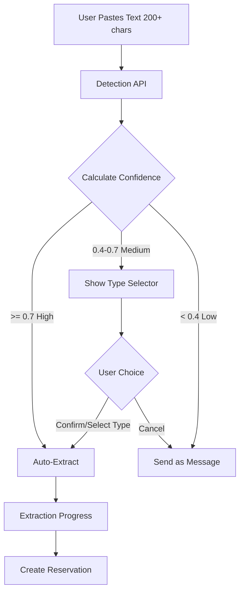

# Reservation Type Confirmation - Complete

## Problem Solved

Transfer bookings were being misidentified as hotel or flight reservations due to overlapping keywords (e.g., "arrival", "booking", "passenger", "pickup"). When confidence was low-to-medium (0.4-0.7), the system would either:
- Send as a normal chat message (ignoring the reservation)
- Auto-extract with the wrong type

## Solution Implemented

Created a user confirmation flow that asks users to verify or correct the detected reservation type when confidence is between 0.4-0.7.

## Implementation

### 1. Reservation Type Selector Component

**New File:** [`app/exp/components/reservation-type-selector.tsx`](app/exp/components/reservation-type-selector.tsx)

A new UI component that displays:
- Detected reservation type with confidence percentage
- Grid of all available reservation types (Hotel, Flight, Car Rental, Restaurant, Event, Train, Cruise)
- Visual indicators showing which type was auto-detected
- Confirm button to proceed with extraction
- Cancel button to send as normal message

**Features:**
- Color-coded confidence badges (yellow >60%, orange >50%, red <50%)
- Icons for each reservation type
- Responsive grid layout (2 cols mobile, 3 cols tablet, 4 cols desktop)
- Selected state with checkmark indicator
- Hover states and smooth transitions

### 2. Client State Management

**Modified:** [`app/exp/client.tsx`](app/exp/client.tsx)

**Added State:**
```typescript
const [pendingPaste, setPendingPaste] = useState<{
  text: string;
  detectedType: string;
  confidence: number;
} | null>(null)
```

**Added Handlers:**
- `handlePasteTypeConfirm`: Triggers extraction with user-selected type
- `handlePasteTypeCancel`: Sends text as normal chat message

**Updated Detection Flow:**
- Line ~221-238: Check detection result and handle three cases:
  - High confidence (>0.7): Auto-extract immediately
  - Medium confidence (0.4-0.7): Show type selector
  - Low confidence (<0.4): Send as normal message

**UI Integration:**
- Desktop view: Lines ~1743-1754
- Mobile view: Lines ~1970-1981
- Type selector appears in message stream above loading animation

### 3. Enhanced Detection API

**Modified:** [`app/api/chat/detect-paste/route.ts`](app/api/chat/detect-paste/route.ts)

**Improved Type Detection:**
1. **Keyword Diversity Scoring:** Counts unique keyword prefixes to avoid false positives from repeated words
2. **Negative Keywords:** Penalizes types when conflicting keywords appear (e.g., "boarding pass" reduces car-rental confidence)
3. **Multiple Type Matches:** Returns top matches with individual confidence scores
4. **Gap Bonus:** Increases confidence when top match clearly outscores alternatives

**Enhanced Keywords:**
- Car Rental: Added 'alphard', 'vellfire', 'luggage', 'ski bags', 'eta', 'drive time', 'pickup location', 'destination'
- Hotel: Added 'check-in date', 'check-out date', 'room type', 'suite', 'floor', 'bed', 'amenities'
- Flight: Removed overlapping keywords like 'passenger', 'departure', 'arrival', 'flight number' (these appear in transfer emails)

**Strong Signal Keywords:**
These keywords provide a large confidence boost when detected:
- Transfer/Car Rental: 'transfer service', 'driver will be waiting', 'alphard', 'vellfire', 'drive time'
- Hotel: 'check-in date', 'room type', 'bed type'
- Flight: 'boarding pass', 'seat assignment', 'boarding time'

**New Response Fields:**
```typescript
interface DetectionResult {
  isReservation: boolean;
  confidence: number;
  detectedType?: ReservationType;
  suggestedAction: "extract" | "ignore" | "ask_user";
  alternativeTypes?: TypeMatch[];  // NEW: Top 3 alternative matches
  detectedKeywords?: string[];     // NEW: Keywords that triggered detection
}
```

**Confidence Calculation:**
```
For each type:
  baseConfidence = (keywordCount / 5) * keywordDiversity
  + strongSignalBonus (up to +60%)
  - negativeKeywordPenalty (up to -50%)
  
Overall confidence = 
  typeConfidence (50%) +         // Best type's adjusted confidence
  confirmationConfidence (25%) + // Booking confirmation indicators
  lengthConfidence (5%) +        // Text length
  gapBonus (up to 20%)          // Clear winner bonus
```

**Example for Transfer Email:**
```
Car Rental:
  Base: 7 keywords * 0.8 diversity = 0.56
  Strong signals: "transfer service", "driver will be waiting" = +0.40
  Negative: none = 0
  Final: 0.96

Flight:
  Base: 4 keywords * 0.6 diversity = 0.24
  Strong signals: none = 0
  Negative: "transfer service" = -0.15
  Final: 0.09

Winner: Car Rental (0.96 vs 0.09) -> High confidence auto-extract
```

## User Experience Flow



## Testing Scenarios

### Scenario 1: High Confidence Hotel (>0.7)
**Input:** Standard hotel confirmation from Booking.com
**Expected:** Auto-extract as hotel, no user prompt

### Scenario 2: Medium Confidence Transfer (0.4-0.7)
**Input:** Transfer service email with "pickup", "driver", "luggage"
**Expected:** Show type selector with car-rental pre-selected

### Scenario 3: Ambiguous Booking (0.5)
**Input:** Email with both "arrival" (flight keyword) and "pickup" (car-rental keyword)
**Expected:** Show type selector, let user decide

### Scenario 4: Low Confidence (<0.4)
**Input:** Generic travel info without booking keywords
**Expected:** Send as normal chat message

## Console Logging

The detection API now logs:
```
[DetectPaste] Detected: YES, Type: car-rental, Confidence: 0.65, Action: ask_user
[DetectPaste] Type scores: car-rental:0.58, flight:0.32, hotel:0.15
[DetectPaste] Matched keywords (car-rental): transfer, pickup, driver, luggage, eta
[DetectPaste] Confirmation keywords: booking request, booking no, payment due
```

This helps debug why a certain type was detected and what keywords influenced the decision.

## Files Modified

1. **[`app/exp/components/reservation-type-selector.tsx`](app/exp/components/reservation-type-selector.tsx)** (NEW)
   - Created type selector UI component

2. **[`app/exp/client.tsx`](app/exp/client.tsx)**
   - Added `pendingPaste` state (line ~173)
   - Added import for ReservationTypeSelector (line ~19)
   - Added `handlePasteTypeConfirm` and `handlePasteTypeCancel` handlers (lines ~407-427)
   - Updated detection handler to show type selector for ask_user (lines ~227-234)
   - Rendered type selector in desktop view (lines ~1743-1754)
   - Rendered type selector in mobile view (lines ~1970-1981)

3. **[`app/api/chat/detect-paste/route.ts`](app/api/chat/detect-paste/route.ts)**
   - Added `TypeMatch` interface and enhanced `DetectionResult` (lines ~10-22)
   - Added `NEGATIVE_KEYWORDS` for type disambiguation (lines ~83-99)
   - Added `findMatchedKeywords` helper (lines ~101-104)
   - Created `detectAllReservationTypes` with diversity and penalty scoring (lines ~110-136)
   - Enhanced confidence calculation with gap bonus (lines ~159-176)
   - Added detailed console logging with keyword lists (lines ~193-196)
   - Return alternative types and detected keywords (lines ~199-205)

## Impact

- Transfer bookings are now properly detected or presented for user confirmation
- Users can correct misidentified reservation types before extraction
- Keyword diversity prevents false positives from generic words like "booking" or "reservation"
- Negative keywords reduce confusion between similar types (e.g., flight vs car-rental both use "arrival")
- Better debugging with detailed keyword logging
- More reliable extraction across different email formats and booking providers
