# Surprise Trip Feature - Complete Documentation

## Overview

The "Surprise Trip" feature is an AI-powered automatic trip generator that creates a complete, personalized itinerary in 30-60 seconds based on the user's profile preferences. It provides a real-time, streaming experience where users watch their trip being built across both the chat and itinerary panes.

## Current Implementation

### User Flow

```
1. User clicks "✨ Surprise Trip" button (top-left header)
   ↓
2. New conversation "Surprise Journey - {timestamp}" created
   ↓
3. Chat switches to new conversation
   ↓
4. Streaming loader appears in chat with stages
   ↓
5. AI generates trip structure (8-15 seconds)
   ↓
6. Trip created in database
   ↓
7. Conversation renamed to "{Trip Name} - {timestamp}"
   ↓
8. Right pane shows trip (initially empty)
   ↓
9. Segments created and displayed
   ↓
10. Hotels added progressively (with real-time updates)
   ↓
11. Restaurants added progressively
   ↓
12. Activities added progressively
   ↓
13. Trip finalized (ACTIVE status)
   ↓
14. Both panes show complete trip
   ↓
15. User stays on /exp page (no navigation)
```

### Technical Architecture

#### Components

1. **Button Component** (`app/exp/client.tsx` line 2297)
   - Location: Top-left header, left sidebar
   - Style: Gradient purple-to-blue with sparkle emoji
   - States: Normal, Loading (spinner), Disabled

2. **Loader Component** (`app/exp/components/get-lucky-loader.tsx`)
   - Displays streaming progress stages
   - Shows status indicators (spinner, checkmark, error)
   - Lists sub-items as they're created
   - Uses icons and emojis for visual appeal

3. **API Route** (`app/api/get-lucky/generate/route.ts`)
   - Server-Sent Events (SSE) for real-time streaming
   - Orchestrates AI generation and database operations
   - Emits events: stage, item, trip_created, complete, error

#### Data Flow

```mermaid
sequenceDiagram
    participant User
    participant Button as SurpriseTripButton
    participant Client as ExpClient
    participant API as GetLuckyAPI
    participant AI as OpenAI
    participant DB as Database

    User->>Button: Click ✨ Surprise Trip
    Button->>Client: handleGetLucky()
    Client->>Client: Create "Surprise Journey" conversation
    Client->>Client: Switch to new conversation
    Client->>Client: Show streaming loader
    
    Client->>API: POST /api/get-lucky/generate
    API->>Client: SSE: stage planning
    
    API->>AI: Generate trip with profile data
    AI-->>API: Trip structure + reservations
    
    API->>DB: createDraftTrip()
    DB-->>API: tripId
    
    API->>DB: Update conversation (link + rename)
    API->>Client: SSE: trip_created
    
    Client->>Client: Switch selectedTripId
    Client->>API: GET /api/trips/{id}
    API-->>Client: Trip data
    Client->>Client: Update right pane
    
    API->>DB: syncSegments()
    API->>Client: SSE: stage route
    Client->>API: Refetch trip
    Client->>Client: Update right pane
    
    loop For each reservation type
        API->>DB: createReservationFromSuggestion()
        API->>Client: SSE: item added
        Client->>API: Refetch trip (every 3 items)
        Client->>Client: Update right pane
    end
    
    API->>DB: Finalize trip (ACTIVE)
    API->>Client: SSE: complete
    Client->>API: Final refetch
    Client->>Client: Final update
```



#### Profile Integration

The feature uses the following profile data:

1. **Hobbies** → Destination selection
   - Art → Paris, Florence, New York
   - Food → Tokyo, Barcelona, New Orleans
   - Adventure → New Zealand, Iceland, Costa Rica
   - etc.

2. **Activity Level** → Activity density
   - Relaxed: 1 activity + 1 meal per day
   - Moderate: 2 activities + 2 meals per day
   - Active: 2 activities + 3 meals per day
   - Adventurous: 3 activities + 3 meals per day

3. **Budget Level** → Hotel/restaurant selection
   - Budget: $50-100/day
   - Moderate: $150-250/day
   - Luxury: $500+/day

4. **Other Preferences**
   - Accommodation type (Hotel, Hostel, Airbnb)
   - Travel pace (Slow, Balanced, Fast)
   - Home city (for flight planning)

#### Streaming Stages

1. **Planning** (🗺️)
   - Message: "Planning your chapters..."
   - Duration: 8-15 seconds
   - Action: AI generates complete trip structure

2. **Route** (🛣️)
   - Message: "Creating your journey..."
   - Duration: 1-2 seconds
   - Action: Creates segments in database
   - Items: Segment names with durations

3. **Hotels** (🏨)
   - Message: "Finding hotels..."
   - Duration: 3-5 seconds
   - Action: Creates hotel reservations
   - Items: Hotel names with locations

4. **Restaurants** (🍽️)
   - Message: "Finding restaurants..."
   - Duration: 3-5 seconds
   - Action: Creates restaurant reservations
   - Items: Restaurant names with meal types

5. **Activities** (🎯)
   - Message: "Adding activities..."
   - Duration: 3-5 seconds
   - Action: Creates activity reservations
   - Items: Activity names with times

6. **Complete** (✅)
   - Message: "Your trip is ready!"
   - Duration: Instant
   - Action: Finalizes trip to ACTIVE status

#### Real-Time Updates

The right pane (itinerary) updates progressively through intelligent refetching:

- **Initial fetch**: When trip is created (shows structure)
- **Stage-based refetch**: When route/hotels/restaurants/activities stages start
- **Item-based refetch**: Every 3 items added (throttled to avoid excessive requests)
- **Final refetch**: On completion (ensures everything is synced)

This creates the illusion of real-time updates without websockets or polling.

### Code Locations

#### Key Files

1. **`app/exp/client.tsx`**
   - Lines 882-1118: `handleGetLucky()` function
   - Lines 2297-2310: Surprise Trip button
   - Handles conversation creation, SSE processing, trip refetching

2. **`app/api/get-lucky/generate/route.ts`**
   - Complete API route for trip generation
   - SSE streaming implementation
   - Database operations orchestration

3. **`app/exp/components/get-lucky-loader.tsx`**
   - Visual loader component
   - Stage rendering with icons/emojis
   - Item list display

4. **`lib/utils/profile-helpers.ts`**
   - Activity density calculation
   - Preference extraction utilities

5. **`lib/ai/get-lucky-full-generation-prompt.ts`**
   - AI prompt construction
   - Structured output schema

## UI Improvement Suggestions

### High Priority Improvements

#### 1. Enhanced Button Visibility & Discoverability

**Current State:**
- Small button in top-left corner
- Gradient background (purple-to-blue)
- Sparkle emoji (✨)

**Improvements:**
```typescript
// Option A: Pulsing animation for first-time users
<Button
  className="h-8 px-3 flex items-center gap-2 
    bg-gradient-to-r from-purple-500 to-blue-500 
    hover:from-purple-600 hover:to-blue-600 
    text-white border-0 shadow-lg
    animate-pulse-slow" // Custom slow pulse
  onClick={handleGetLucky}
>
  <Sparkles className="h-4 w-4" />
  Surprise Me!
</Button>

// Option B: Tooltip on hover
<TooltipProvider>
  <Tooltip>
    <TooltipTrigger asChild>
      <Button ... />
    </TooltipTrigger>
    <TooltipContent>
      <p>Generate a complete trip based on your preferences</p>
      <p className="text-xs text-gray-400">Takes ~30 seconds</p>
    </TooltipContent>
  </Tooltip>
</TooltipProvider>

// Option C: First-time user callout
{isFirstTimeUser && (
  <div className="absolute top-full left-0 mt-2 p-3 bg-purple-100 
    rounded-lg shadow-lg border border-purple-200 z-50">
    <p className="text-sm font-medium">Try our AI trip planner!</p>
    <p className="text-xs text-gray-600">
      Get a complete itinerary in 30 seconds
    </p>
    <button onClick={dismissCallout} className="text-xs text-purple-600 mt-1">
      Got it
    </button>
  </div>
)}
```

**Rationale:** Users may not notice or understand the feature. Better visibility and explanation will increase usage.

#### 2. Progress Percentage & Time Estimate

**Current State:**
- Shows stages with status indicators
- No time estimate or progress percentage

**Improvements:**
```typescript
interface GetLuckyLoaderProps {
  loaderId: string;
  stages: Stage[];
  estimatedTimeRemaining?: number; // NEW
  progressPercentage?: number; // NEW
}

export function GetLuckyLoader({ 
  loaderId, 
  stages, 
  estimatedTimeRemaining,
  progressPercentage 
}: GetLuckyLoaderProps) {
  return (
    <div className="space-y-3 py-2">
      {/* Progress bar */}
      {progressPercentage !== undefined && (
        <div className="space-y-1">
          <div className="flex justify-between text-xs text-gray-500">
            <span>Building your trip...</span>
            <span>{Math.round(progressPercentage)}%</span>
          </div>
          <div className="h-2 bg-gray-200 rounded-full overflow-hidden">
            <div 
              className="h-full bg-gradient-to-r from-purple-500 to-blue-500 
                transition-all duration-500 ease-out"
              style={{ width: `${progressPercentage}%` }}
            />
          </div>
          {estimatedTimeRemaining && estimatedTimeRemaining > 0 && (
            <p className="text-xs text-gray-400 text-right">
              ~{estimatedTimeRemaining}s remaining
            </p>
          )}
        </div>
      )}
      
      {/* Existing stages */}
      {stages.map((stage) => (
        // ... existing stage rendering
      ))}
    </div>
  );
}
```

**Rationale:** Users want to know how long they'll wait. Progress indicators reduce perceived wait time and anxiety.

#### 3. Animated Item Appearance

**Current State:**
- Items appear instantly in list
- No animation or transition

**Improvements:**
```typescript
// Add animation classes
{stage.items && stage.items.length > 0 && (
  <div className="ml-8 space-y-1">
    {stage.items.map((item, idx) => (
      <div 
        key={idx} 
        className="flex items-start gap-2 text-sm text-gray-600
          animate-slide-in-left opacity-0"
        style={{ 
          animationDelay: `${idx * 50}ms`,
          animationFillMode: 'forwards'
        }}
      >
        <CheckCircle2 className="h-4 w-4 text-green-500 mt-0.5 flex-shrink-0" />
        <span>{item.text}</span>
      </div>
    ))}
  </div>
)}

// Add to tailwind.config.js
module.exports = {
  theme: {
    extend: {
      keyframes: {
        'slide-in-left': {
          '0%': { transform: 'translateX(-10px)', opacity: '0' },
          '100%': { transform: 'translateX(0)', opacity: '1' }
        }
      },
      animation: {
        'slide-in-left': 'slide-in-left 0.3s ease-out'
      }
    }
  }
}
```

**Rationale:** Smooth animations make the experience feel more polished and engaging.

#### 4. Right Pane Visual Feedback

**Current State:**
- Right pane updates but no visual indication
- User may not notice updates happening

**Improvements:**
```typescript
// Add pulse animation to newly added items
<div 
  className={`
    ${isNewlyAdded ? 'animate-pulse-once bg-blue-50' : ''}
    transition-colors duration-500
  `}
>
  {/* Reservation card content */}
</div>

// Add visual indicator when refetching
{isRefetchingTrip && (
  <div className="absolute top-4 right-4 flex items-center gap-2 
    bg-blue-100 text-blue-700 px-3 py-1 rounded-full text-xs">
    <Loader2 className="h-3 w-3 animate-spin" />
    Updating...
  </div>
)}
```

**Rationale:** Users should see that the right pane is actively updating as items are added.

### Medium Priority Improvements

#### 5. Customization Options Before Generation

**Current State:**
- Uses profile preferences automatically
- No way to customize before generation

**Improvements:**
```typescript
// Add modal before generation
const [showCustomizeModal, setShowCustomizeModal] = useState(false);

<Dialog open={showCustomizeModal} onOpenChange={setShowCustomizeModal}>
  <DialogContent>
    <DialogHeader>
      <DialogTitle>Customize Your Surprise Trip</DialogTitle>
      <DialogDescription>
        Adjust these settings or use your profile defaults
      </DialogDescription>
    </DialogHeader>
    
    <div className="space-y-4">
      <div>
        <Label>Destination</Label>
        <Select value={destination} onValueChange={setDestination}>
          <SelectTrigger>
            <SelectValue placeholder="Based on your hobbies" />
          </SelectTrigger>
          <SelectContent>
            <SelectItem value="auto">Surprise me!</SelectItem>
            <SelectItem value="paris">Paris</SelectItem>
            <SelectItem value="tokyo">Tokyo</SelectItem>
            {/* ... more options */}
          </SelectContent>
        </Select>
      </div>
      
      <div>
        <Label>Trip Duration</Label>
        <Select value={duration} onValueChange={setDuration}>
          <SelectTrigger>
            <SelectValue />
          </SelectTrigger>
          <SelectContent>
            <SelectItem value="3">3 days (weekend)</SelectItem>
            <SelectItem value="7">7 days (week)</SelectItem>
            <SelectItem value="14">14 days (2 weeks)</SelectItem>
          </SelectContent>
        </Select>
      </div>
      
      <div>
        <Label>Activity Level</Label>
        <RadioGroup value={activityLevel} onValueChange={setActivityLevel}>
          <div className="flex items-center space-x-2">
            <RadioGroupItem value="Relaxed" id="relaxed" />
            <Label htmlFor="relaxed">Relaxed (1 activity/day)</Label>
          </div>
          <div className="flex items-center space-x-2">
            <RadioGroupItem value="Moderate" id="moderate" />
            <Label htmlFor="moderate">Moderate (2 activities/day)</Label>
          </div>
          <div className="flex items-center space-x-2">
            <RadioGroupItem value="Active" id="active" />
            <Label htmlFor="active">Active (2-3 activities/day)</Label>
          </div>
          <div className="flex items-center space-x-2">
            <RadioGroupItem value="Adventurous" id="adventurous" />
            <Label htmlFor="adventurous">Adventurous (3 activities/day)</Label>
          </div>
        </RadioGroup>
      </div>
    </div>
    
    <DialogFooter>
      <Button variant="outline" onClick={() => setShowCustomizeModal(false)}>
        Cancel
      </Button>
      <Button onClick={handleGenerateWithCustomOptions}>
        Generate Trip
      </Button>
    </DialogFooter>
  </DialogContent>
</Dialog>
```

**Rationale:** Power users may want control over generation parameters without changing their profile.

#### 6. Preview Before Finalizing

**Current State:**
- Trip is immediately finalized to ACTIVE status
- No chance to review or modify

**Improvements:**
```typescript
// Keep trip in DRAFT status after generation
// Add preview UI at the end of generation

{generationComplete && (
  <div className="mt-4 p-4 bg-gradient-to-r from-purple-50 to-blue-50 
    rounded-lg border border-purple-200">
    <h3 className="font-semibold text-lg mb-2">
      Your trip is ready!
    </h3>
    <p className="text-sm text-gray-600 mb-4">
      Review your itinerary and make any changes before finalizing.
    </p>
    <div className="flex gap-2">
      <Button 
        onClick={handleFinalizeTrip}
        className="bg-gradient-to-r from-purple-500 to-blue-500"
      >
        Looks Great! Finalize Trip
      </Button>
      <Button variant="outline" onClick={handleRegenerateTrip}>
        Try Again
      </Button>
      <Button variant="ghost" onClick={handleEditTrip}>
        Make Changes
      </Button>
    </div>
  </div>
)}
```

**Rationale:** Users may want to review before committing. Allows for regeneration if not satisfied.

#### 7. Success Celebration

**Current State:**
- Simple "Your trip is ready!" message
- No celebration or next steps

**Improvements:**
```typescript
// Add confetti animation on completion
import confetti from 'canvas-confetti';

useEffect(() => {
  if (generationComplete) {
    confetti({
      particleCount: 100,
      spread: 70,
      origin: { y: 0.6 }
    });
  }
}, [generationComplete]);

// Enhanced completion message
<div className="mt-4 p-6 bg-gradient-to-r from-purple-100 to-blue-100 
  rounded-lg border-2 border-purple-300 text-center">
  <div className="text-4xl mb-2">🎉</div>
  <h3 className="font-bold text-xl mb-2">
    Your {tripName} is Ready!
  </h3>
  <p className="text-gray-600 mb-4">
    {segmentCount} destinations • {reservationCount} reservations • {durationDays} days
  </p>
  <div className="flex gap-2 justify-center">
    <Button onClick={handleViewTrip}>
      View Full Itinerary
    </Button>
    <Button variant="outline" onClick={handleShareTrip}>
      Share Trip
    </Button>
  </div>
</div>
```

**Rationale:** Celebrate the completion and provide clear next steps.

### Low Priority Improvements

#### 8. Generation History

**Current State:**
- No history of generated trips
- Can't compare or regenerate

**Improvements:**
- Add "Recent Surprise Trips" section
- Allow regeneration with same parameters
- Show comparison between attempts

#### 9. Social Proof

**Current State:**
- No indication of feature popularity

**Improvements:**
- Show "X trips generated today" counter
- Display sample trips from other users
- Add testimonials or ratings

#### 10. Advanced AI Options

**Current State:**
- Fixed AI parameters (temperature 0.9)
- No creativity control

**Improvements:**
- Slider for "Creativity Level" (temperature control)
- Toggle for "Include Hidden Gems" vs "Popular Spots"
- Option for "Themed Trips" (food tour, adventure, culture, etc.)

## Performance Metrics

### Current Performance

- **Button Click → Conversation Created**: < 1 second
- **AI Generation**: 8-15 seconds
- **Trip Creation**: 2-3 seconds
- **Segment Creation**: 1-2 seconds
- **Reservation Creation**: 3-5 seconds per batch
- **Total Time**: 30-60 seconds
- **UI Update Latency**: < 100ms
- **Refetch Frequency**: Every 3 items + stage changes

### Optimization Opportunities

1. **Parallel Reservation Creation**
   - Currently sequential
   - Could batch create hotels/restaurants/activities in parallel
   - Potential savings: 10-15 seconds

2. **Optimistic UI Updates**
   - Show items immediately in UI
   - Confirm with database later
   - Perceived performance improvement

3. **Caching**
   - Cache AI responses for popular destinations
   - Cache Google Places lookups
   - Potential savings: 5-10 seconds

## Accessibility Considerations

### Current State
- Visual indicators only (colors, icons)
- No screen reader support for streaming updates
- No keyboard shortcuts

### Improvements Needed

1. **ARIA Labels**
```typescript
<Button
  aria-label="Generate surprise trip based on your preferences"
  aria-busy={isLoading}
  aria-live="polite"
>
  Surprise Trip
</Button>
```

2. **Screen Reader Announcements**
```typescript
<div role="status" aria-live="polite" aria-atomic="true" className="sr-only">
  {currentStage && `${currentStage.message}. ${completedItems} items added.`}
</div>
```

3. **Keyboard Navigation**
```typescript
// Add keyboard shortcut
useEffect(() => {
  const handleKeyPress = (e: KeyboardEvent) => {
    if (e.ctrlKey && e.shiftKey && e.key === 'S') {
      handleGetLucky();
    }
  };
  window.addEventListener('keydown', handleKeyPress);
  return () => window.removeEventListener('keydown', handleKeyPress);
}, []);
```

## Error Handling

### Current Error Scenarios

1. **OpenAI API Failure**
   - Shows error in loader
   - Marks stage as error
   - Logs to console

2. **Database Failure**
   - Continues with partial trip
   - Logs errors
   - Shows warning to user

3. **Network Timeout**
   - SSE connection drops
   - Shows error message
   - Allows retry

### Improvement Suggestions

1. **Graceful Degradation**
```typescript
// If hotels fail, continue with restaurants
// If restaurants fail, continue with activities
// Always create at least trip + segments
```

2. **Retry Mechanism**
```typescript
<Button onClick={handleRetryGeneration}>
  <RefreshCw className="h-4 w-4 mr-2" />
  Retry Generation
</Button>
```

3. **Partial Success Handling**
```typescript
{partialSuccess && (
  <Alert variant="warning">
    <AlertTriangle className="h-4 w-4" />
    <AlertTitle>Trip Created with Some Issues</AlertTitle>
    <AlertDescription>
      Your trip was created but {failedItemCount} items couldn't be added.
      You can add them manually or try regenerating.
    </AlertDescription>
  </Alert>
)}
```

## Testing Recommendations

### Manual Testing Checklist

- [ ] Click button with no profile data
- [ ] Click button with complete profile
- [ ] Click button while another trip is selected
- [ ] Test each activity level (Relaxed → Adventurous)
- [ ] Test each budget level (Budget → Luxury)
- [ ] Test with different hobbies
- [ ] Verify left pane updates correctly
- [ ] Verify right pane updates in real-time
- [ ] Verify conversation naming
- [ ] Verify no navigation occurs
- [ ] Test error scenarios (network failure, API timeout)
- [ ] Test on mobile viewport
- [ ] Test with screen reader
- [ ] Test keyboard navigation

### Automated Testing Needs

1. **Unit Tests**
   - Profile preference extraction
   - Activity density calculation
   - SSE event parsing

2. **Integration Tests**
   - Full generation flow
   - Database operations
   - API error handling

3. **E2E Tests**
   - Button click → trip creation
   - Real-time updates
   - UI synchronization

## Future Enhancements

### Short Term (1-2 weeks)
1. Add progress percentage
2. Implement customization modal
3. Add success celebration
4. Improve error messages

### Medium Term (1-2 months)
1. Generation history
2. Trip comparison
3. Regeneration with tweaks
4. Social proof features

### Long Term (3-6 months)
1. Multi-destination trips
2. Collaborative trip generation
3. AI learning from user edits
4. Integration with booking platforms
5. Calendar sync
6. Budget tracking
7. Weather-aware planning

## Conclusion

The Surprise Trip feature provides a unique, engaging way for users to quickly generate complete trip itineraries. The current implementation is functional and performant, with clear opportunities for UI/UX improvements that would increase engagement and user satisfaction.

Priority should be given to:
1. Better button visibility and discoverability
2. Progress indicators and time estimates
3. Smooth animations and transitions
4. Clear success states and next steps

These improvements would significantly enhance the user experience without requiring major architectural changes.
