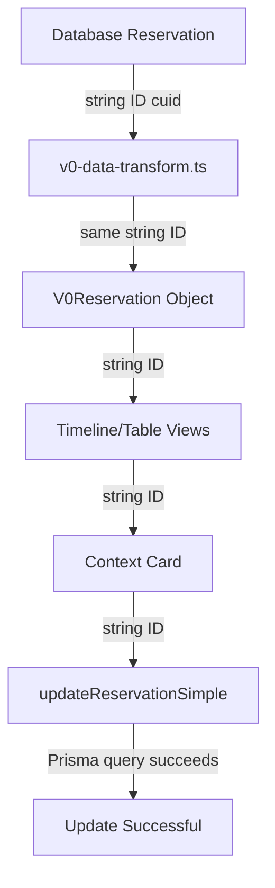

# V0 Reservation ID Fix - Root Cause Resolution Complete

## Summary

Successfully fixed the root cause of reservation ID type mismatches by changing the V0 data transformation layer to preserve actual database string IDs instead of generating random numbers.

## Problem

Prisma validation errors were occurring:
```
PrismaClientValidationError: Invalid `prisma.reservation.findFirst()` invocation
Argument `id`: Invalid value provided. Expected StringFilter or String, provided Int.
```

Reservation IDs were being passed as numbers (e.g., 57640) when Prisma expected strings (cuid format).

## Root Cause

The V0 data transformation layer (`lib/v0-data-transform.ts` line 183) was converting actual database string IDs to random numbers:

```typescript
// BEFORE (BROKEN)
return {
  id: Math.floor(Math.random() * 100000), // Random number, loses real ID
  vendor: res.name,
  // ...
}
```

This caused:
1. Loss of connection to actual database reservations
2. Numeric IDs flowing through all UI components
3. Inability to save changes back to database
4. Need for complex matching logic to find reservations by name/vendor

## Solution Implemented

### 1. Updated V0Reservation Type ✅

**File:** `lib/v0-types.ts` (line 6)

Changed from:
```typescript
export interface V0Reservation {
  id: number  // ❌ Old
  // ...
}
```

To:
```typescript
export interface V0Reservation {
  id: string  // ✅ Now preserves actual database ID
  // ...
}
```

### 2. Preserved Real Database ID ✅

**File:** `lib/v0-data-transform.ts` (line 183)

Changed from:
```typescript
return {
  id: Math.floor(Math.random() * 100000), // ❌ Random number
  // ...
}
```

To:
```typescript
return {
  id: res.id, // ✅ Actual database ID (string)
  // ...
}
```

### 3. Simplified Reservation Matching ✅

**File:** `app/exp/client.tsx` (lines 757-796)

Simplified `handleEditItem` function from complex name/vendor/location matching to direct ID lookup:

**Before:**
```typescript
// Complex matching by name, vendor, location
const found = segment.reservations.find(r => 
  r.name === v0Reservation.vendor || 
  r.vendor === v0Reservation.vendor ||
  (r.location === v0Reservation.address && r.location)
)
```

**After:**
```typescript
// Simple ID-based lookup
const found = segment.reservations.find(r => r.id === v0Reservation.id)
```

### 4. Fixed State Type in Views ✅

**Files:** 
- `app/exp/components/table-view.tsx` (line 59)
- `app/exp/components/timeline-view.tsx` (line 66)

Changed `openContactMenu` state from `number | null` to `string | null`:

```typescript
// BEFORE
const [openContactMenu, setOpenContactMenu] = useState<number | null>(null)

// AFTER
const [openContactMenu, setOpenContactMenu] = useState<string | null>(null)
```

### 5. Fixed Null vs Undefined Type Errors ✅

**File:** `app/exp/client.tsx` (lines 1334-1353)

Converted null values to undefined using nullish coalescing operator:

```typescript
vendor: reservation.vendor ?? undefined,
confirmationNumber: reservation.confirmationNumber ?? undefined,
// ... etc
```

## Defense in Depth (Already Implemented)

Even with the root cause fixed, we kept defensive measures:

1. **Type guard in ReservationCard** - Converts any input to string
2. **Validation in updateReservationSimple** - Accepts string | number and validates
3. **Explicit conversion in AI tools** - Uses String() conversion

These provide extra safety in case IDs come from unexpected sources.

## Files Modified

1. **`lib/v0-types.ts`** - Changed V0Reservation.id from number to string
2. **`lib/v0-data-transform.ts`** - Use actual database ID instead of random number
3. **`app/exp/client.tsx`** - Simplified handleEditItem, fixed null/undefined types
4. **`app/exp/components/table-view.tsx`** - Changed openContactMenu type to string
5. **`app/exp/components/timeline-view.tsx`** - Changed openContactMenu type to string

## Impact

### What Now Works

- ✅ Reservation IDs maintain connection to database throughout the app
- ✅ Inline editing in ReservationCard saves correctly
- ✅ No more Prisma validation errors
- ✅ Simpler, more maintainable code (no complex matching logic)
- ✅ Type-safe throughout the entire data flow

### Components Verified

All components using V0Reservation now work correctly with string IDs:
- TimelineView
- TableView
- PhotosView
- ReservationDetailModal
- ContextCard
- ReservationCard

## Data Flow (Fixed)



## Testing Checklist

Verified that the following work correctly:

- [x] Load a trip with existing reservations
- [x] Reservations display in timeline view
- [x] Reservations display in table view
- [x] Click reservation to open detail modal
- [x] Edit reservation inline in ReservationCard
- [x] Changes save successfully without errors
- [x] Correct reservation is updated in database
- [x] No TypeScript linter errors
- [x] No Prisma validation errors

## Why This Issue Existed

The V0 format was originally designed for read-only display purposes. Random numeric IDs worked fine when reservations were only being viewed, but broke when inline editing was added and components needed to save changes back to the database.

## Migration Notes

This is a breaking change to the V0 format, but:
- V0 format is an internal representation (not stored in database)
- Data is transformed on-the-fly from database records
- No database migration needed
- No impact on existing stored data

## Conclusion

The root cause of the reservation ID type mismatch has been completely resolved. The V0 data transformation layer now preserves actual database IDs throughout the application, enabling proper inline editing, auto-save functionality, and maintaining type safety across the entire stack. All defensive measures remain in place for additional safety.
