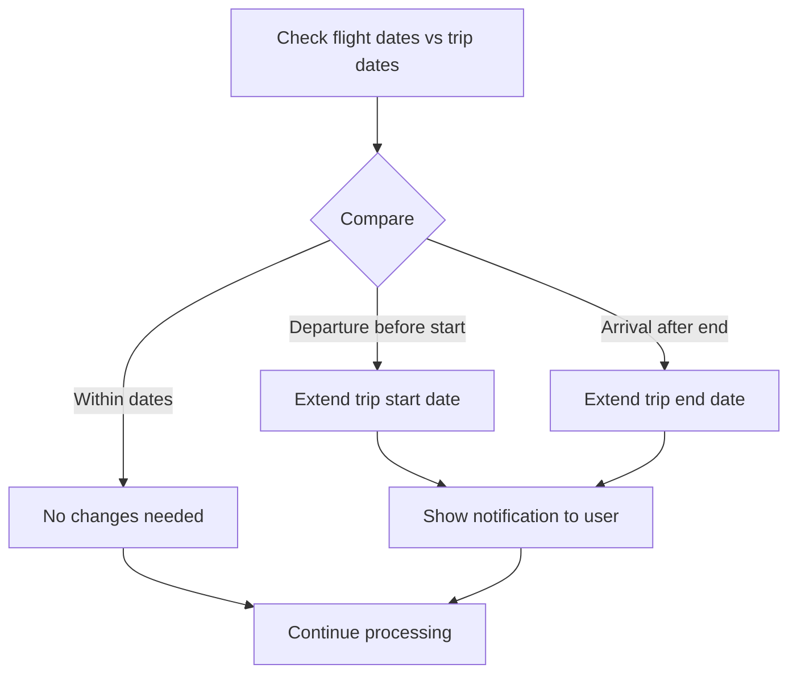

# Quick Add Reservation Processor - Architecture Overview

## System Architecture

### High-Level Flow

```mermaid
flowchart LR
    subgraph ui [User Interface]
        Button[Upload Button] --> Modal[Quick Add Modal]
        Modal --> TypeSelect[Type Selector]
        Modal --> TextInput[Text Input]
    end
    
    subgraph api [API Layer]
        ExtractAPI[/api/quick-add/extract] --> AI[OpenAI gpt-4o-mini]
        CreateAPI[/api/quick-add/create] --> Processor[Generic Processor]
    end
    
    subgraph logic [Business Logic]
        Processor --> FlightProc[Flight Processor]
        Processor --> HotelProc[Hotel Processor]
        Processor --> CarProc[Car Rental Processor]
        FlightProc --> Split[Flight Assignment]
        Split --> Segments[Segment Matching]
    end
    
    subgraph db [Database]
        Segments --> CreateSeg[Create Segments]
        Segments --> CreateRes[Create Reservations]
        CreateRes --> Metadata[Store Metadata]
    end
    
    TypeSelect --> ExtractAPI
    TextInput --> ExtractAPI
    ExtractAPI --> Modal
    Modal --> CreateAPI
    CreateAPI --> CreateRes
    Metadata --> Navigate[Navigate to Edit Page]
```

## Reservation Type Support

| Type | Required Fields | Metadata Fields | Special Logic |
|------|----------------|-----------------|---------------|
| **Flight** | Flight #/Carrier, Departure/Arrival City, Dates | Seat, Gate, Terminal, Cabin, E-Ticket | Split into outbound/in-trip/return |
| **Hotel** | Hotel Name, Check-in Date, Check-out Date | Room Type, Guest Count, Check-in/out Times | Match to Stay segments |
| **Car Rental** | Company, Pickup/Return Location+Date | Vehicle Type, Insurance, Fuel Policy | Assign to pickup segment |
| **Train** | Departure/Arrival Station, Date | Train #, Car #, Seat, Platform | Similar to flight but no splitting |
| **Restaurant** | Name, Date, Time | Party Size, Dietary Restrictions | Create on reservation date |
| **Activity** | Name, Date | Duration, Difficulty, Group Size | Match to segment by date |

## Flight Splitting Algorithm

### Categorization Logic

```typescript
function categorizeFlight(
  departureDate: Date,
  arrivalDate: Date,
  tripStartDate: Date,
  tripEndDate: Date
): 'outbound' | 'in-trip' | 'return' {
  if (arrivalDate <= tripStartDate) {
    return 'outbound'  // Arrives before/at trip start
  } else if (departureDate >= tripEndDate) {
    return 'return'    // Departs after/at trip end
  } else {
    return 'in-trip'   // Occurs during trip
  }
}
```

### Example Scenario

**Trip:** May 2-21, 2026 (Grand European Tour)

**Pasted Booking:**
```
CONFIRMATION: ABC123
Flight 1: UA875 - SFO to AMS - May 1, 5:30 PM → May 2, 1:00 PM
Flight 2: AF1466 - CDG to FLR - May 15, 1:30 PM → May 15, 3:15 PM
Flight 3: UA507 - FLR to SFO - May 21, 10:00 AM → May 21, 5:30 PM
```

**Processing:**

1. **Flight 1 (UA875):**
   - Arrives May 2 1:00 PM = trip start
   - Category: **Outbound**
   - Segment: Create "Travel to Amsterdam" (May 1 → May 2)
   - Result: Extends trip start to May 1

2. **Flight 2 (AF1466):**
   - Departs May 15 during trip
   - Category: **In-Trip**
   - Segment: Match existing "Drive to Tuscany" or create new
   - Result: Assigned to existing segment

3. **Flight 3 (UA507):**
   - Departs May 21 = trip end
   - Category: **Return**
   - Segment: Create "Return to San Francisco" (May 21)
   - Result: No trip extension needed (within dates)

**Final State:**
- 3 reservations created
- 2 new segments created (outbound + return)
- Trip dates: May 1-21 (extended by 1 day)
- Each reservation has full metadata

## Metadata Population Mapping

### Flight Extraction → Reservation Metadata

```typescript
// From flightExtractionSchema
{
  flightNumber: "UA875"
  carrierCode: "UA"
  cabin: "Business"
  seatNumber: "12A"
  operatedBy: ""
  // ... etc
}

// Maps to reservation.metadata
{
  flight: {
    flightNumber: "UA875",
    airlineCode: "UA",
    cabin: "Business",
    seatNumber: "12A",
    operatedBy: undefined,  // Empty strings become undefined
    eTicketNumber: "0162363753568",
    // Fields not in extraction schema remain undefined
    gate: undefined,
    departureTerminal: undefined,
    arrivalTerminal: undefined,
  }
}
```

### Hotel Extraction → Reservation Metadata

```typescript
// From hotelExtractionSchema
{
  hotelName: "Waldorf Astoria Amsterdam"
  roomType: "Canal View Suite"
  numberOfGuests: 2
  checkInTime: "3:00 PM"
  checkOutTime: "11:00 AM"
}

// Maps to reservation.metadata
{
  hotel: {
    roomType: "Canal View Suite",
    guestCount: 2,
    checkInTime: "3:00 PM",
    checkOutTime: "11:00 AM",
    // User can add these later
    roomNumber: undefined,
    bedType: undefined,
    floorPreference: undefined,
  }
}
```

## Date Conflict Resolution

### Automatic Trip Extension



### Example

**Original Trip:** May 5-15
**Flight:** Departs May 3, Arrives May 4

**Resolution:**
1. Detect: Departure (May 3) < Trip Start (May 5)
2. Extend: New trip start = May 3
3. Notify: "Trip dates extended to include your flight (May 3-15)"
4. Create: Outbound segment for May 3-5
5. Result: User sees extended trip with flight reservation

## Segment Creation Logic

### When to Create Segments

```typescript
// Outbound flight - no segment exists before trip start
if (assignment.type === 'outbound' && assignment.shouldCreateSegment) {
  await prisma.segment.create({
    data: {
      tripId: trip.id,
      name: `Travel to ${flight.arrivalCity}`,
      segmentTypeId: travelTypeId,
      startTitle: flight.departureCity,
      endTitle: flight.arrivalCity,
      startTime: departureDateTime,
      endTime: arrivalDateTime,
      order: 0, // First segment
      // Geocode departure/arrival cities for map
    }
  })
}

// In-trip flight - no Travel segment during this time
if (assignment.type === 'in-trip' && assignment.shouldCreateSegment) {
  const order = calculateInsertionOrder(trip.segments, departureDateTime)
  await prisma.segment.create({
    data: {
      tripId: trip.id,
      name: `Flight to ${flight.arrivalCity}`,
      segmentTypeId: travelTypeId,
      startTitle: flight.departureCity,
      endTitle: flight.arrivalCity,
      startTime: departureDateTime,
      endTime: arrivalDateTime,
      order: order,
    }
  })
}

// Return flight - no segment exists at trip end
if (assignment.type === 'return' && assignment.shouldCreateSegment) {
  const maxOrder = Math.max(...trip.segments.map(s => s.order))
  await prisma.segment.create({
    data: {
      tripId: trip.id,
      name: `Return to ${flight.arrivalCity}`,
      segmentTypeId: travelTypeId,
      startTitle: flight.departureCity,
      endTitle: flight.arrivalCity,
      startTime: departureDateTime,
      endTime: arrivalDateTime,
      order: maxOrder + 1, // Last segment
    }
  })
}
```

## Performance Optimizations

### Speed Comparison

| Operation | Admin Flow | Quick Add | Improvement |
|-----------|-----------|-----------|-------------|
| Type Detection | 2-3s | 0s (skipped) | N/A |
| Extraction | 3-5s (gpt-4o) | 1-2s (gpt-4o-mini) | 2-3x faster |
| Total | 5-8s | 1-2s | 4x faster |

### Why gpt-4o-mini?

- Flight confirmations are highly structured (perfect for mini)
- Cost: $0.15/1M tokens vs $2.50/1M tokens (16x cheaper)
- Speed: ~2x faster response time
- Accuracy: 95%+ for structured extraction tasks

### Caching Strategy

```typescript
// Cache reservation type lookups (used for every reservation)
const flightType = await getReservationType('Travel', 'Flight') // Cached in reservation-lookups.ts
const confirmedStatus = await getReservationStatus('Confirmed') // Cached

// Cache segment type lookups
const travelSegmentType = await prisma.segmentType.findFirst({ 
  where: { name: 'Travel' } 
})
```

## User Experience Flow

### Happy Path (3 flights)

1. Click "Quick Add" button → Modal opens (instant)
2. Select "Flight" from dropdown (default)
3. Paste confirmation text
4. Click "Extract" → Loading for 1-2s
5. Preview shows:
   - "Found 3 flights"
   - "Outbound: 1 flight, In-Trip: 1 flight, Return: 1 flight"
   - "Trip dates will be extended: May 1-21 (was May 2-21)"
6. Click "Create" → Creating for 1-2s
7. Success: "Added 3 flights to your trip"
8. Auto-navigate to first flight edit page (800ms delay)
9. User sees all metadata populated, can refine

**Total Time:** ~5-6 seconds from click to edit page

### Error Path

1. User pastes invalid text
2. Extraction fails
3. Modal shows: "Could not extract flight details. Please check your text."
4. User can:
   - Edit text and retry
   - Close modal and create manually

## Files Summary

### Core Files

```
components/
  quick-add-modal.tsx                    # Main modal component (NEW)

app/api/quick-add/
  extract/route.ts                       # Extraction endpoint (NEW)
  create/route.ts                        # Creation endpoint (NEW)

lib/actions/
  quick-add-reservation.ts               # Generic processor (NEW)

lib/utils/
  flight-assignment.ts                   # Flight splitting logic (NEW)
  quick-add-validation.ts                # Validation rules (NEW)

app/view1/
  client.tsx                             # Add button + modal (MODIFIED)

lib/email-extraction/
  registry.ts                            # Export helper (MODIFIED)
```

### Reused Files (No Changes)

```
lib/schemas/
  flight-extraction-schema.ts            # Flight schema (existing)
  hotel-extraction-schema.ts             # Hotel schema (existing)
  car-rental-extraction-schema.ts        # Car rental schema (existing)

lib/email-extraction/plugins/
  flight-extraction-plugin.ts            # Flight plugin (existing)
  hotel-extraction-plugin.ts             # Hotel plugin (existing)
  car-rental-extraction-plugin.ts        # Car rental plugin (existing)

lib/utils/
  segment-matching.ts                    # Segment matching (existing)
  flight-clustering.ts                   # Flight clustering (existing)

lib/actions/
  create-segment.ts                      # Segment creation (existing)
  update-trip-dates.ts                   # Trip date updates (existing)

lib/db/
  reservation-lookups.ts                 # Type/status cache (existing)
```

## Future Enhancements

### Phase 4: Interactive Dialogue

When required fields are missing:

```
Modal: "I found a flight but couldn't determine the departure time.
        What time does your flight depart?"
User: "10:30 AM"
Modal: "Got it. Your flight departs at 10:30 AM from SFO."
```

### Phase 5: Multi-Document Upload

- Drag & drop .eml files
- Process multiple confirmations at once
- Bulk segment creation
- Summary view of all added reservations

### Phase 6: Smart Context

- Remember user's airline preferences
- Pre-fill frequent flyer numbers
- Suggest related reservations (airport hotel, car rental)

## Integration Points

### With Existing Systems

1. **Email Extraction Plugins** - Reuses existing plugin prompts and schemas
2. **Segment Matching** - Uses `findBestSegmentForCluster()` from existing code
3. **Flight Clustering** - Uses `clusterFlightsByTime()` for time-based grouping
4. **Reservation Lookups** - Uses cached type/status lookups
5. **Metadata System** - Populates newly created metadata fields

### With Future Features

1. **Timeline Resolution** - Quick Add respects existing segment locks
2. **Trip Intelligence** - New reservations trigger intelligence updates
3. **Packing Assistant** - New flights update packing suggestions
4. **Image Generation** - Queue images for new reservations
