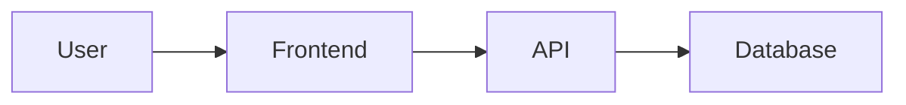

# [Feature Name]

> **Status**: Proposed | Approved | In Progress | Testing | Completed | On Hold | Cancelled  
> **Priority**: High | Medium | Low  
> **Effort**: Small (1-3 days) | Medium (1-2 weeks) | Large (2+ weeks)  
> **Owner**: [Developer/Team name]  
> **Created**: YYYY-MM-DD  
> **Last Updated**: YYYY-MM-DD

## Overview

Brief 2-3 sentence description of what this improvement accomplishes and why it matters.

## Problem Statement

### Current State

Describe the current behavior or limitation. Be specific about:
- What exists today
- What problems users face
- What pain points exist for developers
- Any technical debt or limitations

### User Impact

Explain how this affects users:
- Who is affected? (All users, power users, admins, etc.)
- How does it impact their workflow?
- What are they currently unable to do?
- What workarounds do they use?

### Evidence

Optional but helpful:
- User feedback or support tickets
- Analytics data showing the issue
- Performance metrics
- Competitive analysis

## Proposed Solution

### High-Level Approach

Describe the solution in 3-5 sentences. Focus on:
- What will be built
- How it solves the problem
- Key user-facing changes

### Detailed Design

Break down the solution into components:

#### Component 1: [Name]
- Description
- Key features
- User interaction flow

#### Component 2: [Name]
- Description
- Key features
- User interaction flow

### User Experience

Describe the new user flow:
1. User action
2. System response
3. Next steps

Include mockup descriptions or ASCII diagrams if helpful.

### Alternatives Considered

List other approaches that were considered and why they weren't chosen:

**Alternative 1: [Name]**
- Description
- Pros
- Cons
- Why not chosen

**Alternative 2: [Name]**
- Description
- Pros
- Cons
- Why not chosen

## Implementation Plan

### Phase 1: [Name] - Priority: High/Medium/Low

**Goals**: What will be accomplished

**Tasks**:
- [ ] Task 1
- [ ] Task 2
- [ ] Task 3

**Estimated Effort**: X days

**Dependencies**: List any blockers

**Deliverables**:
- Specific feature or component
- Tests
- Documentation

### Phase 2: [Name] - Priority: High/Medium/Low

**Goals**: What will be accomplished

**Tasks**:
- [ ] Task 1
- [ ] Task 2
- [ ] Task 3

**Estimated Effort**: X days

**Dependencies**: List any blockers

**Deliverables**:
- Specific feature or component
- Tests
- Documentation

### Phase 3: [Name] - Priority: High/Medium/Low

(Repeat structure as needed)

## Technical Considerations

### Architecture

Describe the technical architecture:
- System components involved
- Data flow
- Integration points

Optional: Include a mermaid diagram



### Database Changes

**New Tables/Models**:
- Table name: Description
- Fields and relationships

**Schema Modifications**:
- Changes to existing tables
- Migration strategy

**Data Migration**:
- Any data transformation needed
- Backward compatibility concerns

### API Changes

**New Endpoints**:
- `POST /api/example` - Description
- `GET /api/example/:id` - Description

**Modified Endpoints**:
- Changes to existing APIs
- Breaking changes (if any)

### Frontend Changes

**New Components**:
- Component name and purpose
- Props and state management

**Modified Components**:
- Changes to existing components
- Refactoring needed

### Third-Party Integrations

- External APIs or services
- Authentication requirements
- Rate limits or quotas
- Cost implications

### Performance Considerations

- Expected load/traffic impact
- Caching strategy
- Database query optimization
- Asset optimization

### Security Considerations

- Authentication/authorization changes
- Data privacy concerns
- Input validation
- OWASP considerations

### Testing Strategy

**Unit Tests**:
- Functions/modules to test
- Coverage targets

**Integration Tests**:
- API endpoints to test
- Component integration

**E2E Tests**:
- Critical user flows
- Edge cases

**Manual Testing**:
- Scenarios to verify
- User acceptance criteria

## Files Affected

### New Files
```
path/to/new/file1.ts - Description
path/to/new/file2.tsx - Description
```

### Modified Files
```
path/to/existing/file1.ts - What will change
path/to/existing/file2.tsx - What will change
```

### Deleted Files
```
path/to/deprecated/file.ts - Why it's being removed
```

## Dependencies

### Prerequisites
- Other improvements that must be completed first
- Infrastructure requirements
- External service setup

### Related Improvements
- Link to related improvement docs
- Explain the relationship

### External Dependencies
- Third-party library versions
- API access requirements
- Environment variables needed

## Success Criteria

### User-Facing Metrics
- [ ] Criterion 1: Measurable outcome
- [ ] Criterion 2: Measurable outcome
- [ ] User satisfaction target

### Technical Metrics
- [ ] Performance benchmark
- [ ] Code coverage target
- [ ] Error rate reduction

### Acceptance Criteria
- [ ] Feature works as specified
- [ ] All tests pass
- [ ] Documentation updated
- [ ] No regressions
- [ ] Accessibility requirements met

## Rollout Plan

### Deployment Strategy
- Phased rollout vs. big bang
- Feature flags
- A/B testing approach

### Monitoring
- Metrics to track
- Alerts to set up
- Dashboard updates

### Rollback Plan
- How to revert if issues arise
- Data recovery strategy

## Open Questions

- [ ] Question 1: Who needs to answer this?
- [ ] Question 2: What research is needed?
- [ ] Question 3: What decisions are pending?

## Future Enhancements

Ideas for extending this improvement later:
- Enhancement 1
- Enhancement 2
- Enhancement 3

## References

- Links to related documentation
- Research articles
- Design inspiration
- Similar implementations in other products

## Change Log

| Date | Change | Author |
|------|--------|--------|
| YYYY-MM-DD | Initial proposal | Name |
| YYYY-MM-DD | Updated after review | Name |
